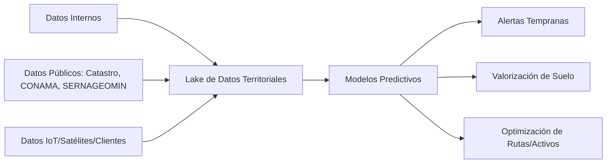
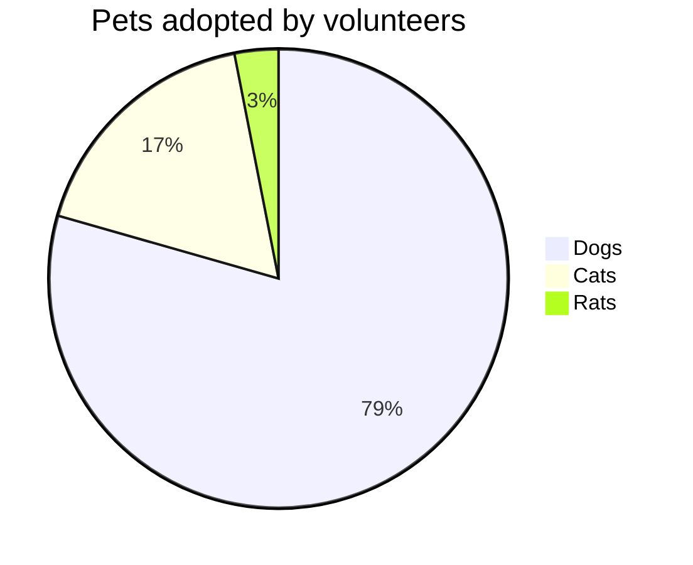
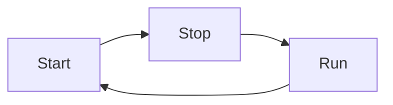
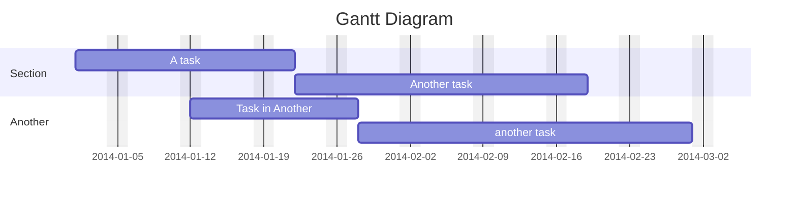

---

```mermaid
graph LR
    A[Datos Internos] --> D[Lake de Datos Territoriales]
    B[Datos Públicos: Catastro, CONAMA, SERNAGEOMIN] --> D
    C[Datos IoT/Satélites/Clientes] --> D
    D --> E[Modelos Predictivos]
    E --> F[Alertas Tempranas]
    E --> G[Valorización de Suelo]
    E --> H[Optimización de Rutas/Activos]
```
 

---

```mermaid
pie title Pets adopted by volunteers
    "Dogs" : 386
    "Cats" : 85
    "Rats" : 15
```
 

```mermaid
flowchart LR
    Start --> Stop
    Stop --> Run --> Start
```

```mermaid
gantt
    title Gantt Diagram
    dateFormat YYYY-MM-DD
    excludes    weekends
    section Section
        A task          :a1, 2014-01-01, 15d
        Another task    :after a1, 20d
    section Another
        Task in Another :2014-01-12, 12d
        another task    :24d
```