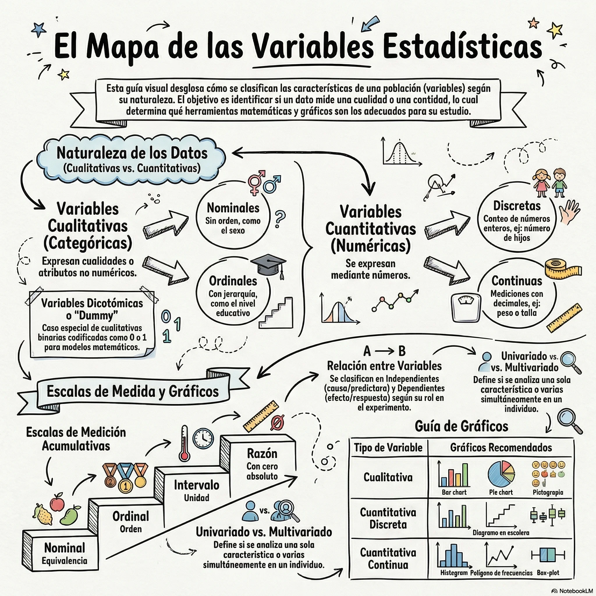

Una **variable** se define como cualquier característica, rasgo o propiedad de una unidad experimental (paciente, objeto o ser vivo) cuyo valor puede cambiar o variar entre los diferentes elementos de una población.

La taxonomía de las variables es crítica, ya que determina el tipo de análisis estadístico y los modelos matemáticos que pueden aplicarse a los datos recolectados. 

## 1. Variables Cualitativas (Categóricas)
Miden una cualidad o atributo no numérico en cada unidad experimental. Los datos resultantes se clasifican según similitudes o diferencias de clase.

### **Nominales** 
Consisten en categorías que sirven como etiquetas e identificadores, sin que exista un orden jerárquico o un significado numérico entre ellas.

**Dicotómicas (o Binomiales):** Caso especial con solo dos categorías excluyentes. 

* *Ejemplo:* Género (masculino/femenino), presencia de enfermedad (sí/no), estado vital (vivo/muerto).
    
**Politómicas:** Presentan más de dos categorías. 

* *Ejemplo:* Grupo sanguíneo (A, B, O, AB), estado civil (soltero, casado, divorciado, viudo), color de ojos.
### **Ordinales** 
Poseen un orden o jerarquía significativa entre sus categorías, aunque no existe una distancia constante o cuantificable entre un nivel y otro.
* *Ejemplo:* Etapas de un cáncer (I, II, III, IV), escalas de dolor (leve, moderado, severo), nivel de satisfacción (muy pobre a muy bueno).

## 2. Variables Cuantitativas (Numéricas)
Miden una cantidad numérica y permiten señalar cuán grandes son las diferencias observadas entre individuos.

**Discretas:** Toman valores aislados, generalmente números enteros, y resultan de un proceso de conteo. Poseen "brechas" entre los posibles valores.
*   *Ejemplo:* Número de hijos, cantidad de visitas al hospital, conteo de glóbulos blancos por unidad de sangre.

**Continuas:** Pueden adoptar cualquier valor dentro de un intervalo real, permitiendo una cantidad infinita de fracciones o decimales. Surgen típicamente de procesos de medición.
*   *Ejemplo:* Peso de un recién nacido, estatura, presión arterial, niveles de glucosa en plasma, tiempo de reacción.

## 3. Escalas de Medición Cuantitativa
Es vital distinguir entre la naturaleza de los datos según su origen (cero absoluto):

**Escala de Intervalo:** Los datos tienen un orden y distancias significativas, pero el valor "cero" es arbitrario y no indica ausencia de la característica.
*   *Ejemplo:* Temperatura en grados Celsius o Fahrenheit. Un valor de $0^{\circ}C$ no significa ausencia de temperatura.

**Escala de Razón:** Posee todas las propiedades de la escala de intervalo más un cero absoluto o natural, lo que permite realizar comparaciones de proporcionalidad (ej. $x$ es el doble que $y$).
*   *Ejemplo:* Peso en kilogramos, edad en años, temperatura en grados Kelvin (donde 0 K es el cero absoluto).

## 4. Otras Clasificaciones Especiales
**Variables Latentes y Observables:** Una variable latente es un atributo no directamente medible (como la inteligencia o calidad de vida), mientras que las variables observables son las que se utilizan para cuantificar dicho concepto (como el puntaje de un test de CI).

**Variables Indicadoras (Dummy):** Recodificación binaria (0 y 1) de variables cualitativas para que puedan ser incluidas en modelos de regresión matemática.
    *   *Ejemplo:* En un modelo de riesgo coronario, asignar 1 a "fumador" y 0 a "no fumador".

**Variables Censuradas:** Comunes en el análisis de supervivencia. Ocurren cuando se conoce que el valor de la variable supera cierto límite, pero no se conoce el valor exacto (ej. un paciente abandona el estudio antes de que ocurra el evento final).

**Independientes (Explicativas) vs. Dependientes (Respuesta):** En modelos predictivos, la variable dependiente ($Y$) es el resultado de interés, mientras que la independiente ($X$) es la que se utiliza para explicar o predecir dicho resultado.

