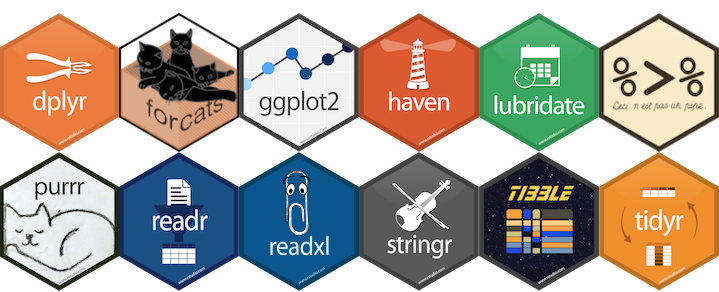

En el ecosistema de la bioestadística, la elección entre **R** y **Python** no representa meramente una preferencia técnica, sino una decisión estratégica basada en el objetivo de la investigación. Mientras que R fue concebido por y para estadísticos, Python surgió como un lenguaje de propósito general con una adopción posterior masiva en la ciencia de datos.

La integración de lenguajes de programación en la bioinformática ha consolidado a **R** y **Python** como las herramientas predominantes para el análisis bioestadístico y la investigación biomédica. Mientras que R se mantiene como la "lingua franca" del análisis de datos científico debido a su origen estadístico, Python ha ganado terreno por su versatilidad en la integración de sistemas y el aprendizaje profundo (*Deep Learning*).


## 🟦 R: El Entorno Especializado

R se define no solo como un lenguaje, sino como un **ambiente integrado** para el cómputo estadístico y gráfico. Su origen se remonta al lenguaje S, desarrollado en los laboratorios Bell para el análisis de datos.

### Ventajas en el Área Médica
**Dominio en Epidemiología y Genómica:** R es considerado la "lingua franca" del análisis de datos científicos. Posee repositorios especializados como **Bioconductor**, que contiene miles de paquetes específicos para bioinformática y análisis genómico.

**Rigor en el Modelado Estadístico:** La sintaxis de R permite implementar modelos complejos de forma directa. Por ejemplo, la función `glm()` facilita el ajuste de **Modelos Lineales Generalizados**, esenciales para desenlaces biomédicos dicotómicos o de conteo.

*Fórmula base de un GLM en R:*
        ```math
        g(E[Y]) = \beta_0 + \beta_1 X_1 + ... + \beta_k X_k
        ```

    Donde $g$ es la función de enlace (link function) que conecta la esperanza matemática del resultado con el predictor lineal.

**Capacidad Gráfica Superior:** Herramientas como `ggplot2` y el sistema base de R permiten crear visualizaciones de calidad editorial (curvas de supervivencia de Kaplan-Meier, diagramas de caja, curvas ROC) de manera más sofisticada que la mayoría de los paquetes comerciales.

**Reproducibilidad Científica:** Mediante el uso de *scripts* y herramientas como `knitr` o `Sweave`, R permite integrar el código y los resultados en un único documento, garantizando que el flujo de trabajo pueda ser auditado y replicado exactamente meses después.

### Desventajas
**Curva de Aprendizaje:** Para usuarios habituados a interfaces de "apuntar y hacer clic" (como SPSS), R puede resultar intimidante al requerir comandos escritos.

**Gestión de Memoria RAM:** R carga todos los objetos en la memoria virtual, lo que puede alentar el sistema o generar errores si se trabaja con bases de datos masivas (en el rango de gigabytes o terabytes) sin técnicas de optimización.

### Bibliotecas esenciales en bioestadística

El entorno R no se considera simplemente un paquete estadístico, sino un ecosistema computacional completo y un lenguaje de programación orientado a objetos que permite la manipulación, evaluación e interpretación de procedimientos estadísticos complejos aplicados a datos de salud. La extensibilidad de R a través de sus bibliotecas (paquetes) es lo que permite abordar desde análisis descriptivos básicos hasta modelos genómicos de alta dimensionalidad.

A continuación, se describen las bibliotecas esenciales para la bioestadística, categorizadas por su dominio de aplicación científica:

### 1. El Sistema Base y Modelado Lineal
Aunque R incluye funciones nativas potentes, la base de la estadística inferencial se apoya en paquetes que estandarizan el ajuste de modelos.

*   **`stats`**: Es parte del núcleo de R y proporciona las funciones fundamentales para modelos lineales (`lm()`) y modelos lineales generalizados (`glm()`), esenciales para variables de respuesta no normales.
  
*   **`rms` (Regression Modeling Strategies)**: Desarrollada por Frank Harrell, es indispensable en la investigación médica para el ajuste de modelos multivariados, validación de modelos mediante *bootstrapping*, y la creación de nomogramas para la predicción de riesgos clínicos.
 
*   **`VGAM` (Vector Generalized Linear and Additive Models)**: Implementa más de 50 distribuciones y 20 funciones de enlace, permitiendo modelar respuestas múltiples y categóricas ordenadas o multinomiales con un rigor matemático superior al `glm()` estándar.

La estructura matemática fundamental que comparten estas bibliotecas para un modelo lineal generalizado (GLM) se define por la función de enlace $g(\cdot)$:

```math
\eta = g(E[Y]) = \beta_0 + \beta_1 X_1 + \dots + \beta_m X_m
```

Donde $E[Y]$ es el valor esperado de la variable biológica y $\eta$ es el predictor lineal.

### 2. Análisis de Supervivencia (Time-to-Event)
El análisis de datos truncados o censurados es el "pilar" de la investigación clínica y epidemiológica.
**`survival`**: Es la biblioteca de referencia absoluta. Contiene funciones críticas como `Surv()` para definir objetos de supervivencia, `survfit()` para estimaciones de Kaplan-Meier y `coxph()` para el modelo de riesgos proporcionales de Cox.

**`coxrobust`**: Específicamente diseñada para la estimación robusta en [modelos de Cox](/docs/08-temas_avanzados/3-cox.md) cuando existen valores atípicos que pueden sesgar los resultados.

El [modelo de Cox](/docs/08-temas_avanzados/3-cox.md) ajustado en estas bibliotecas se expresa como:

```math
\lambda(t|Z) = \lambda_0(t) e^{\theta'Z}
```

Donde $\lambda(t|Z)$ es la función de riesgo condicionado a las covariables $Z$, y $\lambda_0(t)$ es el riesgo basal.

### 3. El Ecosistema `tidyverse` para Ciencia de Datos Médicos



La informática moderna requiere herramientas eficientes para la limpieza y organización de grandes bases de datos hospitalarias.

**`dplyr` y `tidyr`**: Esenciales para la manipulación de datos y la transformación de formatos "anchos" a "largos", garantizando que los datos sean "tidy" (ordenados) antes del análisis.

**`ggplot2`**: Implementación de la "Gramática de Gráficos", permite generar visualizaciones de alta calidad para publicaciones, desde curvas ROC hasta diagramas de cajas complejos.

**`lubridate`**: Crítica para manejar la complejidad de fechas y tiempos en registros de salud electrónicos.

Enlaces
- https://tidyverse.org/
- https://rpubs.com/paraneda/tidyverse

### 4. Epidemiología y Bioinformática
*   **`epibasix`**: Proporciona herramientas elementales para problemas epidemiológicos comunes, como el cálculo del tamaño muestral y el análisis de tablas de contingencia $2 \times 2$.
 
*   **`Bioconductor` (Repositorio)**: No es un paquete único, sino un ecosistema para el análisis ómico. Incluye bibliotecas como `SNPassoc` para estudios de asociación genética y `pcaMethods` para la reducción de dimensionalidad en datos genómicos. https://www.bioconductor.org/

*   **`meta` y `metafor`**: Bibliotecas estándar de oro para realizar meta-análisis, permitiendo la síntesis cuantitativa de evidencia clínica de múltiples estudios.

### 5. Inferencia Especializada y Datos Faltantes
*   **`mice` (Multivariate Imputation by Chained Equations)**: Esencial para tratar el problema de los datos faltantes en estudios clínicos mediante imputación múltiple, preservando la variabilidad de los datos.

*   **`coin`**: Implementa procedimientos de inferencia condicional y pruebas de permutación, útiles cuando los supuestos de las pruebas paramétricas tradicionales no se cumplen en muestras médicas pequeñas.


<br />


## 🟩 Python: La Versatilidad del Propósito General

Python es un lenguaje de programación de uso general, lo que significa que su arquitectura está diseñada para construir cualquier tipo de aplicación, no exclusivamente para estadística.

### Ventajas
**Integración de Sistemas:** Es excelente para integrarse con infraestructuras de software hospitalario, aplicaciones web o dispositivos médicos, permitiendo que un modelo estadístico pase a producción de manera más fluida que R.

**Sintaxis Intuitiva:** Su estructura es a menudo percibida como más coherente para personas con formación en ingeniería de software, lo que facilita el desarrollo de aplicaciones de informática complejas.

**Machine Learning a Escala:** Aunque R tiene capacidades robustas, Python suele liderar en el entrenamiento de modelos de redes neuronales profundas (*Deep Learning*) para el análisis de imágenes médicas (ej. radiografías u oncología digital).

### Desventajas
**Fragmentación Bioestadística:** A diferencia de R, donde un paquete como `survival` es el estándar universal para análisis de supervivencia, en Python las bibliotecas estadísticas están más dispersas y a veces carecen de la profundidad técnica específica de los paquetes de CRAN desarrollados por comunidades de estadísticos académicos.

**Menor Enfoque en la Inferencia:** Mientras R se centra en la **inferencia** (entender la relación entre variables y su significancia), Python a menudo prioriza la **predicción** (precisión del resultado final), lo que puede ser un inconveniente en la investigación clínica tradicional.


### Bibliotecas de Python esenciales

El ecosistema de Python ofrece una infraestructura robusta que complementa las capacidades analíticas de R, especialmente cuando se requiere la integración de modelos predictivos en sistemas de producción o el procesamiento de datos biológicos a gran escala.

A continuación, se describen las bibliotecas de Python consideradas esenciales para la bioestadística y la investigación biomédica, fundamentadas en su rigor técnico y aplicaciones específicas:

### 1. Modelado Estadístico Inferencial: `statsmodels`
Mientras que muchas bibliotecas de Python se centran en la predicción, `statsmodels` es la herramienta estándar para la **inferencia estadística**. Permite la estimación de modelos mediante Máxima Verosimilitud (MLE) y proporciona diagnósticos detallados, similares a los encontrados en el entorno R.

Es fundamental para el ajuste de **Modelos Lineales Generalizados (GLM)**, cuya estructura matemática se define como:

```math
g(E[Y]) = \beta_0 + \sum_{j=1}^{k} \beta_j X_j
```

*Donde:*
*   $g$: Es la función de enlace o *link function* (como *logit* para respuestas binarias o *log* para datos de conteo/Poisson).
*   $E[Y]$: Es la esperanza matemática del desenlace clínico.
*   $\beta_j$: Representan los coeficientes que cuantifican el efecto de las covariables.

### 2. Computación Biológica y Genómica: `Biopython`
Esta biblioteca es el pilar para la bioinformática estructural y la manipulación de secuencias biológicas. A diferencia del enfoque puramente estadístico de paquetes de R como `genetics` o `SNPassoc`, `Biopython` se especializa en:
*   **Manipulación de secuencias:** Lectura y escritura de formatos FASTA, GenBank y acceso a bases de datos como NCBI.

*   **Bioinformática estructural:** Análisis de archivos PDB para el estudio de la conformación de proteínas.

*   **Automatización:** Creación de tuberías (*pipelines*) de procesamiento de datos genómicos.

### 3. Proteómica y Espectrometría de Masas: `pyOpenMS`
En el ámbito del descubrimiento de biomarcadores proteicos, `pyOpenMS` ofrece una interfaz eficiente (basada en C++) para el procesamiento de señales masivas. Es esencial para:
*   **Identificación de péptidos:** Procesamiento de espectros de masa en crudo.

*   **Cuantificación:** Análisis de abundancia relativa de proteínas, superando a menudo la velocidad de procesamiento de otras herramientas en el manejo de volúmenes masivos de datos.

### 4. Aprendizaje Automático y Diagnóstico Predictivo: `scikit-learn`
Aunque se originó en la ciencia de datos general, `scikit-learn` es indispensable en bioestadística moderna para la implementación de algoritmos de clasificación y regresión que aseguran la generalización de los resultados. Incluye:
*   **Máquinas de Vectores Soporte (SVM):** Utilizadas para separar poblaciones celulares o diagnosticar patologías mediante fronteras de decisión óptimas.

*   **Bosques Aleatorios (Random Forests):** Esenciales para identificar la importancia de variables (como SNPs o biomarcadores) en la predicción de riesgos.

*   **Regularización (LASSO/Ridge):** Crítica para mitigar el sobreajuste (*overfitting*) en datasets biomédicos con alta dimensionalidad,.

### 5. Análisis de Datos y Manipulación: `pandas`
Aunque no es estrictamente una biblioteca estadística, `pandas` proporciona la estructura de datos `DataFrame`, necesaria para la limpieza y organización de registros de salud electrónicos (EHR). Permite transformar datos de formatos "anchos" a "largos" (tidy data), requisito previo para cualquier análisis inferencial serio.


## Comparaciones en áreas específicas

### 1. Modelado Estadístico: R vs. statsmodels
En la bioestadística clínica, el rigor en la inferencia es prioritario sobre la mera predicción.

**R (Base y `rms`):** R utiliza funciones nativas como `glm()` para Modelos Lineales Generalizados, permitiendo especificar distribuciones de error y funciones de enlace con precisión matemática. La biblioteca `rms` de Frank Harrell es el estándar de oro para el modelado multivariado en medicina.

**Python (`statsmodels`):** `statsmodels` es la biblioteca de Python que más se aproxima al flujo de trabajo de R. Permite realizar estimaciones por Máxima Verosimilitud (MLE) y análisis de varianza (ANOVA).

**Fundamentación Matemática:** Ambos implementan el modelo lineal generalizado bajo la estructura:

```math
g(E[Y]) = \beta_0 + \sum_{j=1}^{k} \beta_j X_j
```

*Donde:*
*   $g$: Es la función de enlace (ej. *logit* para regresión logística o *log* para Poisson).
*   $E[Y]$: Es la esperanza matemática o valor esperado de la variable respuesta biológica.
*   $\beta_0, \beta_j$: Representan los parámetros o coeficientes a estimar.

### 2. Bioinformática y Genética: `Bioconductor` (R) vs. Biopython

El manejo de datos ómicos (genómica, transcriptómica) requiere estructuras de datos capaces de gestionar alta dimensionalidad.

*   **R (`Bioconductor`):** Es un proyecto masivo de código abierto diseñado específicamente para el análisis de datos genómicos. Incluye paquetes como `genetics` para estudios de asociación y `SNPassoc` para polimorfismos de un solo nucleótido.

*   **Python (`Biopython`):** A diferencia de la orientación analítica de Bioconductor, `Biopython` se centra en la computación biológica (manipulación de secuencias, lectura de archivos estructurales PDB y acceso a bases de datos como NCBI). Es superior en la creación de tuberías (*pipelines*) de bioinformática estructural.

### 3. Proteómica y Espectrometría: R vs. pyOpenMS

El análisis de proteínas y su expresión es crítico para el descubrimiento de biomarcadores.

*   **R (Ecosistema Proteómico):** Dentro de Bioconductor, R ofrece paquetes para el procesamiento de espectrometría de masas y análisis de abundancia relativa, facilitando el análisis estadístico posterior de los péptidos detectados.

*   **Python (`pyOpenMS`):** `pyOpenMS` es un envoltorio (*wrapper*) de la biblioteca C++ OpenMS. Es excepcionalmente eficiente para el procesamiento de datos brutos de espectrometría de masas en grandes volúmenes, superando a menudo la velocidad de procesamiento de R en la fase de identificación inicial de señales.

## Comparativa Conceptual

| Característica       | R (Software Estadístico)                                | Python (Programación)   |
| :------------------- | :------------------------------------------------------ | :---------------------------------------------------------------------- |
| **Origen**           | Diseñado por estadísticos para análisis de datos.       | Diseñado para computación general.                                      |
| **Fortaleza Médica** | Análisis de supervivencia, genómica y ensayos clínicos. | Procesamiento de imágenes, integración web y automatización.            |
| **Visualización**    | Líder con `ggplot2` y `lattice`.                        | Bueno, pero a menudo requiere más líneas de código para el mismo rigor. |
| **Ecosistema**       | **CRAN** y **Bioconductor** (>20k paquetes).            | **PyPI** (extenso, pero menos especializado en estadística pura).       |
| **Manejo de Datos**  | Data Frames nativos muy potentes.                       | Requiere bibliotecas externas (como Pandas) para simular tablas.        |

<br />

## Cuadro Comparativo de Capacidades


| Área    | Fortaleza de R (Bioconductor)                           | Fortaleza de Python (Bibliotecas )                                                  |
| :-------------------- | :---------------------------------------------------------------------- | :------------------------------------------------------------------------------------------------ |
| **Rigor Estadístico** | Superior; mayor cantidad de pruebas post-hoc y diagnósticos de modelos. | Muy fuerte en `statsmodels`, pero a menudo disperso entre múltiples bibliotecas.                  |
| **Genómica**          | Insuperable con Bioconductor para análisis de expresión.                | `Biopython` es excelente para manipulación de secuencias y automatización.                        |
| **Proteómica**        | Gran capacidad para modelado estadístico de biomarcadores.              | `pyOpenMS` lidera en eficiencia de procesamiento de señales masivas.                              |
| **Visualización**     | Líder absoluto con `ggplot2` y gráficos de calidad editorial.           | Fuerte, pero requiere más líneas de código para el mismo nivel de personalización bioestadística. |

## Conclusión
Centrado en la investigación clínica, la epidemiología analítica o el análisis de biomarcadores, **R es la herramienta de primera elección** debido a su inmensa biblioteca de funciones validadas y su capacidad de generar informes reproducibles. Sin embargo, si el objetivo es el desarrollo de sistemas de apoyo a la decisión integrados en la nube o herramientas de procesamiento masivo de datos no estructurados, **Python** ofrece una versatilidad superior.

**R** sigue siendo indispensable cuando el objetivo es la **validación científica** y la investigación reproducible mediante herramientas como `knitr`. Sin embargo, **Python** es la elección estratégica para el **desarrollo de software médico**, integración con registros de salud electrónicos (EHR) y aplicaciones de procesamiento de señales de alta intensidad mediante bibliotecas como `pyOpenMS`.

***
