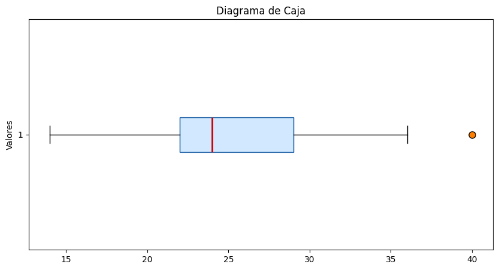
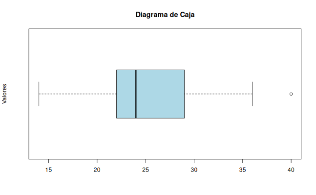

## Medidas de Dispersión
Las medidas de dispersión, por otro lado, cuantifican la variabilidad o esparcimiento de los datos alrededor de la medida de tendencia central. Son igualmente cruciales porque describen la consistencia de los datos.

### Rango
**Rango:** Es la diferencia entre el valor máximo y el mínimo del conjunto de datos. Es fácil de calcular pero muy sensible a los valores atípicos.

### Varianza
La **Varianza ($\sigma^2$)** Mide el promedio de las diferencias al cuadrado de cada dato respecto a la media. Al elevar al cuadrado las diferencias, se asegura que los valores positivos y negativos no se cancelen, y se da más peso a las observaciones más alejadas de la media. Sin embargo, sus unidades son las de los datos originales al cuadrado, lo que puede dificultar su interpretación directa.

### Varianza Poblacional

La **varianza poblacional** mide el promedio de las desviaciones al cuadrado de cada observación respecto a la media de toda la población. Su fórmula es:

```math
\sigma^2 = \frac{1}{N} \sum_{i=1}^{N} (x_i - \mu)^2
```

**Donde:**

- $\sigma^2$ (sigma cuadrada): **Varianza poblacional**. Es la medida de dispersión que queremos calcular.
- $N$: **Tamaño total de la población** (número de observaciones en la población completa).
- $x_i$: **Valor de la $i$-ésima observación** en la población.
- $\mu$ (mu): **Media poblacional**, calculada como $\mu = \frac{1}{N} \sum_{i=1}^{N} x_i$.
- $\sum_{i=1}^{N}$: **Sumatoria** que indica que se deben sumar las desviaciones al cuadrado para todas las observaciones desde $i = 1$ hasta $i = N$.
<br>
</br>

:::note
Se eleva al cuadrado la diferencia $(x_i - \mu)$ para evitar que las desviaciones positivas y negativas se cancelen entre sí, y para dar mayor peso a los valores que están más alejados de la media.
:::

### Varianza Muestral
La **varianza muestral** estima la varianza de una población a partir de una muestra. Su fórmula es:

```math
S^2 = \frac{1}{n-1} \sum_{i=1}^{n} (x_i - \bar{x})^2
```

**Donde:**

- $S^2$ (S cuadrada): **Varianza muestral**. Es la medida de dispersión que queremos calcular.
- $n$: **Tamaño de la muestra** (número de observaciones en la muestra).
- $x_i$: **Valor de la $i$-ésima observación** en la muestra.
- $\bar{x}$ (x barra): **Media muestral**, calculada como $\bar{x} = \frac{1}{n} \sum_{i=1}^{n} x_i$.
- $\sum_{i=1}^{n}$: **Sumatoria** que indica que se deben sumar las desviaciones al cuadrado para todas las observaciones desde $i = 1$ hasta $i = n$.
<br>
</br>

:::note
Se eleva al cuadrado la diferencia $(x_i - \bar{x})$ para evitar que las desviaciones positivas y negativas se cancelen entre sí, y para dar mayor peso a los valores que están más alejados de la media.
:::

### Desviación Estándar
**Desviación Estándar ($\sigma$):** Es la raíz cuadrada de la varianza. Es la medida de dispersión más utilizada porque vuelve a las unidades a las originales de los datos, facilitando su interpretación. Una desviación estándar baja indica que los datos están agrupados cerca de la media, mientras que una alta indica que los datos están más dispersos.

La formula de la desviacion estandar es:
```math
\sigma = \sqrt{\sigma^2}
``` 
**Donde:**
- $\sigma$ (sigma): **Desviación estándar poblacional**. Es la medida de dispersión que queremos calcular.
- $\sigma^2$ (sigma cuadrada): **Varianza poblacional**. Es la medida de dispersión que queremos calcular.


### Ejemplo de Cálculo de Medidas de Dispersión
Consideremos el conjunto de datos: [4, 8, 6, 5, 3, 7]
1. **Rango:**
   - Valor máximo = 8
   - Valor mínimo = 3
   - Rango = 8 - 3 = 5  

2. **Varianza:**
   - Media ($\bar{x}$) = (4 + 8 + 6 + 5 + 3 + 7) / 6 = 5.5
   - Desviaciones al cuadrado:
     - (4 - 5.5)² = 2.25
     - (8 - 5.5)² = 6.25
     - (6 - 5.5)² = 0.25
     - (5 - 5.5)² = 0.25
     - (3 - 5.5)² = 6.25
     - (7 - 5.5)² = 2.25
   - Varianza ($S^2$) = (2.25 + 6.25 + 0.25 + 0.25 + 6.25 + 2.25) / (6 - 1) = 17.5 / 5 = 3.5
   
3. **Desviación Estándar:** $S = \sqrt{S^2} = \sqrt{3.5} \approx 1.87$     
La desviación estándar de aproximadamente 1.87 indica que, en promedio, los datos se desvían de la media en esa cantidad.


<Tabs>
  <TabItem value="python" label="Python" default>
    ```python
    # Medidas de dispersion en Python...
import statistics
import numpy as np

# 1. Dataset (the same ages used in the previous examples)
data = [22, 25, 22, 30, 25, 22, 40, 35, 25, 22, 28, 22]

# 2. Range
data_range = max(data) - min(data)

# 3. Variance
variance = statistics.variance(data)

# 4. Standard Deviation
std_dev = statistics.stdev(data)

# 5. Interquartile Range (IQR)
q75, q25 = np.percentile(data, [75 ,25])
iqr = q75 - q25

# 6. Displaying the results
print("--- Measures of Dispersion (Python) ---")
print(f"Dataset: {data}")
print(f"Range: {data_range}")
print(f"Variance: {variance:.2f}")
print(f"Standard Deviation: {std_dev:.2f}")
print(f"Interquartile Range (IQR): {iqr}")

# 3. Generating the Horizontal Boxplot
plt.figure(figsize=(10, 5))
# 'vert=False' ensures the orientation is horizontal
plt.boxplot(data, vert=False, patch_artist=True,
            boxprops=dict(facecolor='#D1E8FF', color='#004C99'),
            medianprops=dict(color='#CC0000', linewidth=2),
            flierprops=dict(marker='o', markerfacecolor='#FF8000', markersize=8))

plt.title('Analysis of Dispersion: Distribution of Ages', fontsize=14, fontweight='bold')
plt.xlabel('Age (Years)', fontsize=12)
plt.yticks([1], ['Sample Group'])
plt.grid(axis='x', linestyle='--', alpha=0.6)
plt.tight_layout()

# Saving and displaying the plot
plt.savefig('dispersion_analysis.png')
plt.show()
    ```


    </TabItem>
    <TabItem value="r" label="R" default>
    ```python
    # Medidas de tendencia central en R...
# 1. Definición del conjunto de datos
datos = c(14, 15, 22, 25, 22, 21, 24, 24, 30, 25, 22, 36, 40, 35, 36, 25, 22, 28, 22)
# 2. Rango
rango <- max(datos) - min(datos)

# 3. Varianza
varianza <- var(datos)

# 4. Desviación Estándar
desviacion_estandar <- sd(datos)

# 5. Rango Intercuartílico (IQR)
rango_iqr <- IQR(datos)

# 6. Mostrar los resultados
cat("--- Medidas de Dispersión en R ---\n")
cat("Datos analizados:", datos, "\n")
cat("Rango:", rango, "\n")
cat("Varianza:", round(varianza, 2), "\n")
cat("Desviación Estándar:", round(desviacion_estandar, 2), "\n")
cat("Rango Intercuartílico (IQR):", rango_iqr, "\n")

# Extra: Visualización rápida de la dispersión
boxplot(datos, main="Diagrama de Caja de las Edades", horizontal=TRUE, col="lightblue")
    ```


    </TabItem>
</Tabs>