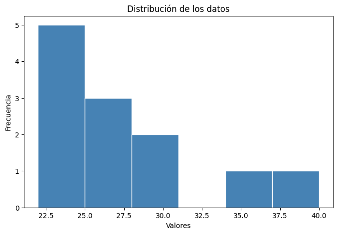
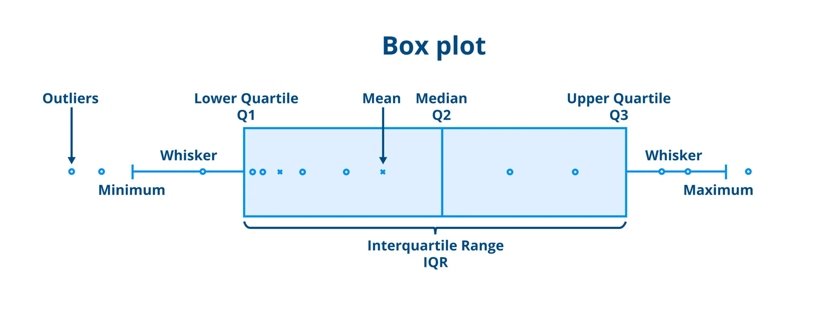
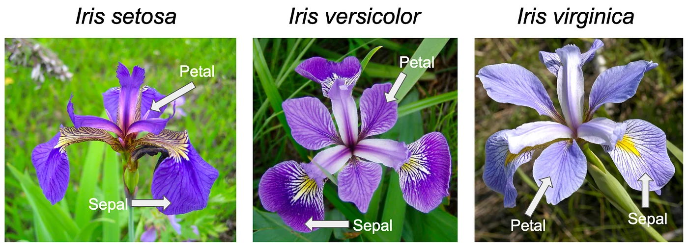
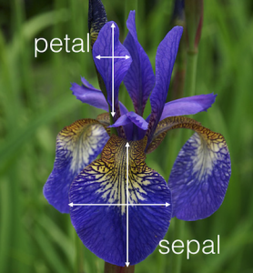
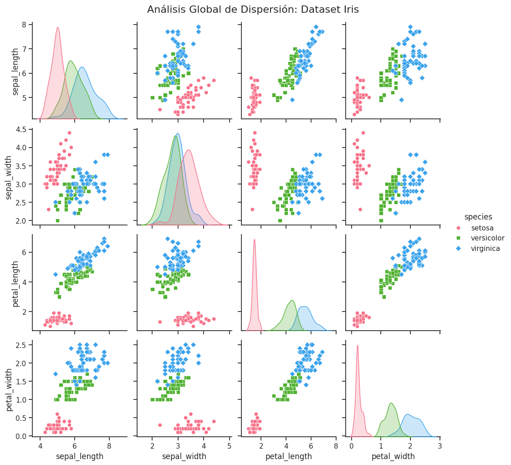

# Herramientas gráficas
Además de estas medidas, la estadística descriptiva utiliza diversas herramientas gráficas. Los **histogramas** son diagramas de barras que muestran la frecuencia de datos dentro de intervalos consecutivos, revelando la forma o distribución de los datos. Los **diagramas de caja (box plots)** visualizan la distribución de los datos a través de su cinco números resumen: mínimo, primer cuartil (Q1), mediana, tercer cuartil (Q3) y máximo, destacando eficazmente los valores atípicos. Otras medidas de posición incluyen los **cuartiles** (dividen los datos en cuatro partes iguales) y los **percentiles** (dividen los datos en cien partes iguales), que son útiles para evaluar el rendimiento relativo de una observación dentro de un grupo. En resumen, la estadística descriptiva es el proceso de limpieza, exploración y resumen inicial que prepara el camino para todas las fases posteriores del análisis de datos.

### Histogramas
Un histograma es una representación gráfica que organiza un conjunto de datos numéricos en intervalos (o "bins") y muestra la frecuencia de datos dentro de cada intervalo mediante barras. A diferencia de un gráfico de barras tradicional, que se utiliza para datos categóricos, un histograma es ideal para datos continuos y ayuda a visualizar la distribución de los datos.

<Tabs>
  <TabItem value="python1" label="Python" default>
```python
# Python con matplotlib
import matplotlib.pyplot as plt

datos = [22, 25, 22, 30, 25, 22, 40, 35, 25, 22, 28, 22]

plt.figure(figsize=(8, 5))
plt.hist(datos, bins=6, color='steelblue', edgecolor='white')
plt.title('Distribución de los datos')
plt.xlabel('Valores')
plt.ylabel('Frecuencia')
plt.show()
```

  </TabItem>
  <TabItem value="r1" label="R" default>
```r
# R
datos = [22, 25, 22, 30, 25, 22, 40, 35, 25, 22, 28, 22]
hist(datos, 
     main = "Distribución de los datos",
     xlab = "Valores",
     ylab = "Frecuencia",
     col = "steelblue",
     border = "white")
```
  </TabItem>
</Tabs>


### Diagramas de Caja (Box Plots)
Un diagrama de caja, o box plot, es una herramienta gráfica que resume la distribución de un conjunto de datos a través de sus cinco números resumen: 
- mínimo, 
- primer cuartil (Q1), 
- mediana, 
- tercer cuartil (Q3) y 
- máximo. 

El box plot muestra la mediana como una línea dentro de la caja, que representa el rango intercuartílico (IQR, por sus siglas en inglés), que es la distancia entre Q1 y Q3. Los "bigotes" se extienden desde la caja hasta los valores mínimo y máximo, excluyendo los valores atípicos, que se representan como puntos individuales fuera de los bigotes.


* *Box plot de ejemplo*


* *Box plot comparado con una función de densidad de probabilidad (PDF)*
* *Fuente: [Wikimedia Commons](https://commons.wikimedia.org/wiki/File:Boxplot_vs_PDF.svg)*

El boxplot muestra visualmente la mediana, cuartiles y valores atípicos:

<Tabs>
  <TabItem value="python2" label="Python" default>
```python
# Python
import matplotlib.pyplot as plt

datos = [14, 15, 22, 25, 22, 21, 24, 24, 30, 25, 22, 36, 40, 35, 36, 25, 22, 28, 22]

plt.figure(figsize=(10, 5))
plt.boxplot(datos, vert=False, patch_artist=True,
        boxprops=dict(facecolor='#D1E8FF', color='#004C99'),
        medianprops=dict(color='#CC0000', linewidth=2),
        flierprops=dict(marker='o', markerfacecolor='#FF8000', markersize=8))
plt.title('Diagrama de Caja')
plt.ylabel('Valores')
plt.show()
```

  </TabItem>
  <TabItem value="r2" label="R" default>
```r
# R
datos = c(14, 15, 22, 25, 22, 21, 24, 24, 30, 25, 22, 36, 40, 35, 36, 25, 22, 28, 22)
boxplot(datos, horizontal = TRUE,
        main = "Diagrama de Caja",
        ylab = "Valores",
        col = "lightblue")
```


  </TabItem>
</Tabs>

## Gráficas de tallo y hoja


## Diagramas de dispersión
Un diagrama de dispersión, o scatter plot, es una representación gráfica que utiliza puntos para mostrar la relación entre dos variables numéricas. Cada punto en el gráfico representa un par de valores correspondientes a las dos variables, con una variable representada en el eje X (horizontal) y la otra en el eje Y (vertical).

* *Diagrama de dispersión de ejemplo*
* Fuente: [Wikimedia Commons](https://commons.wikimedia.org/wiki/File:Scatter_diagram_for_quality_characteristic_XXX.svg)


### Iris Dataset
El conjunto de datos Iris es un conjunto de datos clásico en el campo del aprendizaje automático y la estadística. Fue introducido por el estadístico y biólogo Ronald A. Fisher en 1936 como un ejemplo para ilustrar técnicas de clasificación. El conjunto de datos contiene 150 muestras de flores de iris, divididas en tres especies diferentes: Iris setosa, Iris versicolor e Iris virginica. Cada muestra tiene cuatro características numéricas: longitud del sépalo, ancho del sépalo, longitud del pétalo y ancho del pétalo, todas medidas en centímetros. Estas características permiten a los investigadores y científicos de datos analizar y clasificar las flores en función de sus atributos físicos. El conjunto de datos Iris es ampliamente utilizado como un punto de partida para aprender y practicar técnicas de análisis de datos y aprendizaje automático debido a su simplicidad y claridad.

#### Referencias
- Freedman, D., Pisani, R., & Purves, R. (2007). *Statistics* (4th ed.). W. W. Norton & Company.




<Tabs>
  <TabItem value="python3" label="Python" default>
```python
# iris
import pandas as pd
import seaborn as sns
import matplotlib.pyplot as plt
import plotly.express as px
from sklearn.datasets import load_iris

def cargar_y_preparar_datos():
    """Carga el dataset Iris y lo convierte a un DataFrame de Pandas."""
    iris = load_iris()
    # Crear el DataFrame con los nombres de las características
    df = pd.DataFrame(data=iris.data, columns=iris.feature_names)
    # Añadir la columna de especies y mapear los nombres
    df['species'] = iris.target
    target_names = {0: 'setosa', 1: 'versicolor', 2: 'virginica'}
    df['species'] = df['species'].map(target_names)
    
    # Traducir los nombres de las columnas para facilitar la lectura (opcional)
    df.columns = [col.replace(' (cm)', '').replace(' ', '_') for col in df.columns]
    
    return df

def analisis_estatico_pairplot(df):
    """
    Crea una matriz de diagramas de dispersión (pairplot) para ver
    todas las combinaciones de características a la vez.
    """
    print("\nGenerando pairplot estático...")
    
    # Configurar el estilo
    sns.set_theme(style="ticks")
    
    # Crear el pairplot coloreado por especie
    pairplot = sns.pairplot(df, hue="species", palette="husl", markers=["o", "s", "D"])
    
    # Añadir un título general
    pairplot.fig.suptitle("Análisis Global de Dispersión: Dataset Iris", y=1.02, fontsize=16)
    
    plt.show()


# --- EJECUCIÓN DEL PROGRAMA ---

if __name__ == "__main__":
    print("==========================================")
    print("   ANÁLISIS DE DISPERSIÓN DEL DATASET IRIS")
    print("==========================================\n")
    
    # 1. Cargar datos
    iris_df = cargar_y_preparar_datos()
    
    # 2. Análisis Visual Global (Pairplot)
    analisis_estatico_pairplot(iris_df)

    print("\nAnálisis finalizado.")


```


  </TabItem>
  <TabItem value="r3" label="R" default>
```r
# ==============================================================================
# PROGRAMA EN R PARA ANALIZAR EL DATASET IRIS CON UN PAIRPLOT
# ==============================================================================

# --- PASO 1: INSTALACIÓN Y CARGA DE LIBRERÍAS ---

# Definimos las librerías necesarias
librerias_necesarias <- c("ggplot2", "GGally")

# Instalamos las librerías si no están instaladas
# (Esta sección es opcional si ya las tienes, pero útil para reproducibilidad)
for (lib in librerias_necesarias) {
  if (!require(lib, character.only = TRUE)) {
    message(paste("Instalando la librería:", lib))
    install.packages(lib, dependencies = TRUE)
    library(lib, character.only = TRUE)
  }
}

# --- PASO 2: CARGA Y PREPARACIÓN DE DATOS ---

# El dataset Iris está precargado en R, lo asignamos a una variable
data(iris)

# Renombramos las columnas al español para facilitar la lectura
names(iris) <- c("Largo.Sepalo", "Ancho.Sepalo", "Largo.Petalo", "Ancho.Petalo", "Especie")

# --- PASO 3: EXPLORACIÓN INICIAL (OPCIONAL) ---
# Mostramos las primeras filas y la estructura
message("\n--- Vista rápida de los datos ---")
print(head(iris))
message("\n--- Estructura de los datos ---")
print(str(iris))

# --- PASO 4: CREACIÓN DEL PAIRPLOT CON GGALLY ---

message("\nGenerando el Pairplot Chart...")

# Usamos la función ggpairs() de la librería GGally.
# Es la forma más potente de integrar el estilo de ggplot2 en matrices de gráficos.

pairplot <- ggpairs(
  data = iris,
  
  # 1. Columnas a incluir (todas menos 'Especie', que es la 5)
  columns = 1:4, 
  
  # 2. Asignación Estética Principal: Color por Especie
  # Esto colorea puntos, líneas y distribuciones por grupo.
  mapping = ggplot2::aes(color = Especie, alpha = 0.7),
  
  # 3. Configuración de los cuadrantes (Arriba, Abajo, Diagonal)
  upper = list(
    # Arriba: Mostrar coeficientes de correlación coloreados por grupo
    continuous = wrap("cor", size = 4, alignPercent = 0.8)
  ),
  lower = list(
    # Abajo: Mostrar diagramas de dispersión con una línea de tendencia suavizada
    continuous = wrap("smooth", alpha = 0.3, size = 0.1)
  ),
  diag = list(
    # Diagonal: Mostrar densidades (curvas) en lugar de histogramas
    continuous = wrap("densityDiag", alpha = 0.5)
  ),
  
  # 4. Título y Etiquetas
  title = "Matriz de Dispersión (Pairplot) del Dataset Iris"
)

# --- PASO 5: APLICAR ESTILO FINAL Y MOSTRAR EL GRÁFICO ---

# ggpairs devuelve un objeto especial que podemos "personalizar" con temas de ggplot2.
# Usamos un tema minimalista y movemos la leyenda al final.

pairplot_final <- pairplot + 
  theme_minimal() +
  theme(
    plot.title = element_text(face = "bold", size = 16, hjust = 0.5),
    strip.text = element_text(face = "bold"), # Etiquetas de ejes en la matriz
    legend.position = "bottom"
  )

# Mostramos el gráfico final en la ventana de Plots
print(pairplot_final)

message("\nAnálisis finalizado. El gráfico se ha generado en la pestaña 'Plots'.")

```

  </TabItem>
</Tabs>

