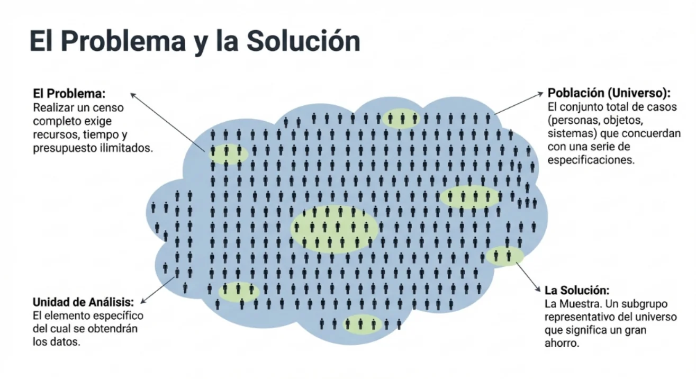
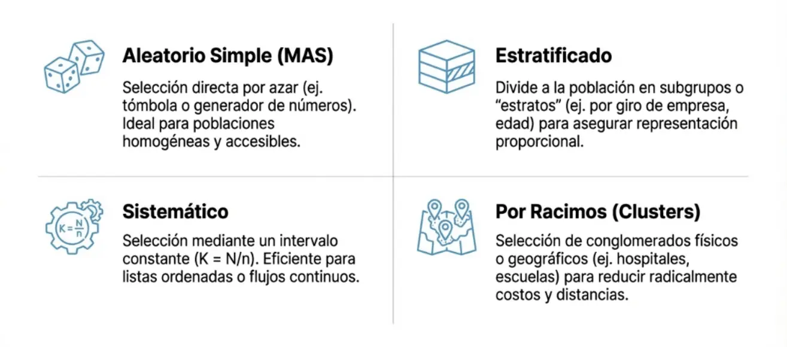
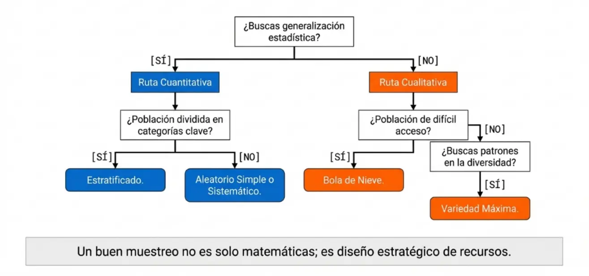

La calidad de la evidencia generada depende intrínsecamente del rigor aplicado en la obtención de los datos. Este proceso se divide en la selección de las fuentes, la aplicación de técnicas instrumentales y el diseño de estrategias de muestreo que garanticen la representatividad de la población.



## Técnicas de Recolección de Datos

La recolección de datos es el procedimiento sistemático para obtener información de las unidades de estudio. En salud, se distinguen según su origen:

*   **Fuentes Primarias:** Los datos se obtienen directamente del sujeto o fenómeno mediante observación directa, mediciones físicas (ej. presión arterial) o químicas (ej. niveles de glucosa), e interrogatorios (entrevistas o cuestionarios).
*   **Fuentes Secundarias:** Información proveniente de registros previos como historias clínicas electrónicas (EHR), censos poblacionales o bases de datos administrativas hospitalarias.

Para que la recolección sea científicamente válida, el investigador debe considerar la **especificidad** (distinguir la variable de interés de confusores) y la **sensibilidad** de la técnica.

## 1. Población y Muestra: El Fundamento de la Inferencia
La **Población** (o universo) se define como el conjunto total de elementos o unidades de análisis que comparten características comunes y que constituyen el objeto de interés en un estudio. En medicina, estas poblaciones pueden ser **finitas**, como los pacientes ingresados en una unidad de cuidados intensivos en un día determinado, o **infinitas/conceptuales**, como todos los pacientes futuros que podrían padecer una patología específica bajo ciertas condiciones experimentales.

La **Muestra** es un subconjunto representativo de la población, extraído con el fin de investigar características de la totalidad sin necesidad de realizar un censo, lo cual sería logística y económicamente inviable. La relación crítica radica en que los **parámetros** (medidas descriptivas de la población, como la media $\mu$) son estimados a través de los **estadísticos** (medidas calculadas en la muestra, como la media $\overline{x}$).

## 2. Técnicas de Muestreo Poblacional
El muestreo es el procedimiento científico que asegura que la muestra sea un reflejo fiel de la variabilidad biológica de la población objetivo. Se dividen principalmente en probabilísticos y no probabilísticos, siendo los primeros los únicos que permiten cuantificar el error aleatorio y realizar inferencias válidas.



## Muestreo Probabilístico (Aleatorio)

El muestreo probabilístico se fundamenta en que cada miembro de la población tiene una probabilidad conocida y mayor a cero de ser incluido en la muestra. Es el único método que permite realizar inferencias estadísticas válidas y cuantificar el error de muestreo.

Requiere obligatoriamente un **marco muestral** (*sampling frame*), que es el listado o mapa actualizado de todos los elementos de la población objetivo.

### Tipos y Aplicaciones:

### Muestreo Aleatorio Simple (MAS)

El **Muestreo Aleatorio Simple (MAS)** constituye el esquema fundamental de la teoría del muestreo probabilístico y es la técnica de referencia para la estadística inferencial. Se define rigurosamente como aquel procedimiento en el que cada unidad de la población tiene una probabilidad conocida, constante y mayor a cero de ser incluida en la muestra. Cada unidad experimental (paciente, registro clínico o muestra biológica) posea una probabilidad de inclusión conocida e idéntica, eliminando sesgos de selección sistemáticos. Se requiere de un **marco muestral** (lista exhaustiva de la población) y la selección se realiza mediante generadores de números aleatorios o sorteos.

Garantiza la independencia de las observaciones.

#### 1. Definición y Fundamento Teórico
El MAS se sustenta en la construcción de un **marco muestral** (*sampling frame*), que consiste en la lista exhaustiva y numerada de todos los elementos que componen la población objetivo. Matemáticamente, si extraemos una muestra aleatoria de una variable $X$ con media poblacional $\mu$ y varianza $\sigma^2$, los estimadores fundamentales operan bajo los siguientes principios:

1.  **Media Muestral ($\bar{X}$):** Es un estimador insesgado de $\mu$, calculado como:
    ```math
    \bar{X} = \frac{1}{n} \sum_{i=1}^{n} X_i
    ```
2.  **Varianza de la Media:** En poblaciones infinitas o con reemplazo, la varianza del estimador es:
    ```math
    V(\bar{X}) = \frac{\sigma^2}{n}
    ```
3.  **Factor de Corrección para Población Finita (FPC):** Cuando el muestreo es sin reemplazo y la fracción de muestreo ($n/N$) es significativa (generalmente $> 5\%$), se debe ajustar el error estándar mediante:
    ```math
    \sigma_{\bar{X}} = \frac{\sigma}{\sqrt{n}} \cdot \sqrt{\frac{N-n}{N-1}}
    ```
*   **Error Estándar (SE):** Cuantifica la variabilidad del estimador y se reduce a medida que aumenta el tamaño de la muestra ($n$):
    ```math
    SE(\bar{x}) = \frac{\sigma}{\sqrt{n}}
    ```
    *(Si $n$ representa más del 5% de la población, se debe aplicar el factor de corrección para población finita: $\sqrt{\frac{N-n}{N-1}}$)*.


El MAS garantiza que los estadísticos calculados sean **estimadores insesgados** de los parámetros poblacionales. 
*   **Media Muestral ($\bar{x}$):** Su valor esperado coincide con la media poblacional ($\mu$), es decir, $E(\bar{X}) = \mu$. Se calcula como:
    ```math
    \bar{x} = \frac{\sum_{i=1}^{n} x_i}{n}
    ```


El uso del FPC es crítico en estudios de salud de comunidades pequeñas, ya que reduce la varianza estimada al reconocer que se ha capturado una proporción importante de la información total de la población.

Este método puede realizarse bajo dos modalidades:
*   **Sin reemplazo:** Un elemento no puede ser seleccionado más de una vez para la misma muestra. Es el estándar en la investigación clínica.
*   **Con reemplazo:** Cada elemento seleccionado se reintegra a la población antes de la siguiente extracción, permitiendo que una unidad aparezca múltiples veces.

#### Formulación Matemática
Para una población finita de tamaño $N$, el número total de muestras posibles ($M$) de tamaño $n$ sin reemplazo se determina mediante la combinación:

```math
M = \binom{N}{n} = \frac{N!}{(N-n)!n!}
```

Bajo este supuesto, la probabilidad de seleccionar cualquier muestra específica es:
```math
P(\text{muestra}) = \frac{1}{M}
```

La probabilidad individual de que cualquier unidad sea incluida en la muestra es $n/N$.

#### 2. Requisitos Operativos
Para la ejecución técnica de un MAS en un entorno clínico u hospitalario, se requieren dos elementos críticos:
1.  **Marco Muestral:** Un listado, mapa o base de datos exhaustiva y actualizada que identifique a todos los elementos de la población objetivo, numerados secuencialmente del $1$ al $N$.
2.  **Mecanismo de Aleatorización:** La selección debe basarse estrictamente en el azar, utilizando herramientas como tablas de números aleatorios, generadores computacionales, calculadoras (función `RAN#`) o software especializado como Excel (`ALEATORIO.ENTRE`) u OpenEpi.



#### 4. Usos y Limitaciones
**Usos:** Es ideal cuando la población es homogénea y las unidades están concentradas en un área pequeña, facilitando la enumeración. Es la base para diseños más complejos como el muestreo estratificado o por conglomerados.

**Limitaciones:** Su principal desventaja es la dificultad técnica y el costo de elaborar marcos muestrales completos en poblaciones extensas. Además, si la característica de interés presenta una varianza elevada (coeficiente de variación $> 30\%$), se requiere un tamaño de muestra considerablemente grande para mantener la precisión.

En la práctica clínica y epidemiológica, el MAS se aplica en escenarios diversos:
*   **Auditoría de Calidad:** Selección de 5 expedientes clínicos electrónicos de una base de datos de 1.000 para verificar la integridad de los datos codificados.

*   **Ensayos Clínicos Controlados:** Asignación aleatoria de 50 especímenes de laboratorio o sujetos a grupos de tratamiento y control para garantizar la comparabilidad basal.

*   **Estudios de Prevalencia:** Selección de una muestra de ciudadanos para estimar la tasa de vacunación o la incidencia de enfermedades raras como la poliomielitis.


<br />
#### 📝 Programación:
<Tabs>
<TabItem value="mas" label="Antecedente" default>
Considere un investigador que desea auditar la calidad de los registros clínicos en una base de datos hospitalaria que contiene $N = 1000$ archivos de pacientes. Para obtener una muestra aleatoria simple de $n = 5$ archivos, el investigador debe:
1.  Asignar un número de identificación del 1 al 1000 a cada registro.
2.  Generar una secuencia de números aleatorios mediante un algoritmo computacional.
3.  Seleccionar los registros cuyos números coincidan con los generados, excluyendo repeticiones si el muestreo es sin reemplazo.
</TabItem>
<TabItem value="python" label="Pyhton" >
```python
# Implementación en Python
# MAS
import random

# Configuración inicial
N = 1000  # Población total de archivos
n = 5     # Tamaño de la muestra deseada

# 1. Asignar un número de identificación del 1 al 1000 a cada registro.
# Creamos una lista que represente nuestra base de datos de IDs.
registros_clinicos = list(range(1, N + 1))

# 2. Generar una secuencia de números aleatorios y 
# 3. Seleccionar los registros coincidentes excluyendo repeticiones.
# random.sample garantiza que los elementos seleccionados sean únicos.
muestra_seleccionada = random.sample(registros_clinicos, n)

# Mostrar resultados
print(f"Auditoría de Calidad - Registros Clínicos")
print(f"Población total (N): {N}")
print(f"Tamaño de muestra (n): {n}")
print("-" * 30)
print(f"Archivos de pacientes seleccionados para revisión: {muestra_seleccionada}")
```
</TabItem>
<TabItem value="r" label="R" default>
```r
# Implementación en R
# MAS
# Parámetros del estudio
N <- 1000  # Total de la población (archivos)
n <- 5     # Tamaño de la muestra

# PASO 1: Asignar un número de identificación del 1 al 1000 a cada registro
# Creamos un vector que representa los IDs de los registros clínicos
registros_clinicos <- 1:N

# PASO 2 y 3: Generar secuencia aleatoria y seleccionar registros (sin reemplazo)
# La función sample() selecciona 'n' elementos del vector de forma aleatoria.
# El argumento 'replace = FALSE' asegura que no haya repeticiones.
muestra_seleccionada <- sample(registros_clinicos, size = n, replace = FALSE)

# Mostrar los resultados
cat("Auditoría de registros clínicos\n")
cat("Población total:", N, "\n")
cat("Tamaño de muestra:", n, "\n")
cat("Archivos seleccionados (IDs):", muestra_seleccionada, "\n")
```
</TabItem>
</Tabs>

<br />

### Muestreo Estratificado

El **muestreo aleatorio estratificado (MAE)** es un método de muestreo probabilístico diseñado para optimizar la precisión de las estimaciones estadísticas cuando se trabaja con poblaciones heterogéneas. Este procedimiento consiste en particionar la población total ($N$) en subgrupos mutuamente excluyentes y colectivamente exhaustivos denominados **estratos**, los cuales deben ser internamente homogéneos con respecto a la característica de estudio, pero heterogéneos entre sí.

Tras la división, se procede a realizar un muestreo aleatorio simple (MAS) de forma independiente dentro de cada estrato para conformar la muestra global ($n$).

#### 1. Fundamento Matemático y Estimación

El uso del MAE permite reducir el error de muestreo en comparación con el muestreo aleatorio simple, ya que garantiza que las características críticas de la población queden debidamente representadas.

#### Media Aritmética Estratificada ($\bar{x}_{st}$)
El estimador de la media poblacional en un diseño estratificado se calcula mediante una media ponderada de las medias obtenidas en cada estrato:

```math
\bar{x}_{st} = \sum_{h=1}^{L} W_h \bar{x}_h = \frac{\sum_{h=1}^{L} N_h \bar{x}_h}{N}
```

**Significado de sus componentes:**
*   **$L$**: Número total de estratos definidos en la población.
*   **$N_h$**: Tamaño de la población dentro del estrato $h$.
*   **$N$**: Tamaño total de la población ($N = \sum N_h$).
*   **$\bar{x}_h$**: Media aritmética observada en la muestra del estrato $h$.
*   **$W_h$**: Peso relativo o proporción del estrato $h$ en la población ($W_h = N_h / N$).

#### 2. Métodos de Afijación (Distribución de la Muestra)

La determinación de cuántas unidades de observación ($n_h$) deben extraerse de cada estrato es crucial para la eficiencia del diseño. Se distinguen tres técnicas principales:

1.  **Afijación Igual:** Se selecciona el mismo número de unidades para cada estrato, independientemente de su tamaño poblacional ($n_h = n / L$). Es útil cuando se desea obtener información detallada de cada subgrupo por separado.
2.  **Afijación Proporcional:** El tamaño de la muestra en cada estrato es proporcional a su peso en la población ($n_h = n \cdot W_h$). Es el método más común pues mantiene la representatividad de la estructura poblacional en la muestra.
3.  **Afijación Óptima (Neyman):** El tamaño de $n_h$ se determina considerando tanto el tamaño del estrato como su variabilidad interna ($\sigma_h$) y el costo unitario de muestreo ($C_h$). Su objetivo es minimizar el error de estimación para un costo total dado.

#### 3. Aplicaciones

El muestreo estratificado es la herramienta de elección en la investigación clínica y epidemiológica por varias razones estratégicas:
*   **Control de Confusión:** Permite evaluar la asociación entre una exposición y una patología controlando variables de confusión mediante la estratificación por niveles (ej. edad, sexo o severidad clínica).
*   **Representatividad de Grupos Minoritarios:** En estudios sobre enfermedades raras, asegura que los subgrupos de interés con baja prevalencia tengan presencia suficiente en la muestra final para permitir inferencias válidas.
*   **Análisis Multicéntrico:** Facilita la gestión administrativa de estudios realizados en múltiples hospitales o regiones geográficas, tratando a cada centro como un estrato independiente.

<br />
#### 📝 Programación:
<Tabs>
<TabItem value="python" label="Pyhton" default>
```python
# Implementación en Python
```
</TabItem>
<TabItem value="r" label="R" default>
```r
# Implementación en R
```
</TabItem>
</Tabs>

<br />

### Muestreo por Conglomerados

El **Muestreo por Conglomerados** (o por racimos) es una técnica de muestreo probabilístico en la que las unidades de muestreo no son individuos aislados, sino conjuntos o agrupaciones naturales de elementos denominados "conglomerados". En la investigación a gran escala, este método es esencial cuando la población es muy numerosa, se encuentra geográficamente dispersa o cuando no se dispone de un marco muestral (listado detallado) de todos los individuos, pero sí de las agrupaciones que los contienen.

#### 1. Fundamento y Lógica del Diseño
A diferencia del muestreo estratificado —donde se busca homogeneidad interna en los estratos y heterogeneidad entre ellos—, el muestreo por conglomerados opera bajo la premisa inversa: se espera que cada conglomerado sea lo más **heterogéneo** posible en su interior (una "pequeña réplica" de la población total) y que exista **homogeneidad** entre los distintos conglomerados.

Desde una perspectiva técnica, el proceso consiste en:
1.  Dividir la población total en $N$ grupos mutuamente excluyentes y colectivamente exhaustivos (ej. hospitales, manzanas, escuelas).
2.  Seleccionar aleatoriamente una muestra de $n$ conglomerados.
3.  Realizar el estudio sobre los elementos pertenecientes a los conglomerados seleccionados.

#### 2. Clasificación según Etapas de Selección
El diseño puede variar en complejidad dependiendo de si se analizan todos los elementos del racimo o solo una parte:

*   **Muestreo Monoetápico (Una etapa):** Una vez seleccionados los conglomerados al azar, se registra la información de **todos** los elementos que los integran.

*   **Muestreo Bietápico (Dos etapas):** Tras seleccionar los conglomerados (unidades primarias), se realiza un segundo muestreo aleatorio simple dentro de cada uno de ellos para elegir a los sujetos finales (unidades secundarias).

*   **Muestreo Polietápico (Multietápico):** Es una generalización que implica múltiples fases de selección (ej. Ciudad $\rightarrow$ Barrios $\rightarrow$ Manzanas $\rightarrow$ Viviendas $\rightarrow$ Individuos).

#### 3. Estimadores Matemáticos
En el muestreo por conglomerados de una etapa con tamaños desiguales, el estimador de la media poblacional ($\overline{X}_{cl}$) se comporta como un estimador de razón:

```math
\overline{X}_{cl} = \frac{\sum_{i=1}^{n} x_i}{\sum_{i=1}^{n} m_i}
```

**Significado de sus componentes:**
*   **$n$**: Número de conglomerados seleccionados en la muestra.
*   **$x_i$**: Suma de los valores de la variable en el $i$-ésimo conglomerado.
*   **$m_i$**: Número de elementos (tamaño) del $i$-ésimo conglomerado.
*   **Nota:** Este estimador es técnicamente sesgado si no se conoce el total de elementos de la población ($M$), pero el sesgo suele ser despreciable en muestras grandes.

#### 4. Ventajas y Desventajas Técnicas
**Ventajas:**
*   **Eficiencia de Costos:** Reduce drásticamente los gastos de transporte y logística, ya que el investigador solo se traslada a los puntos seleccionados en lugar de recorrer toda la región.
*   **Viabilidad:** Es el único método práctico cuando no existe un listado previo de la población objetivo.

**Desventajas:**
*   **Error de Muestreo Elevado:** Generalmente presenta un error estándar mayor que el muestreo aleatorio simple (MAS) para un mismo tamaño de muestra. Esto se debe a que los elementos dentro de un conglomerado tienden a parecerse entre sí (correlación intraclase).
*   **Complejidad Analítica:** Requiere fórmulas de estimación más sofisticadas que el MAS.

#### 5. Aplicaciones en Salud
Este muestreo es la herramienta de elección en:
*   **Ensayos Comunitarios:** Donde la intervención se aplica a grupos completos (ej. fluoración del agua en ciudades aleatorizadas o programas educativos en centros de salud específicos).
*   **Auditorías Clínicas:** Selección de centros hospitalarios para evaluar la calidad de los registros electrónicos de salud.
*   **Vigilancia Epidemiológica:** Estudios sobre la prevalencia de patologías infecciosas en áreas geográficas extensas.

<br />
#### 📝 Programación:
<Tabs>
<TabItem value="python" label="Pyhton" default>
```python
# Implementación en Python
```
</TabItem>
<TabItem value="r" label="R" default>
```r
# Implementación en R
```
</TabItem>
</Tabs>

<br />

### Muestreo Sistemático

El **Muestreo Sistemático** es un procedimiento de selección probabilística que se fundamenta en la extracción de elementos a intervalos regulares a lo largo de una lista ordenada de la población. Este método se valora por su simplicidad operativa y su capacidad para garantizar una cobertura uniforme de la población objetivo cuando se dispone de marcos muestrales organizados cronológica o alfabéticamente.

#### 1. Fundamento Matemático y Procedimiento

La ejecución técnica del muestreo sistemático requiere la determinación de dos componentes críticos: el intervalo de selección y el punto de arranque aleatorio.

**A. Cálculo del Intervalo de Muestreo ($k$)**

El intervalo de muestreo, denotado frecuentemente como $k$, representa la distancia numérica entre dos unidades consecutivas seleccionadas para la muestra. Se calcula mediante la razón:

```math
k = \frac{N}{n}
```

**Significado de sus componentes:**
*   **$N$**: Tamaño total de la población o universo.
*   **$n$**: Tamaño de la muestra deseado.
*   **$k$**: Intervalo de salto; si el resultado no es entero, se recomienda redondear al número superior más cercano para mantener el rigor del diseño.

**B. Selección del Punto de Arranque ($m$)**

Para que el muestreo mantenga su naturaleza probabilística, el primer elemento debe elegirse estrictamente al azar. Se selecciona un número aleatorio $m$ tal que $1 \le m \le k$. Este número $m$ identifica la primera unidad de la lista que formará parte de la muestra, denominada "punto de arranque".

#### C. Secuencia de Selección
Una vez establecido $m$, la muestra se compone de los elementos situados en las posiciones:

```math
\{e_m, e_{m+k}, e_{m+2k}, e_{m+3k}, \dots, e_{m+(n-1)k}\}
```
Este proceso se repite automáticamente hasta completar el tamaño muestral $n$.

#### 2. Aplicaciones

Este método es particularmente útil en entornos clínicos donde los pacientes o registros ingresan de forma secuencial. Por ejemplo, en una auditoría de historias clínicas electrónicas, si se desea analizar $n=100$ registros de una base de $N=1000$, se calcula un intervalo $k=10$. Si el punto de arranque aleatorio es 8, se auditarán los expedientes 8, 18, 28, y así sucesivamente.

También se aplica en el control de calidad de procesos hospitalarios, como la revisión del cumplimiento de protocolos por parte del personal, seleccionando, por ejemplo, cada décima tarjeta de registro diario.

#### 3. Ventajas y Consideraciones Críticas

*   **Eficiencia y Simplicidad:** Es más directo y económico que el muestreo aleatorio simple (MAS), ya que solo requiere una selección al azar inicial.

*   **Representatividad:** Cuando el orden de la lista refleja una tendencia (como el aumento de severidad clínica o el tiempo), el muestreo sistemático suele ser más preciso que el MAS al asegurar que todas las secciones de la población queden representadas.

*   **Riesgo de Periodicidad:** Un peligro inherente es la existencia de "periodicidades ocultas" en la lista que coincidan con el intervalo $k$. Si, por ejemplo, se analiza la ocupación hospitalaria cada 7 días y el intervalo cae siempre en domingo, la muestra estará sesgada y no representará la variabilidad real de la semana.

*   **Muestreo Circular:** En casos donde $N/n$ no es un número entero, se puede emplear el "muestreo circular", donde la lista se trata como si el último elemento estuviera conectado al primero, garantizando que todos los elementos tengan la misma probabilidad de ser elegidos.


<br />
#### 📝 Programación:
<Tabs>
<TabItem value="python" label="Pyhton" default>
```python
# Implementación en Python
```
</TabItem>
<TabItem value="r" label="R" default>
```r
# Implementación en R
```
</TabItem>
</Tabs>

<br />

## Muestreo No Probabilístico

En este modelo, la selección de los sujetos no depende del azar, sino del criterio del investigador o la accesibilidad de las unidades. Sus resultados no son generalizables a la población general, independientemente del tamaño de la muestra.

### Tipos y Aplicaciones:
*   **Muestreo por Conveniencia:** Selección de sujetos fácilmente accesibles (ej. pacientes voluntarios en una sala de espera). Es común en estudios piloto iniciales.
*   **Muestreo por Cuotas:** Se fijan cantidades específicas de sujetos con ciertas características (ej. 50 hombres y 50 mujeres) pero la selección final es a criterio del entrevistador.
*   **Muestreo de Casos Consecutivos:** Se incluyen todos los pacientes que cumplen con los criterios de elegibilidad durante un periodo de tiempo determinado. Es el método no probabilístico que más se aproxima al rigor del muestreo aleatorio en investigación clínica.
*   **Muestreo en Bola de Nieve:** Los sujetos estudiados reclutan a otros participantes. Es vital para estudiar poblaciones de difícil acceso o estigmatizadas (ej. usuarios de drogas inyectables).

### Aplicaciones
El dominio de estas técnicas permite al informático médico diseñar sistemas de soporte a la decisión basados en datos robustos, validar algoritmos de *machine learning* con muestras representativas y realizar vigilancia epidemiológica precisa a través de la integración de fuentes primarias y secundarias.


<br />
#### 📝 Programación:
<Tabs>
<TabItem value="python" label="Pyhton" default>
```python
# Implementación en Python
```
</TabItem>
<TabItem value="r" label="R" default>
```r
# Implementación en R
```
</TabItem>
</Tabs>