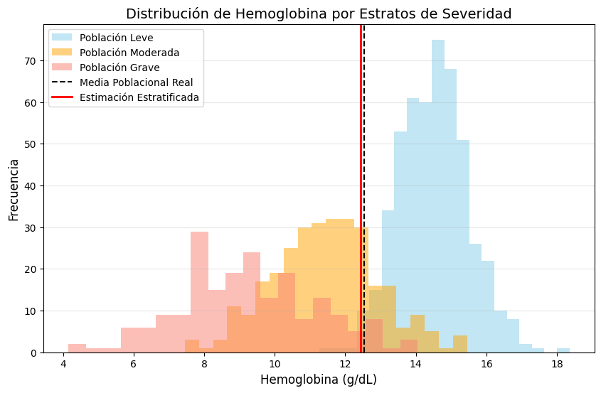
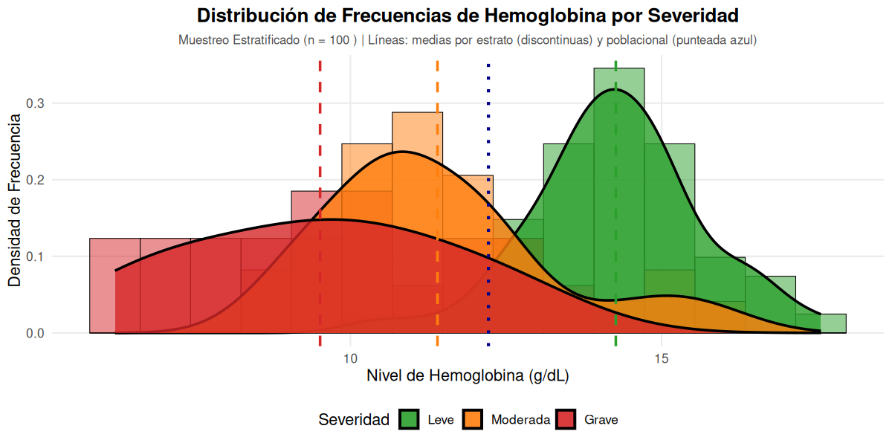

En el marco de toda investigación biomédica o no, la capacidad de generalizar hallazgos desde un grupo reducido hacia una colectividad es fundamental. Este proceso se sustenta en la relación lógica entre población y muestra, mediada por técnicas de muestreo que garantizan la validez de la inferencia estadística.

La calidad de la evidencia generada depende intrínsecamente del rigor aplicado en la obtención de los datos. Este proceso se divide en la selección de los orígenes de datos, la aplicación de técnicas instrumentales y el diseño de estrategias de muestreo que garanticen la representatividad de la población.


## Técnicas de Recolección de Datos

La recolección de datos es el procedimiento sistemático para obtener información de las unidades de estudio. En salud, se distinguen según su origen:

*   **Primarias:** Los datos se obtienen directamente del sujeto o fenómeno mediante observación directa, mediciones físicas (ej. presión arterial) o químicas (ej. niveles de glucosa), e interrogatorios (entrevistas o cuestionarios).
*   **Secundarias:** Información proveniente de registros previos como historias clínicas electrónicas (EHR), censos poblacionales o bases de datos administrativas hospitalarias.

Para que la recolección sea científicamente válida, el investigador debe considerar la **especificidad** (distinguir la variable de interés de confusores) y la **sensibilidad** de la técnica.

## Población y Muestra: El Fundamento de la Inferencia
La **Población** (o universo) se define como el conjunto total de elementos o unidades de análisis que comparten características comunes y que constituyen el objeto de interés en un estudio. En medicina, estas poblaciones pueden ser **finitas**, como los pacientes ingresados en una unidad de cuidados intensivos en un día determinado, o **infinitas/conceptuales**, como todos los pacientes futuros que podrían padecer una patología específica bajo ciertas condiciones experimentales.

La **Muestra** es un subconjunto representativo de la población, extraído con el fin de investigar características de la totalidad sin necesidad de realizar un censo, lo cual sería logística y económicamente inviable. La relación crítica radica en que los **parámetros** (medidas descriptivas de la población, como la media $\mu$) son estimados a través de los **estadísticos** (medidas calculadas en la muestra, como la media $\overline{x}$).

## Técnicas de Muestreo Poblacional
El muestreo es el procedimiento científico que asegura que la muestra sea un reflejo fiel de la variabilidad biológica de la población objetivo. Se dividen principalmente en probabilísticos y no probabilísticos, siendo los primeros los únicos que permiten cuantificar el error aleatorio y realizar inferencias válidas.


### Muestreo Aleatorio Simple

El **Muestreo Aleatorio Simple (MAS)** constituye el esquema fundamental de la teoría del muestreo probabilístico y es la técnica de referencia para la estadística inferencial. Se define como aquel procedimiento en el que cada unidad de la población tiene una probabilidad conocida, constante y mayor a cero de ser incluida en la muestra. Cada unidad experimental (paciente, registro clínico o muestra biológica) posea una probabilidad de inclusión conocida e idéntica, eliminando sesgos de selección sistemáticos. Requiere obligatoriamente un **marco muestral** (*sampling frame*), que es el listado o mapa actualizado de todos los elementos de la población objetivo y la selección se realiza mediante generadores de números aleatorios o sorteos.

Garantiza la independencia de las observaciones.

#### Definición y Fundamento Teórico
El MAS se sustenta en la construcción de un **marco muestral** (*sampling frame*), que consiste en la lista exhaustiva y numerada de todos los elementos que componen la población objetivo. Matemáticamente, si extraemos una muestra aleatoria de una variable $X$ con media poblacional $\mu$ y varianza $\sigma^2$, los estimadores fundamentales operan bajo los siguientes principios:

1.  **Media Muestral ($\bar{X}$):** Es un estimador insesgado de $\mu$, calculado como:
    ```math
    \bar{X} = \frac{1}{n} \sum_{i=1}^{n} X_i
    ```
2.  **Varianza de la Media:** En poblaciones infinitas o con reemplazo, la varianza del estimador es:
    ```math
    V(\bar{X}) = \frac{\sigma^2}{n}
    ```
3.  **Factor de Corrección para Población Finita (FPC):** Cuando el muestreo es sin reemplazo y la fracción de muestreo ($n/N$) es significativa (generalmente $> 5\%$), se debe ajustar el error estándar mediante:
    ```math
    \sigma_{\bar{X}} = \frac{\sigma}{\sqrt{n}} \cdot \sqrt{\frac{N-n}{N-1}}
    ```
*   **Error Estándar (SE):** Cuantifica la variabilidad del estimador y se reduce a medida que aumenta el tamaño de la muestra ($n$):
    ```math
    SE(\bar{x}) = \frac{\sigma}{\sqrt{n}}
    ```
* *(Si $n$ representa más del 5% de la población, se debe aplicar el factor de corrección para población finita: $\sqrt{\frac{N-n}{N-1}}$)*.


El MAS garantiza que los estadísticos calculados sean **estimadores insesgados** de los parámetros poblacionales. 
*   **Media Muestral ($\bar{x}$):** Su valor esperado coincide con la media poblacional ($\mu$), es decir, $E(\bar{X}) = \mu$. Se calcula como:
    ```math
    \bar{x} = \frac{\sum_{i=1}^{n} x_i}{n}
    ```

El uso del FPC es crítico en estudios de salud de comunidades pequeñas, ya que reduce la varianza estimada al reconocer que se ha capturado una proporción importante de la información total de la población.

Este método puede realizarse bajo dos modalidades:
*   **Sin reemplazo:** Un elemento no puede ser seleccionado más de una vez para la misma muestra. Es el estándar en la investigación clínica.
*   **Con reemplazo:** Cada elemento seleccionado se reintegra a la población antes de la siguiente extracción, permitiendo que una unidad aparezca múltiples veces.

#### Formulación Matemática
Para una población finita de tamaño $N$, el número total de muestras posibles ($M$) de tamaño $n$ sin reemplazo se determina mediante la combinación:

```math
M = \binom{N}{n} = \frac{N!}{(N-n)!n!}
```

Bajo este supuesto, la probabilidad de seleccionar cualquier muestra específica es:
```math
P(\text{muestra}) = \frac{1}{M}
```

La probabilidad individual de que cualquier unidad sea incluida en la muestra es $n/N$.

#### Requisitos Operativos
Para la ejecución técnica de un MAS en un entorno clínico u hospitalario, se requieren dos elementos críticos:
1.  **Marco Muestral:** Un listado, mapa o base de datos exhaustiva y actualizada que identifique a todos los elementos de la población objetivo, numerados secuencialmente del $1$ al $N$.
2.  **Mecanismo de Aleatorización:** La selección debe basarse estrictamente en el azar, utilizando herramientas como tablas de números aleatorios, generadores computacionales, calculadoras (función `RAN#`) o software especializado como Excel (`ALEATORIO.ENTRE`) u OpenEpi.


#### Implementación en el Entorno R

El lenguaje R ofrece herramientas robustas para la ejecución del MAS, permitiendo la reproducibilidad científica mediante la fijación de la semilla del generador de números pseudoaleatorios.

<details>
<summary>R: Selección de una muestra desde un marco muestral</summary>

**Ejemplo 1:** Para seleccionar 10 pacientes aleatorios de un listado de 355 registrados en un sistema hospitalario:

```r showLineNumbers
set.seed(123) # Garantiza reproducibilidad
poblacion_id <- 1:355 # Marco muestral numerado
muestra <- sample(poblacion_id, size = 10, replace = FALSE) # MAS sin reemplazo
print(muestra)
```
**Ejemplo 2:** Simulación de la distribución del peso al nacer en una población normal para evaluar la media muestral:
```r showLineNumbers
# Generación de una población hipotética de pesos (n=1000, media=3100g, sd=500g)
poblacion_pesos <- rnorm(1000, mean = 3100, sd = 500)

# Extracción de una MAS de 50 pesos
muestra_pesos <- sample(poblacion_pesos, size = 50)

# Cálculo de la media y error típico
media_obs <- mean(muestra_pesos)
error_tipico <- sd(muestra_pesos) / sqrt(50)
```
</details>

#### Usos y Limitaciones
**Usos:** Es ideal cuando la población es homogénea y las unidades están concentradas en un área pequeña, facilitando la enumeración. Es la base para diseños más complejos como el muestreo estratificado o por conglomerados.

**Limitaciones:** Su principal desventaja es la dificultad técnica y el costo de elaborar marcos muestrales completos en poblaciones extensas. Además, si la característica de interés presenta una varianza elevada (coeficiente de variación $> 30\%$), se requiere un tamaño de muestra considerablemente grande para mantener la precisión.

En la práctica clínica y epidemiológica, el MAS se aplica en escenarios diversos:
* **Auditoría de Calidad:** Selección de 5 expedientes clínicos electrónicos de una base de datos de 1.000 para verificar la integridad de los datos codificados.

* **Ensayos Clínicos Controlados:** Asignación aleatoria de 50 especímenes de laboratorio o sujetos a grupos de tratamiento y control para garantizar la comparabilidad basal.

* **Estudios de Prevalencia:** Selección de una muestra de ciudadanos para estimar la tasa de vacunación o la incidencia de enfermedades raras como la poliomielitis.

#### Diferenciación Conceptual Importante
Es imperativo distinguir entre el muestreo **con reemplazo** y **sin reemplazo**. El muestreo con reemplazo se modela mediante una distribución binomial, permitiendo que un mismo individuo sea seleccionado múltiples veces; sin embargo, en biomedicina es estándar el muestreo sin reemplazo (hipergeométrico), ya que carece de sentido clínico evaluar el mismo sujeto dos veces como si fueran entidades independientes.

<br />
#### 📝 Programación:
<Tabs>
<TabItem value="mas" label="Antecedente" default>
<div class="alert alert--primary">
Considere un investigador que desea auditar la calidad de los registros clínicos en una base de datos hospitalaria que contiene $N = 1000$ archivos de pacientes. Para obtener una muestra aleatoria simple de $n = 5$ archivos, el investigador debe:
1.  Asignar un número de identificación del 1 al 1000 a cada registro.
2.  Generar una secuencia de números aleatorios mediante un algoritmo computacional.
3.  Seleccionar los registros cuyos números coincidan con los generados, excluyendo repeticiones si el muestreo es sin reemplazo.
</div>
</TabItem>
<TabItem value="python" label="Pyhton" >
```python showLineNumbers
# Implementación en Python
# MAS
import random

# Configuración inicial
N = 1000  # Población total de archivos
n = 5     # Tamaño de la muestra deseada

# 1. Asignar un número de identificación del 1 al 1000 a cada registro.
# Creamos una lista que represente nuestra base de datos de IDs.
registros_clinicos = list(range(1, N + 1))

# 2. Generar una secuencia de números aleatorios y 
# 3. Seleccionar los registros coincidentes excluyendo repeticiones.
# random.sample garantiza que los elementos seleccionados sean únicos.
muestra_seleccionada = random.sample(registros_clinicos, n)

# Mostrar resultados
print(f"Auditoría de Calidad - Registros Clínicos")
print(f"Población total (N): {N}")
print(f"Tamaño de muestra (n): {n}")
print("-" * 30)
print(f"Archivos de pacientes seleccionados para revisión: {muestra_seleccionada}")
```
</TabItem>
<TabItem value="r" label="R" default>
```r showLineNumbers
# Implementación en R
# MAS
# Parámetros del estudio
N <- 1000  # Total de la población (archivos)
n <- 5     # Tamaño de la muestra

# PASO 1: Asignar un número de identificación del 1 al 1000 a cada registro
# Creamos un vector que representa los IDs de los registros clínicos
registros_clinicos <- 1:N

# PASO 2 y 3: Generar secuencia aleatoria y seleccionar registros (sin reemplazo)
# La función sample() selecciona 'n' elementos del vector de forma aleatoria.
# El argumento 'replace = FALSE' asegura que no haya repeticiones.
muestra_seleccionada <- sample(registros_clinicos, size = n, replace = FALSE)

# Mostrar los resultados
cat("Auditoría de registros clínicos\n")
cat("Población total:", N, "\n")
cat("Tamaño de muestra:", n, "\n")
cat("Archivos seleccionados (IDs):", muestra_seleccionada, "\n")
```
</TabItem>
</Tabs><br />

<br />

### Muestreo Estratificado

El **muestreo aleatorio estratificado (MAE)** es un método de muestreo probabilístico diseñado para optimizar la precisión de las estimaciones estadísticas cuando se trabaja con poblaciones heterogéneas. Este procedimiento consiste en particionar la población total ($N$) en subgrupos mutuamente excluyentes y colectivamente exhaustivos denominados **estratos**, los cuales deben ser internamente homogéneos con respecto a la característica de estudio, pero heterogéneos entre sí. Este método es superior al muestreo aleatorio simple (MAS) cuando se identifican variables (estratos) que influyen significativamente en la variable de respuesta, permitiendo reducir la varianza del error de estimación.

Tras la división, se procede a realizar un muestreo aleatorio simple (MAS) de forma independiente dentro de cada estrato para conformar la muestra global ($n$).

* **Significado:** Reduce el error de muestreo al controlar la variabilidad interna de los grupos.
* **Fórmula de asignación proporcional:** 
    ```math
    n_h = n \cdot \left(\frac{N_h}{N}\right)
    ```
    Donde $n_h$ es el tamaño de la muestra en el estrato, $n$ el tamaño de la muestra total, $N_h$ el tamaño del estrato en la población y $N$ el total de la población.

#### 1. Fundamentación

El uso del MAE permite reducir el error de muestreo en comparación con el muestreo aleatorio simple, ya que garantiza que las características críticas de la población queden debidamente representadas.

El MAE consiste en dividir la población total de tamaño $N$ en $L$ subpoblaciones o **estratos** mutuamente excluyentes y colectivamente exhaustivos, de tamaños $N_1, N_2, \dots, N_L$, de tal manera que $\sum_{h=1}^{L} N_h = N$. Una vez definidos, se extrae una muestra aleatoria simple (MAS) de tamaño $n_h$ de cada estrato de forma independiente.

#### Media Aritmética Estratificada ($\bar{x}_{st}$)
El estimador de la media poblacional en un diseño estratificado ($\bar{x}_{st}$), se calcula mediante una media ponderada de las medias obtenidas en cada estrato ($\bar{x}_h$):

```math
\bar{x}_{st} = \sum_{h=1}^{L} W_h \bar{x}_h = \frac{\sum_{h=1}^{L} N_h \bar{x}_h}{N}
```

**Significado de sus componentes:**
*   **$L$**: Número total de estratos definidos en la población.
*   **$N_h$**: Tamaño de la población dentro del estrato $h$.
*   **$N$**: Tamaño total de la población ($N = \sum N_h$).
*   **$\bar{x}_h$**: Media aritmética observada en la muestra del estrato $h$.
*   **$W_h$**: Peso relativo o proporción del estrato $h$ en la población ($W_h = N_h / N$).

#### 2. Métodos de Afijación (Distribución de la Muestra)

La determinación de cuántas unidades de observación ($n_h$) deben extraerse de cada estrato es crucial para la eficiencia del diseño. Se distinguen tres técnicas principales:

1.  **Afijación Igual:** Se selecciona el mismo número de unidades para cada estrato, independientemente de su tamaño poblacional ($n_h = n / L$). Es útil cuando se desea obtener información detallada de cada subgrupo por separado.

2.  **Afijación Proporcional:** El tamaño de la muestra en cada estrato es proporcional a su peso en la población ($n_h = n \cdot W_h$). Es el método más común pues mantiene la representatividad de la estructura poblacional en la muestra.

3.  **Afijación Óptima (Neyman):** El tamaño de $n_h$ se determina considerando tanto el tamaño del estrato como su variabilidad interna ($\sigma_h$) y el costo unitario de muestreo ($C_h$). Su objetivo es minimizar el error de estimación para un costo total dado.

#### 3. Aplicaciones

En medicina, la estratificación es crítica para controlar **variables confusoras**. Por ejemplo, en un estudio sobre la eficacia de un nuevo fármaco antihipertensivo, la "edad" o el "sexo" pueden ser factores que modifiquen el efecto. Si se utilizara un MAS, se correría el riesgo de que, por azar, un grupo de tratamiento tuviera significativamente más adultos mayores que el grupo control, sesgando los resultados. El MAE asegura que cada grupo etario esté representado proporcionalmente, aumentando la **validez interna** del estudio.

El muestreo estratificado es la herramienta de elección en la investigación clínica y epidemiológica por varias razones estratégicas:
*   **Control de Confusión:** Permite evaluar la asociación entre una exposición y una patología controlando variables de confusión mediante la estratificación por niveles (ej. edad, sexo o severidad clínica).

*   **Representatividad de Grupos Minoritarios:** En estudios sobre enfermedades raras, asegura que los subgrupos de interés con baja prevalencia tengan presencia suficiente en la muestra final para permitir inferencias válidas.

*   **Análisis Multicéntrico:** Facilita la gestión administrativa de estudios realizados en múltiples hospitales o regiones geográficas, tratando a cada centro como un estrato independiente.


#### Ventajas Metodológicas
*   **Reducción del Error Estándar:** Si los estratos son internamente homogéneos, el error típico de la media estratificada será menor que el de una media obtenida por MAS.

*   **Garantía de Análisis de Subgrupos:** Permite obtener conclusiones válidas para cada estrato por separado, lo cual es vital en epidemiología para identificar grupos de riesgo.

*   **Eficiencia en Costos:** En poblaciones muy dispersas, estratificar geográficamente puede reducir los gastos de recolección de datos.

<br />
#### 📝 Programación:
<Tabs>
<TabItem value="me" label="Antecedentes" default>
<div class="alert alert--primary">
**Muestreo estratificado**<br />
**Escenario Clínico:** nivel promedio de hemoglobina en una población hospitalaria. Se desea estudiar el nivel promedio de hemoglobina en una población hospitalaria de 1,000 pacientes, estratificada por "Severidad de la Enfermedad" (Leve, Moderada, Grave), dado que se sabe que la variabilidad biológica es distinta en cada grupo.

*   $N_{Leve} = 500$
*   $N_{Mod} = 300$
*   $N_{Grave} = 200$
*   Tamaño de muestra total deseado: $n = 100$.

🔬 Interpretación clínica esperada:

- Estrato Leve: Distribución más concentrada alrededor de 14 g/dL (poca variabilidad, pacientes estables).
- Estrato Moderada: Mayor dispersión, cola izquierda más marcada (anemia moderada, comorbilidades).
- Estrato Grave: Distribución desplazada hacia valores bajos (menor a 10 g/dL) con alta variabilidad (pacientes críticos, transfusiones, pérdida sanguínea).
</div>
</TabItem>
<TabItem value="me-python" label="Pyhton" default>
```python showLineNumbers
# Implementación en Python
import pandas as pd
import numpy as np
import matplotlib.pyplot as plt
from scipy import stats

def generar_datos_clinicos():
    """
    Genera una población sintética de 1,000 pacientes con niveles de hemoglobina
    estratificados por severidad de la enfermedad.
    """
    np.random.seed(42)
    N = 1000
    
    # Definición de estratos y sus pesos en la población (N_h)
    # Se asume una prevalencia hospitalaria común: Leve (50%), Moderada (30%), Grave (20%)
    estratos_config = {
        'Leve': {'N_h': 500, 'mean': 14.5, 'std': 1.0},
        'Moderada': {'N_h': 300, 'mean': 11.5, 'std': 1.5},
        'Grave': {'N_h': 200, 'mean': 9.0, 'std': 2.0}
    }
    
    datos = []
    for severidad, config in estratos_config.items():
        # Generación de valores siguiendo una distribución normal N(mu, sigma^2)
        hb_vals = np.random.normal(config['mean'], config['std'], config['N_h'])
        for val in hb_vals:
            datos.append({'Severidad': severidad, 'Hemoglobina': val})
            
    return pd.DataFrame(datos), estratos_config

def analisis_estratificado():
    """
    Ejecuta el flujo de muestreo estratificado y cálculo de estimadores.
    """
    df_poblacion, config_poblacion = generar_datos_clinicos()
    N = len(df_poblacion)
    
    # 1. Parámetros Poblacionales Reales (Gold Standard)
    media_poblacional_real = df_poblacion['Hemoglobina'].mean()
    print(f"--- PARÁMETROS POBLACIONALES (N={N}) ---")
    print(f"Media Poblacional Real (mu): {media_poblacional_real:.4f} g/dL\n")

    # 2. Diseño del Muestreo Estratificado
    # Deseamos una muestra total n = 100 utilizando Afijación Proporcional
    n_total = 100
    
    # n_h = n * (N_h / N)
    print(f"--- DISEÑO DE MUESTRREO (n={n_total}, Afijación Proporcional) ---")
    muestras_estratos = {}
    
    for severidad, config in config_poblacion.items():
        N_h = config['N_h']
        W_h = N_h / N  # Peso del estrato
        n_h = int(n_total * W_h) # Tamaño de muestra del estrato h
        
        # Selección aleatoria simple dentro del estrato
        estrato_data = df_poblacion[df_poblacion['Severidad'] == severidad]
        muestras_estratos[severidad] = estrato_data.sample(n=n_h, random_state=42)
        
        print(f"Estrato {severidad:8}: N_h={N_h}, W_h={W_h:.2f}, n_h={n_h}")

    # 3. Estimación de la Media Estratificada (y_st)
    # Formula: y_st = sum(W_h * y_bar_h)
    df_muestra_total = pd.concat(muestras_estratos.values())
    
    estimaciones_h = []
    for severidad, muestra_h in muestras_estratos.items():
        y_bar_h = muestra_h['Hemoglobina'].mean()
        s_h_sq = muestra_h['Hemoglobina'].var()
        W_h = config_poblacion[severidad]['N_h'] / N
        estimaciones_h.append({
            'Severidad': severidad,
            'y_bar_h': y_bar_h,
            's_h_sq': s_h_sq,
            'W_h': W_h,
            'n_h': len(muestra_h)
        })

    df_est = pd.DataFrame(estimaciones_h)
    media_estratificada = (df_est['W_h'] * df_est['y_bar_h']).sum()

    # 4. Cálculo de la Varianza del Estimador
    # Var(y_st) = sum [ W_h^2 * (1 - f_h) * (s_h^2 / n_h) ]
    # f_h = n_h / N_h (fracción de muestreo)
    varianza_y_st = 0
    for idx, row in df_est.iterrows():
        N_h = config_poblacion[row['Severidad']]['N_h']
        f_h = row['n_h'] / N_h
        termino = (row['W_h']**2) * (1 - f_h) * (row['s_h_sq'] / row['n_h'])
        varianza_y_st += termino
    
    error_estandar = np.sqrt(varianza_y_st)
    
    # Intervalo de Confianza 95%
    z = stats.norm.ppf(0.975)
    ic_inf = media_estratificada - z * error_estandar
    ic_sup = media_estratificada + z * error_estandar

    print(f"\n--- RESULTADOS DE LA INFERENCIA ---")
    print(f"Media Estratificada Estimada (y_st): {media_estratificada:.4f} g/dL")
    print(f"Error Estándar (SE): {error_estandar:.4f}")
    print(f"IC 95%: [{ic_inf:.4f}, {ic_sup:.4f}]")
    
    # 5. Visualización
    plt.figure(figsize=(10, 6))
    colors = {'Leve': 'skyblue', 'Moderada': 'orange', 'Grave': 'salmon'}
    
    for severidad in config_poblacion.keys():
        subset = df_poblacion[df_poblacion['Severidad'] == severidad]
        plt.hist(subset['Hemoglobina'], bins=20, alpha=0.5, 
                 label=f'Población {severidad}', color=colors[severidad])
    
    plt.axvline(media_poblacional_real, color='black', linestyle='--', label='Media Poblacional Real')
    plt.axvline(media_estratificada, color='red', linewidth=2, label='Estimación Estratificada')
    
    plt.title('Distribución de Hemoglobina por Estratos de Severidad', fontsize=14)
    plt.xlabel('Hemoglobina (g/dL)', fontsize=12)
    plt.ylabel('Frecuencia', fontsize=12)
    plt.legend()
    plt.grid(axis='y', alpha=0.3)
    plt.show()

if __name__ == "__main__":
    analisis_estratificado()
```
```raw
# resultados
--- PARÁMETROS POBLACIONALES (N=1000) ---
Media Poblacional Real (mu): 12.5401 g/dL

--- DISEÑO DE MUESTRREO (n=100, Afijación Proporcional) ---
Estrato Leve    : N_h=500, W_h=0.50, n_h=50
Estrato Moderada: N_h=300, W_h=0.30, n_h=30
Estrato Grave   : N_h=200, W_h=0.20, n_h=20

--- RESULTADOS DE LA INFERENCIA ---
Media Estratificada Estimada (y_st): 12.4430 g/dL
Error Estándar (SE): 0.1380
IC 95%: [12.1726, 12.7134]
```

</TabItem>
<TabItem value="me-r" label="R" default>
```r showLineNumbers
# Implementación en R
# ==============================================================================
# SCRIPT: Muestreo Estratificado - Gráfico de Frecuencias de Hemoglobina
# ==============================================================================

# Instalar y cargar librerías necesarias
if (!requireNamespace("ggplot2", quietly = TRUE)) install.packages("ggplot2")
if (!requireNamespace("scales", quietly = TRUE)) install.packages("scales")
library(ggplot2)
library(scales)

set.seed(42)  # Reproducibilidad

# 1. PARÁMETROS DE LA POBLACIÓN
N_total <- 1000
estratos <- c("Leve", "Moderada", "Grave")
N_estrato <- c(Leve = 500, Moderada = 300, Grave = 200)

# Parámetros biológicos (media y SD en g/dL)
mu_estrato <- c(Leve = 14.0, Moderada = 11.5, Grave = 9.0)
sd_estrato <- c(Leve = 1.2, Moderada = 2.0, Grave = 2.5)

# 2. SIMULAR POBLACIÓN COMPLETA
poblacion <- data.frame()
for (est in estratos) {
  n_est <- N_estrato[est]
  hemoglobina <- rnorm(n_est, mean = mu_estrato[est], sd = sd_estrato[est])
  poblacion <- rbind(poblacion, data.frame(
    ID = seq_len(n_est),
    Estrato = est,
    Hemoglobina = hemoglobina
  ))
}
poblacion$ID <- 1:nrow(poblacion)
media_poblacional <- mean(poblacion$Hemoglobina)

# 3. MUESTREO ESTRATIFICADO (n = 100, asignación proporcional)
n_total <- 100
n_muestra <- round(n_total * (N_estrato / N_total))
diff_n <- n_total - sum(n_muestra)
n_muestra[1] <- n_muestra[1] + diff_n  # Ajuste por redondeo

cat("Tamaño de muestra por estrato:\n")
print(n_muestra)

# 4. EXTRACCIÓN DE LA MUESTRA
muestra <- data.frame()
for (est in estratos) {
  idx_estrato <- which(poblacion$Estrato == est)
  idx_muestra <- sample(idx_estrato, size = n_muestra[est], replace = FALSE)
  muestra <- rbind(muestra, poblacion[idx_muestra, ])
}

# 5. ESTIMACIÓN DE LA MEDIA
medias_por_estrato <- tapply(muestra$Hemoglobina, muestra$Estrato, mean)
media_estratificada <- sum((N_estrato / N_total) * medias_por_estrato)

cat("\n=== RESULTADOS ===\n")
cat(sprintf("Media poblacional real:        %.3f g/dL\n", media_poblacional))
cat(sprintf("Estimador estratificado:       %.3f g/dL\n", media_estratificada))
cat(sprintf("Error absoluto:                %.3f g/dL\n", abs(media_poblacional - media_estratificada)))

# 6. GRÁFICO DE FRECUENCIAS (Histograma + Densidad por Estrato)

# Preparar datos: añadir densidad para suavizado
muestra$Estrato <- factor(muestra$Estrato, levels = c("Leve", "Moderada", "Grave"))

p_freq <- ggplot(muestra, aes(x = Hemoglobina, fill = Estrato)) +
  # Histograma con densidad (y = after_stat(density)) para superponer curva
  geom_histogram(aes(y = after_stat(density)), 
                 bins = 15, 
                 alpha = 0.5, 
                 color = "black", 
                 linewidth = 0.3,
                 position = "identity") +
  # Curva de densidad kernel (KDE)
  geom_density(alpha = 0.8, linewidth = 1, adjust = 1.2) +
  # Líneas verticales con medias de cada estrato
  geom_vline(data = data.frame(Estrato = names(medias_por_estrato), 
                               Media = medias_por_estrato),
             aes(xintercept = Media, color = Estrato),
             linetype = "dashed", linewidth = 1) +
  # Línea de media poblacional real
  geom_vline(xintercept = media_poblacional, 
             color = "darkblue", linetype = "dotted", linewidth = 1.2) +
  # Escala de colores
  scale_fill_manual(values = c("Leve" = "#2ca02c", "Moderada" = "#ff7f0e", "Grave" = "#d62728"),
                    name = "Severidad") +
  scale_color_manual(values = c("Leve" = "#2ca02c", "Moderada" = "#ff7f0e", "Grave" = "#d62728"),
                     guide = "none") +
  # Etiquetas y títulos
  labs(
    title = "Distribución de Frecuencias de Hemoglobina por Severidad",
    subtitle = paste("Muestreo Estratificado (n =", n_total, ") | Líneas: medias por estrato (discontinuas) y poblacional (punteada azul)"),
    x = "Nivel de Hemoglobina (g/dL)",
    y = "Densidad de Frecuencia"
  ) +
  theme_minimal(base_size = 13) +
  theme(legend.position = "bottom",
        panel.grid.minor = element_blank(),
        plot.title = element_text(face = "bold", hjust = 0.5),
        plot.subtitle = element_text(size = 10, hjust = 0.5, color = "gray30"))

print(p_freq)

# 7. GRÁFICO ADICIONAL: Facetas separadas para mejor comparación individual
p_facet <- ggplot(muestra, aes(x = Hemoglobina, fill = Estrato)) +
  geom_histogram(aes(y = after_stat(density)), 
                 bins = 12, 
                 alpha = 0.7, 
                 color = "black", 
                 linewidth = 0.3) +
  geom_density(alpha = 0.9, linewidth = 1, color = "black", adjust = 1.1) +
  geom_vline(aes(xintercept = media_poblacional), 
             color = "darkblue", linetype = "dotted", linewidth = 1) +
  facet_wrap(~Estrato, ncol = 1, scales = "free_y") +
  scale_fill_manual(values = c("Leve" = "#2ca02c", "Moderada" = "#ff7f0e", "Grave" = "#d62728")) +
  labs(
    title = "Distribución de Hemoglobina por Estrato (Vista Individual)",
    x = "Hemoglobina (g/dL)",
    y = "Densidad",
    caption = "Línea azul punteada: Media poblacional real"
  ) +
  theme_bw(base_size = 12) +
  theme(legend.position = "none",
        strip.text = element_text(face = "bold", size = 11),
        plot.title = element_text(face = "bold", hjust = 0.5))

print(p_facet)

# 8. TABLA RESUMEN DE ESTADÍSTICOS MUESTRALES
resumen <- data.frame(
  Estrato = estratos,
  N_poblacion = N_estrato,
  n_muestra = n_muestra,
  Media_muestral = sapply(estratos, function(e) mean(muestra$Hemoglobina[muestra$Estrato == e])),
  SD_muestral = sapply(estratos, function(e) sd(muestra$Hemoglobina[muestra$Estrato == e])),
  Min = sapply(estratos, function(e) min(muestra$Hemoglobina[muestra$Estrato == e])),
  Max = sapply(estratos, function(e) max(muestra$Hemoglobina[muestra$Estrato == e]))
)

cat("\n=== RESUMEN ESTADÍSTICO POR ESTRATO ===\n")
print(resumen, row.names = FALSE)
```
```raw
Tamaño de muestra por estrato:
    Leve Moderada    Grave 
      50       30       20 

=== RESULTADOS ===
Media poblacional real:        12.218 g/dL
Estimador estratificado:       11.316 g/dL
Error absoluto:                0.902 g/dL
```

</TabItem>
</Tabs><br />

<br />


### Muestreo por Conglomerados

El **Muestreo por Conglomerados** (o por racimos) es una técnica de muestreo probabilístico en la que las unidades de muestreo no son individuos aislados, sino conjuntos o agrupaciones naturales de elementos denominados "conglomerados". En la investigación a gran escala, este método es esencial cuando la población es muy numerosa, se encuentra geográficamente dispersa o cuando no se dispone de un marco muestral (listado detallado) de todos los individuos, pero sí de las agrupaciones que los contienen.

A diferencia de la estratificación (donde se busca homogeneidad interna), el muestreo por conglomerados divide la población en grupos naturales que se supone son tan heterogéneos como la población misma (p. ej., hospitales, escuelas o manzanas de una ciudad). Se seleccionan aleatoriamente algunos conglomerados y se estudian todos los individuos dentro de ellos (una etapa) o una muestra de ellos (dos etapas).

:::info
Es una técnica costo-efectiva útil cuando no existe un marco muestral de individuos, pero sí de grupos geográficos o administrativos.
:::

El Muestreo por Conglomerados (o por racimos) es una técnica de muestreo probabilístico en la que la unidad de selección no es el individuo, sino un grupo de individuos que forman una unidad natural o administrativa, denominada **conglomerado**. En el ámbito de la salud, esta técnica es esencial cuando no se dispone de un listado exhaustivo de todos los pacientes (marco muestral individual), pero sí existe un registro de las instituciones o áreas donde se agrupan.

#### 1. Fundamentación
A diferencia del muestreo estratificado, donde se busca homogeneidad interna y heterogeneidad entre estratos, el muestreo por conglomerados asume que cada grupo es una **"micro-población"** que representa fielmente la diversidad de la población total. Por lo tanto, se busca que exista **heterogeneidad interna** (máxima variabilidad dentro del grupo) y **homogeneidad externa** (que los conglomerados sean similares entre sí).

Desde una perspectiva técnica, el proceso consiste en:
1.  Dividir la población total en $N$ grupos mutuamente excluyentes y colectivamente exhaustivos (ej. hospitales, manzanas, escuelas).
2.  Seleccionar aleatoriamente una muestra de $n$ conglomerados.
3.  Realizar el estudio sobre los elementos pertenecientes a los conglomerados seleccionados.

#### Unidades Primarias y Secundarias
*   **Unidades Primarias de Muestreo (UPM):** Son los conglomerados seleccionados en la primera etapa (ej. hospitales, centros de salud, manzanas geográficas).
*   **Unidades Secundarias de Muestreo (USM):** Son los elementos individuales dentro de los conglomerados (ej. pacientes, expedientes clínicos).

#### 2. Clasificación según Etapas de Selección
El diseño puede variar en complejidad dependiendo de si se analizan todos los elementos del racimo o solo una parte:

*   **Muestreo Monoetápico (Una etapa):** Una vez seleccionados los conglomerados al azar, se registra la información de **todos** los elementos que los integran.

*   **Muestreo Bietápico (Dos etapas):** Tras seleccionar los conglomerados (unidades primarias), se realiza un segundo muestreo aleatorio simple dentro de cada uno de ellos para elegir a los sujetos finales (unidades secundarias).

*   **Muestreo Polietápico (Multietápico):** Es una generalización que implica múltiples fases de selección (ej. Ciudad $\rightarrow$ Barrios $\rightarrow$ Manzanas $\rightarrow$ Viviendas $\rightarrow$ Individuos).

#### 3. Estimadores Matemáticos
En un diseño de conglomerados, si se desea estimar la media de una variable de salud (ej. niveles de glucosa), el estimador de la media por unidad ($\overline{x}_{clu}$) se calcula como la razón entre la suma total de los valores observados y el total de individuos muestreados:

```math
\overline{X}_{cl} = \frac{\sum_{i=1}^{n} x_i}{\sum_{i=1}^{n} m_i}
```

**Donde:**
*   **$n$**: Número de conglomerados seleccionados en la muestra.
*   **$x_i$**: Suma de los valores de la variable en el $i$-ésimo conglomerado.
*   **$m_i$**: Número de elementos (tamaño) del $i$-ésimo conglomerado.

:::info Nota
Este estimador es técnicamente sesgado si no se conoce el total de elementos de la población ($M$), pero el sesgo suele ser despreciable en muestras grandes.
:::

:::warning
**Nota sobre el Error:** El error de muestreo suele ser mayor que en el muestreo aleatorio simple (MAS) si existe correlación intraclase (ej. pacientes en un mismo hospital tienden a recibir tratamientos similares), por lo que a veces se requiere aumentar el tamaño de la muestra para compensar este "efecto de diseño".
:::

#### 4. Ventajas y Desventajas Técnicas
**Ventajas:**
*   **Eficiencia de Costos:** Reduce drásticamente los desplazamientos de los investigadores al concentrar la recolección en puntos específicos.

*   **Viabilidad Logística:** Es la única opción cuando los pacientes están dispersos geográficamente y no existe una base de datos centralizada.

*   **Análisis Multinivel:** Permite capturar variaciones debidas a la gestión institucional (efecto hospital) frente a la variación individual del paciente.

**Desventajas:**
*   **Error de Muestreo Elevado:** Generalmente presenta un error estándar mayor que el muestreo aleatorio simple (MAS) para un mismo tamaño de muestra. Esto se debe a que los elementos dentro de un conglomerado tienden a parecerse entre sí (correlación intraclase).

*   **Complejidad Analítica:** Requiere fórmulas de estimación más sofisticadas que el MAS.

#### 5. Aplicaciones en Salud
Este muestreo es la herramienta de elección en:
*   **Ensayos Comunitarios:** Donde la intervención se aplica a grupos completos (ej. fluoración del agua en ciudades aleatorizadas o programas educativos en centros de salud específicos).
*   **Auditorías Clínicas:** Selección de centros hospitalarios para evaluar la calidad de los registros electrónicos de salud.
*   **Vigilancia Epidemiológica:** Estudios sobre la prevalencia de patologías infecciosas en áreas geográficas extensas.

<br />

#### 📝 Programación:

<Tabs>
<TabItem value="mc" label="Antecedentes" default>
<div class="alert alert--primary">
**Muestreo por conglomerado:** 

**Escenario Clínico**: Se desea evaluar la calidad de la atención (escala 0-100) en los centros de atención primaria de una provincia. No hay un listado nacional de pacientes, pero sí de los 50 centros de salud (conglomerados). Se decide realizar un muestreo bietápico: seleccionar 5 centros y, dentro de cada uno, auditar 10 historias clínicas.
</div>
</TabItem>
<TabItem value="mc-python" label="Pyhton" default>
```python showLineNumbers
# Implementación en Python
import pandas as pd
import random

# 1. Simulación de la Base de Datos
# Creamos 50 centros de salud, cada uno con un número variable de historias clínicas (entre 50 y 100)
random.seed(42)  # Para reproductibilidad
centros_salud = []
for i in range(1, 51):
    n_historias = random.randint(50, 100)
    for j in range(1, n_historias + 1):
        centros_salud.append({
            'ID_Centro': f'Centro_{i}',
            'ID_Historia': f'HC_{i}_{j}',
            'Calidad_Atencion': random.randint(0, 100)  # Escala 0-100
        })

df_provincia = pd.DataFrame(centros_salud)

# --- INICIO DEL MUESTREO BIETÁPICO ---

# ETAPA 1: Seleccionar 5 centros de salud (conglomerados)
todos_los_centros = df_provincia['ID_Centro'].unique()
centros_seleccionados = random.sample(list(todos_los_centros), k=5)

print(f"ETAPA 1: Centros seleccionados: {centros_seleccionados}\n")

# ETAPA 2: Dentro de cada centro seleccionado, auditar 10 historias clínicas
muestra_final = []

for centro in centros_seleccionados:
    # Filtramos la base de datos por el centro actual
    universo_centro = df_provincia[df_provincia['ID_Centro'] == centro]
    
    # Seleccionamos 10 historias al azar de ese centro específico
    muestra_centro = universo_centro.sample(n=10)
    muestra_final.append(muestra_centro)

# Consolidamos la muestra total
df_muestra_final = pd.concat(muestra_final)

# --- RESULTADOS ---

print("RESULTADOS DE LA AUDITORÍA (Muestra de 50 registros):")
print(df_muestra_final.head(15)) # Mostramos los primeros 15 registros de la muestra

# Análisis rápido de la muestra
print("\nResumen Estadístico de la Calidad de Atención en la Muestra:")
print(df_muestra_final.groupby('ID_Centro')['Calidad_Atencion'].mean())
print(f"\nPromedio General de la Provincia (estimado): {df_muestra_final['Calidad_Atencion'].mean():.2f}")
```
</TabItem>
<TabItem value="mc-r" label="R" default>
```r showLineNumbers
# Implementación en R
# 1. Simulación del Marco Muestral (50 centros con n pacientes cada uno)
set.seed(123)
poblacion_centros <- data.frame(
  centro_id = rep(1:50, each = 100),
  calidad_atencion = rnorm(5000, mean = 75, sd = 10)
)

# 2. Etapa 1: Selección Aleatoria de Conglomerados (UPM)
n_clusters <- 5
clusters_seleccionados <- sample(unique(poblacion_centros$centro_id), size = n_clusters)

# 3. Etapa 2: Selección Aleatoria de Individuos dentro de los clusters (USM)
# Filtramos la población por los centros seleccionados
muestra_upm <- poblacion_centros[poblacion_centros$centro_id %in% clusters_seleccionados, ]

# Seleccionamos 10 pacientes por cada centro usando split y lapply
muestra_final_lista <- lapply(split(muestra_upm, muestra_upm$centro_id), function(df_centro) {
  df_centro[sample(1:nrow(df_centro), 10), ]
})

muestra_final <- do.call(rbind, muestra_final_lista)

# 4. Cálculo del Estimador de la Media de Conglomerados
media_est <- mean(muestra_final$calidad_atencion)
print(paste("Estimación de la calidad media:", round(media_est, 2)))
```
</TabItem>
</Tabs><br />

<br />

### Muestreo Sistemático

El **Muestreo Sistemático** es un procedimiento de selección probabilística que se fundamenta en la extracción de elementos a intervalos regulares de una población organizada en una lista o secuencia, mediante la aplicación de un intervalo constante tras un arranque aleatorio inicial. Este método se valora por su simplicidad y eficiencia operativa y su capacidad para garantizar una cobertura y distribución uniforme de la muestra de la población objetivo cuando se dispone de marcos muestrales organizados cronológica o alfabéticamente, lo que en poblaciones con tendencias ordenadas puede aumentar la precisión de los estimadores.

Consiste en seleccionar elementos de una lista ordenada a intervalos regulares. Se elige un punto de arranque aleatorio entre el primer elemento y el valor del intervalo $k$.
*   **Intervalo de muestreo ($k$):** 
    $$k = \frac{N}{n}$$

*   **Relación:** Es más eficiente que el MAS cuando la lista está ordenada de forma que no existan periodicidades ocultas que sesguen la muestra.

*   **Ejemplo:** Seleccionar cada 10º paciente que ingresa a urgencias, empezando por un número al azar entre 1 y 10.

#### 1. Fundamentación

La ejecución técnica del muestreo sistemático requiere la determinación de dos componentes críticos: el intervalo de selección y el punto de arranque aleatorio. El rigor del muestreo sistemático reside en la determinación precisa de dos componentes críticos: el intervalo de muestreo ($k$) y el punto de arranque aleatorio ($A$).

**Cálculo del Intervalo de Muestreo ($k$)**

El intervalo de muestreo, denotado frecuentemente como $k$, representa la distancia numérica fija entre dos unidades consecutivas seleccionadas para la muestra. Se define matemáticamente como la razón entre el tamaño de la población ($N$) y el tamaño de la muestra deseado ($n$):

```math
k = \frac{N}{n}
```
:::info Nota
Si el cociente no es un número entero, se suele redondear al entero más cercano o superior para asegurar la cobertura.
:::

**Significado de sus componentes:**
*   **$N$**: Tamaño total de la población o universo.
*   **$n$**: Tamaño de la muestra deseado.
*   **$k$**: Intervalo de salto; si el resultado no es entero, se recomienda redondear al número superior más cercano para mantener el rigor del diseño.

**Selección del Punto de Arranque ($m$)**

Para que el muestreo mantenga su naturaleza probabilística, el primer elemento debe elegirse estrictamente al azar. Se selecciona un número aleatorio $m$ tal que $1 \le m \le k$. Este número $m$ identifica la primera unidad de la lista que formará parte de la muestra, denominada "punto de arranque".
```math
1 \le A \le k
```

**Secuencia de Selección**

Una vez establecido $m$, los elementos que conformarán la muestra son aquellos que ocupan las posiciones:

```math
\{e_m, e_{m+k}, e_{m+2k}, e_{m+3k}, \dots, e_{m+(n-1)k}\}
```
:::info
Este proceso se repite automáticamente hasta completar el tamaño muestral $n$.
:::

**Variación: Muestreo Sistemático Circular**

Cuando el intervalo $k$ no es exacto, existe el riesgo de que los últimos elementos de la lista tengan una probabilidad nula de ser elegidos, introduciendo un sesgo de selección. Para mitigar esto, se utiliza el **muestreo circular**, donde se considera que el elemento $N+1$ coincide con el primero, permitiendo recorrer la lista completamente partiendo de cualquier número aleatorio entre $1$ y $N$.

#### 2. Aplicaciones

Este método es particularmente útil en entornos clínicos donde los pacientes o registros ingresan de forma secuencial o están organizados jerárquicamente: Por ejemplo, en una auditoría de historias clínicas electrónicas, si se desea analizar $n=100$ registros de una base de $N=1000$, se calcula un intervalo $k=10$. Si el punto de arranque aleatorio es 8, se auditarán los expedientes 8, 18, 28, y así sucesivamente.

*   **Auditoría de Calidad Hospitalaria:** Si un hospital atiende a 1,200 pacientes al mes y se desea auditar 120 historias clínicas electrónicas ($k=10$), se selecciona un número al azar entre 1 y 10 (p. ej., el 4) y se analizan las fichas 4, 14, 24, etc..

*   **Ensayos Clínicos en Emergencias:** Selección de pacientes que ingresan a una unidad de cuidados críticos. Al no existir un marco muestral previo, se puede preestablecer estudiar a cada $k$-ésimo paciente que ingrese durante una semana.

*   **Control de Procesos de Laboratorio:** Extracción de una muestra de suero cada 15 tubos procesados por un analizador automático para verificar la calibración.

*   **Control de calidad de procesos hospitalarios:** Como la revisión del cumplimiento de protocolos por parte del personal, seleccionando, por ejemplo, cada décima tarjeta de registro diario.


#### 3. Ventajas y Consideraciones Críticas

La mayor amenaza a la validez del muestreo sistemático es la **periodicidad oculta**. Si la población presenta un ciclo biológico o administrativo que coincide exactamente con el intervalo $k$, la muestra dejaría de ser representativa.

*   **Eficiencia y Simplicidad:** Es más directo y económico que el muestreo aleatorio simple (MAS), ya que solo requiere una selección al azar inicial.

*   **Representatividad:** Cuando el orden de la lista refleja una tendencia (como el aumento de severidad clínica o el tiempo), el muestreo sistemático suele ser más preciso que el MAS al asegurar que todas las secciones de la población queden representadas.

*   **Riesgo de Periodicidad:** Un peligro inherente es la existencia de "periodicidades ocultas" en la lista que coincidan con el intervalo $k$. Si, por ejemplo, se analiza la ocupación hospitalaria cada 7 días y el intervalo cae siempre en domingo, la muestra estará sesgada y no representará la variabilidad real de la semana.

*   **Muestreo Circular:** En casos donde $N/n$ no es un número entero, se puede emplear el "muestreo circular", donde la lista se trata como si el último elemento estuviera conectado al primero, garantizando que todos los elementos tengan la misma probabilidad de ser elegidos.


<br />
#### 📝 Programación:
<Tabs>
<TabItem value="ms" label="Antecedentes" default>
<div class="alert alert--primary">
**Muestreo sistemático:** <br />
Selección de una muestra de pacientes en una base de datos hospitalaria. Simulación de un marco muestral de 1000 pacientes con una variable de interés (ej. Presión Arterial Sistólica)
</div>
</TabItem>
<TabItem value="ms-python" label="Pyhton" default>
```python showLineNumbers
# Implementación en Python
import pandas as pd
import numpy as np
import random

# 1. Simulación del Marco Muestral (N = 1000 pacientes)
# Se genera una variable de interés: Presión Arterial Sistólica (PAS)
# Asumimos una distribución normal típica en adultos: media=120, ds=15 [9, 10]
np.random.seed(2024)
N = 1000
n_muestra = 100  # Tamaño deseado para el análisis

pacientes_id = np.arange(1, N + 1)
pas_valores = np.random.normal(loc=120, scale=15, size=N).round(1)

# Creación del DataFrame (Base de datos hospitalaria)
df_hospital = pd.DataFrame({
    'Paciente_ID': pacientes_id,
    'PAS_mmHg': pas_valores
})

# 2. Cálculo de parámetros para Muestreo Sistemático
k = N // n_muestra  # Intervalo de muestreo [1, 2]

# 3. Selección del punto de arranque aleatorio (m) entre 1 y k
arranque_aleatorio = random.randint(0, k - 1) # Índice 0 a k-1 en Python

# 4. Extracción sistemática de la muestra
# Seleccionamos cada k-ésimo paciente partiendo desde el arranque
indices_seleccionados = np.arange(arranque_aleatorio, N, step=k)
muestra_sistematica = df_hospital.iloc[indices_seleccionados]

# Visualización de resultados
print(f"--- Parámetros del Muestreo ---")
print(f"Población (N): {N}")
print(f"Muestra deseada (n): {n_muestra}")
print(f"Intervalo (k): {k}")
print(f"Punto de arranque aleatorio: {arranque_aleatorio + 1}")
print(f"\n--- Primeros registros de la muestra ---")
print(muestra_sistematica.head(10))

# Validación científica: Comparación de medias
media_poblacional = df_hospital['PAS_mmHg'].mean()
media_muestral = muestra_sistematica['PAS_mmHg'].mean()

print(f"\nMedia PAS Poblacional: {media_poblacional:.2f} mmHg")
print(f"Media PAS Muestral: {media_muestral:.2f} mmHg")

# resultados
--- Parámetros del Muestreo ---
Población (N): 1000
Muestra deseada (n): 100
Intervalo (k): 10
Punto de arranque aleatorio: 4

--- Primeros registros de la muestra ---
    Paciente_ID  PAS_mmHg
3             4     142.8
13           14      91.3
23           24      98.6
33           34     104.1
43           44     115.5
53           54     129.2
63           64     102.1
73           74     143.5
83           84     112.2
93           94     115.1

Media PAS Poblacional: 120.29 mmHg
Media PAS Muestral: 121.64 mmHg
```
</TabItem>
<TabItem value="ms-r" label="R" default>
```r showLineNumbers
# Implementación en R
set.seed(2024)
hospital_data <- data.frame(
  id = 1:1000,
  pas = rnorm(1000, mean = 125, sd = 15)
)

# Parámetros del muestreo
N <- nrow(hospital_data)
n <- 50
k <- floor(N / n) # Intervalo de muestreo

# 1. Selección del Punto de Arranque Aleatorio (A)
punto_arranque <- sample(1:k, 1)

# 2. Generación de los índices sistemáticos
indices_sistematicos <- seq(from = punto_arranque, 
                            by = k, 
                            length.out = n)

# 3. Extracción de la muestra
muestra_sistematica <- hospital_data[indices_sistematicos, ]

# Estimación de la media muestral y error típico
media_muestral <- mean(muestra_sistematica$pas)
error_estandar <- sd(muestra_sistematica$pas) / sqrt(n)

cat("Punto de arranque:", punto_arranque, "\n")
cat("Media estimada:", media_muestral, "\n")
```
</TabItem>
</Tabs>
<br />


### Muestreo No Probabilístico

En este modelo, la selección de los sujetos no depende del azar, sino del criterio del investigador o la accesibilidad de las unidades. Sus resultados no son generalizables a la población general, independientemente del tamaño de la muestra.

#### Tipos y Aplicaciones:
*   **Muestreo por Conveniencia:** Selección de sujetos fácilmente accesibles (ej. pacientes voluntarios en una sala de espera). Es común en estudios piloto iniciales.
*   **Muestreo por Cuotas:** Se fijan cantidades específicas de sujetos con ciertas características (ej. 50 hombres y 50 mujeres) pero la selección final es a criterio del entrevistador.
*   **Muestreo de Casos Consecutivos:** Se incluyen todos los pacientes que cumplen con los criterios de elegibilidad durante un periodo de tiempo determinado. Es el método no probabilístico que más se aproxima al rigor del muestreo aleatorio en investigación clínica.
*   **Muestreo en Bola de Nieve:** Los sujetos estudiados reclutan a otros participantes. Es vital para estudiar poblaciones de difícil acceso o estigmatizadas (ej. usuarios de drogas inyectables).

#### Aplicaciones
El dominio de estas técnicas permite al informático médico diseñar sistemas de soporte a la decisión basados en datos robustos, validar algoritmos de *machine learning* con muestras representativas y realizar vigilancia epidemiológica precisa a través de la integración de fuentes primarias y secundarias.

### Tamaño de la muestra

Para determinar el tamaño de la muestra priero esablecemos el tipo de población a estudiar, en términos de su característica cuantificable. Según esta característica se determina el método más adecuado de muestreo y análisis. La distinción entre una población finita e infinita no solo es conceptual, sino que determina la precisión de los estimadores y la eficiencia del diseño muestral. A continuación, se establecen las diferencias metodológicas y matemáticas en el cálculo del tamaño de la muestra ($n$) para ambos escenarios.

#### 1. Definición de los Marcos Poblacionales
*   **Población Infinita (o Conceptual):** Se asume cuando el número de elementos es ilimitado o tan grande que el proceso de muestreo no altera la probabilidad de selección de las unidades subsiguientes. En investigación biomédica, a menudo se considera la población como el conjunto hipotético de todos los pacientes posibles que podrían recibir un tratamiento bajo condiciones similares.

*   **Población Finita:** Es aquella conformada por un número limitado y computable de unidades ($N$), como los pacientes registrados en una base de datos hospitalaria específica durante un año. En este caso, el muestreo suele realizarse **sin reemplazo**, lo que implica que cada extracción afecta la composición de la población restante.

#### 2. Diferencias en la Formulación Matemática

#### Cálculo para Población Infinita ($n_0$)
Cuando la población es infinita o el tamaño de la muestra es insignificante respecto al total, se utilizan las fórmulas base:

**Para variables cuantitativas (medias):**
    ```math
    n_0 = \frac{Z_{\alpha/2}^2 \cdot \sigma^2}{d^2}
    ```

**Para variables cualitativas (proporciones):**
    ```math
    n_0 = \frac{Z_{\alpha/2}^2 \cdot P \cdot Q}{d^2}
    ```

**Significado de los componentes:**
*   **$Z_{\alpha/2}$**: Coeficiente de confiabilidad derivado de la distribución normal estándar (ej. 1.96 para un nivel de confianza del 95%).
*   **$\sigma^2$**: Varianza poblacional (estimada mediante muestra piloto o literatura previa).
*   **$P$**: Proporción esperada del evento; **$Q$** es su complemento ($1-P$).
*   **$d$**: Precisión o error máximo tolerado por el investigador (mitad de la amplitud del intervalo de confianza).

#### Ajuste para Población Finita ($n$)
Si la población es finita, el tamaño de la muestra calculado inicialmente ($n_0$) debe ajustarse para reflejar que se dispone de menos unidades y que el error estándar se reduce conforme nos acercamos al censo total. La fórmula más utilizada para este ajuste es:

```math
n = \frac{n_0}{1 + \frac{n_0}{N}}
```

Este ajuste deriva del **Factor de Corrección para Población Finita (CPF)**, el cual se expresa matemáticamente como:
```math
CPF = \sqrt{\frac{N-n}{N-1}}
```

#### Criterio de Aplicación: La Regla del 5%
No siempre es obligatorio aplicar el ajuste por población finita. El consenso estadístico establece que si el tamaño de la muestra calculado ($n$) es **menor o igual al 5%** del tamaño de la población total ($n/N \le 0.05$), el factor de corrección es tan cercano a 1 que su efecto es despreciable. En tales circunstancias, se puede proceder con la fórmula de población infinita sin sacrificar rigor científico.

### Ejemplo Comparativo
Suponga que se desea estimar la proporción de registros erróneos en un sistema de información hospitalario con una precisión del 5% ($d=0.05$) y un nivel de confianza del 95% ($Z=1.96$). Se asume una variabilidad máxima ($P=0.5$).

1.  **Cálculo como Población Infinita:**
    ```math
    n_0 = \frac{1.96^2 \cdot 0.5 \cdot 0.5}{0.05^2} = 384.16 \approx 385 \text{ registros.}
    ```
2.  **Ajuste si la Población es Finita ($N=1000$):**
    ```math
    n = \frac{385}{1 + \frac{385}{1000}} = \frac{385}{1.385} \approx 278 \text{ registros.}
    ```

**Conclusión técnica:** El uso del ajuste para poblaciones finitas permite obtener la misma precisión estadística con un tamaño de muestra significativamente menor (278 vs 385), optimizando los recursos de auditoría y tiempo en el entorno clínico.


<br />
#### 📝 Programación:
<Tabs>
<TabItem value="mnp" label="Antecedentes" default>
<div class="alert alert--primary">
**Muestreo en población finita de variable cuantitativa:** <br />
Supongamos que un informático médico desea estimar el promedio de los niveles de hemoglobina en una cohorte específica de N=800 pacientes crónicos. Basado en literatura previa, se asume una desviación estándar (σ) de 1.5 mg/dL, y se busca una precisión (d) de ±0.2 mg/dL con un 95% de confianza
</div>
</TabItem>
<TabItem value="mnp-python" label="Pyhton">
Para los valores proporcionados, el cálculo base para una población infinita arrojaría aproximadamente 217 sujetos. Sin embargo, al aplicar la corrección por población finita para una cohorte de 800 pacientes, el tamaño requerido se reduce a 171 sujetos.

Este ajuste es vital en informática médica para optimizar recursos institucionales. El resultado final debe ser siempre un número entero obtenido mediante la función "techo" (ceiling), ya que incluso una fracción mínima (ej. 170.1) obligaría a reclutar al siguiente paciente para cumplir estrictamente con el margen de error del 0.2 mg/dL y la confianza del 95%

```python showLineNumbers
# Implementación en Python
import math
from scipy import stats

def calcular_muestra_finita(N, sigma, d, confianza=0.95):
    """
    Calcula el tamaño de muestra para una media en población finita.
    """
    # 1. Obtención del valor crítico Z (bilateral)
    alfa = 1 - confianza
    z = stats.norm.ppf(1 - alfa/2)
    
    # 2. Cálculo para población infinita (n0)
    n0 = (z**2 * sigma**2) / (d**2)
    
    # 3. Ajuste para población finita (n)
    n_final = n0 / (1 + (n0 / N))
    
    # 4. Redondeo al entero superior inmediato (Regla de oro en bioestadística)
    # Es necesario aumentar al siguiente entero para no perder potencia [6, 15, 19].
    return math.ceil(n_final), n0

# Parámetros del problema
N_pacientes = 800
desviacion_estandar = 1.5
precision_d = 0.2
nivel_confianza = 0.95

n_ajustado, n_inf = calcular_muestra_finita(N_pacientes, desviacion_estandar, precision_d, nivel_confianza)

print(f"--- Resultados del Cálculo Muestral ---")
print(f"Tamaño base (población infinita): {math.ceil(n_inf)}")
print(f"Tamaño ajustado (cohorte N=800): {n_ajustado} pacientes")
```
```raw
--- Resultados del Cálculo Muestral ---
Tamaño base (población infinita): 217
Tamaño ajustado (cohorte N=800): 171 pacientes
```
</TabItem>
<TabItem value="mnp-r" label="R">
En este script, la función qnorm permite obtener el valor exacto de Z para el nivel de confianza especificado. El uso de ceiling es imperativo en bioestadística, ya que cualquier fracción decimal en el cálculo del tamaño de la muestra debe redondearse al entero superior para garantizar que se cumplan los requisitos mínimos de precisión y potencia estadística del estudio.
```r showLineNumbers
# Implementación en R
# --- Cálculo de Tamaño Muestral para Población Finita ---

# 1. Definición de parámetros
N <- 800              # Tamaño de la población (finita)
sigma <- 1.5          # Variabilidad estimada (desviación estándar)
precision <- 0.2      # Margen de error deseado (d)
confianza <- 0.95     # Nivel de confianza

# 2. Obtención del valor crítico Z
alpha <- 1 - confianza
z <- qnorm(1 - alpha/2)

# 3. Cálculo para población infinita (n0)
n0 <- (z^2 * sigma^2) / (precision^2)

# 4. Ajuste para población finita (n)
n_final <- n0 / (1 + (n0 / N))

# 5. Redondeo al entero superior inmediato
# Siempre se aumenta al siguiente entero para mantener la potencia [7, 19, 23].
n_final <- ceiling(n_final)

# Resultados
cat("Tamaño inicial (infinita):", ceiling(n0), "\n")
cat("Tamaño ajustado (finita):", n_final, "\n")
```
</TabItem>
</Tabs><br />


<br />
#### 📝 Programación:

<Tabs>
<TabItem value="mpi" label="Antecedentes" default>
<div class="alert alert--primary">
**Muestreo en población finita de variable cuantitativa** <br />
Supongamos que un investigador desea estimar la media de una variable con una desviación estándar supuesta de 15 unidades, buscando una precisión de ±2 unidades con un 95% de confianza
</div>
</TabItem>
<TabItem value="mpi-python" label="Pyhton" default>
Se recomienda el uso de la librería scipy.stats para obtener valores críticos exactos de z y la librería math para aplicar la regla de redondeo mandatoria en bioestadística.
```python showLineNumbers
# Implementación en Python
import math
from scipy import stats

# 1. Definición de parámetros del estudio
sigma = 15        # Desviación estándar supuesta
error_E = 2       # Margen de error deseado (precisión)
confianza = 0.95  # Nivel de confianza (95%)

# 2. Determinación del valor crítico z usando la distribución normal estándar
# norm.ppf calcula el percentil para el área acumulada (1 - alpha/2)
alfa = 1 - confianza
z_critico = stats.norm.ppf(1 - alfa/2)

# 3. Aplicación de la fórmula de tamaño muestral
n_exacto = (z_critico * sigma / error_E)**2

# 4. Regla de redondeo: Siempre al entero superior inmediato (ceiling)
# Esto garantiza que el error no exceda el límite E prefijado.
n_final = math.ceil(n_exacto)

# Resultados del análisis
print(f"Valor crítico Z (alpha/2): {z_critico:.4f}")
print(f"Tamaño de muestra calculado (exacto): {n_exacto:.2f}")
print(f"Tamaño de muestra requerido (n): {n_final}")
```
```raw
Valor crítico Z (alpha/2): 1.9600
Tamaño de muestra calculado (exacto): 216.08
Tamaño de muestra requerido (n): 217
```
</TabItem>
<TabItem value="mpi-r" label="R">
En el entorno de R, se utilizan funciones como qnorm() para obtener el valor preciso de z y ceiling() para el redondeo estadístico correcto hacia el entero superior inmediato.
```r showLineNumbers
# Implementación en R
# --- Cálculo de tamaño muestral para una población infinita ---

# 1. Definición de parámetros
sigma <- 15        # Desviación estándar (variabilidad)
E <- 2            # Margen de error deseado (precisión)
confianza <- 0.95 # Nivel de confianza

# 2. Obtención del valor crítico z (usando qnorm para mayor precisión)
alpha <- 1 - confianza
z <- qnorm(1 - alpha/2) # Aproximadamente 1.96 para 95% [6]

# 3. Aplicación de la fórmula
n_exacto <- (z * sigma / E)^2

# 4. Regla de redondeo: Siempre al entero superior inmediato
# En bioestadística, se debe usar ceiling() para no perder potencia [3, 15, 16].
n_final <- ceiling(n_exacto)

# Resultados
cat("Valor crítico z:", round(z, 3), "\n")
cat("Tamaño de muestra calculado:", n_exacto, "\n")
cat("Tamaño de muestra final (n):", n_final, "\n")
```
```raw
Valor crítico Z_alpha/2: 1.96 
Tamaño de muestra exacto: 216.0821 
Tamaño de muestra requerido (n): 217
```
</TabItem>
</Tabs><br />

### Resumen de los tipos muestrales
| Técnica           | Unidad        | Objetivo Principal             | Relación con la Población          |
| :---------------- | :------------ | :----------------------------- | :--------------------------------- |
| **MAS**           | Individuo     | Simplicidad y equiprobabilidad | Representación directa.            |
| **Estratificado** | Estrato       | Representatividad de subgrupos | Control de varianza interna.       |
| **Sistemático**   | Intervalo $k$ | Facilidad operativa            | Distribución uniforme en la lista. |
| **Conglomerados** | Grupo natural | Eficiencia en recursos         | Útil ante dispersión geográfica.   |

