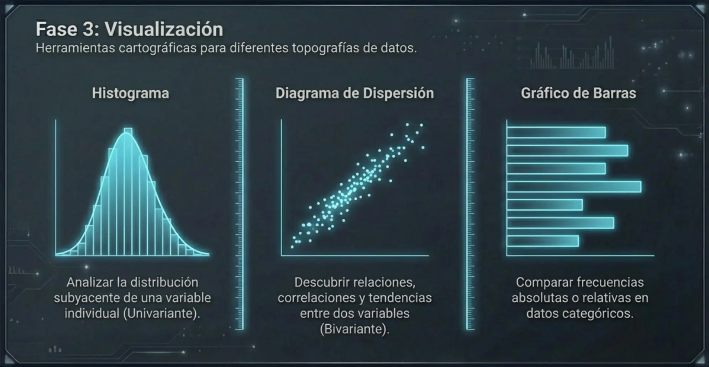

El **Análisis Exploratorio de Datos (EDA)** se define como un paradigma analítico e interactivo diseñado para obtener una comprensión profunda de la estructura de un conjunto de datos antes de proceder a la aplicación de modelos estadísticos formales. Desarrollado originalmente por John Tukey en 1977, el EDA trasciende la mera descripción numérica, empleando herramientas de visualización y métodos heurísticos para detectar patrones, identificar anomalías y refinar las preguntas de investigación.


## Nivel de Importancia

La importancia del EDA en la investigación biomédica es crítica por las siguientes razones fundamentales:

*   **Generación de Hipótesis:** A diferencia del análisis confirmatorio, que busca ratificar una teoría previa mediante el contraste de hipótesis con riesgos $\alpha$ y $\beta$ preestablecidos, el EDA permite "torturar los datos" para que estos sugieran nuevas líneas de investigación y modelos plausibles.

*   **Aseguramiento de la Calidad (Data Cleaning):** Permite detectar de forma temprana errores de transcripción, fallos en sensores médicos o inconsistencias clínicas (como un paciente masculino registrado como gestante).

*   **Validación de Supuestos:** Antes de aplicar pruebas paramétricas (como la prueba *t* de Student o ANOVA), es imperativo verificar supuestos de normalidad y homocedasticidad. El EDA proporciona la evidencia necesaria para decidir si se requiere una transformación de los datos o el uso de métodos no paramétricos.

*   **Detección de *Outliers*:** Identifica valores extremos que podrían distorsionar significativamente los estimadores de tendencia central y variabilidad, permitiendo decidir si estos representan errores o casos clínicos de alto interés.

## Etapas o Pasos del Análisis Exploratorio

El proceso exploratorio sigue un flujo metodológico sistemático que se integra en el ciclo PPDAC (*Problem, Plan, Data, Analysis, Conclusion*).


### 🔹Exploración General y Estructura
Consiste en recuperar la arquitectura del *dataset*: número de observaciones ($n$), número de variables, identificación de tipos de datos (nominales, ordinales o cuantitativos) y verificación de datos ausentes (*NA*). En lenguajes como R, este paso se operacionaliza con funciones como `str()`, `class()` y `summary()`.


### 🔹Organización Tabular y Frecuencias
El resumen de variables cualitativas requiere la construcción de Tablas de Distribución de Frecuencias (TDF). Para el informático médico, esto es esencial al caracterizar la demografía de una cohorte hospitalaria.

### 🔹Resumen Estadístico
Se calculan métricas de posición y variabilidad para describir el "centro de gravedad" y la dispersión biológica de la muestra.


*   **Media Aritmética ($\bar{x}$):** Estimador puntual del parámetro poblacional.
*   **Varianza Muestral ($s^2$):** Cuantifica la dispersión absoluta respecto a la media.

### 🔹Visualización Científica
La representación gráfica es el núcleo del EDA, pues permite procesar visualmente patrones complejos que no son evidentes en los análisis numéricos.



*   **Histogramas:** Para evaluar la forma de la distribución (simetría y curtosis).
*   **Diagramas de Cajas (*Box-plots*):** Herramienta robusta que visualiza la mediana, el rango intercuartílico (IQR) y detecta *outliers* sistemáticos mediante las "vallas" de Tukey (valores fuera de $1.5 \times IQR$).
*   **Diagramas de Dispersión (*Scatterplots*):** Esenciales para explorar la relación bivariada entre dos variables cuantitativas y diagnosticar la linealidad potencial para futuros modelos de regresión.

### 🔹Detección de anomalías


### 🔹Dimensiones y relaciones


### 🔹Refinamiento y Diagnóstico
La etapa final del EDA implica refinar las preguntas iniciales y evaluar la colinealidad (correlación excesiva entre predictores), lo que determina la selección eficiente de variables para el modelado multivariado posterior.

<br />
#### 📝 Programación:
<Tabs>
<TabItem value="mnp" label="Antecedentes" default>
<div class="alert alert--primary">
**Análisis exploratorio:**

Basado en el dataset cáncer de mama (Breast cancer)
- Etapa 1: Carga y obtención de datos. Generalmente en forma tabular o transformaciones desde datos no estructurados.
- Etapa 2: Inspección Inicial y Estructura. El objetivo es conocer las dimensiones del dataset, el tipo de datos de cada columna y obtener una visión rápida de los valores.
- Etapa 3: Limpieza de Datos. Se verifica la presencia de valores nulos o duplicados que puedan sesgar el análisis posterior.
- Etapa 4: Análisis Univariado (Distribuciones). Se analiza la distribución de las variables de forma individual, con especial énfasis en la variable objetivo (target) para detectar posibles desequilibrios de clase.
- Etapa 5: Análisis Bivariado y Correlaciones. Se explora la relación entre las variables independientes y cómo estas se correlacionan con la variable objetivo.
- Etapa 6: Identificación de Valores Atípicos (Outliers). Utilizamos diagramas de caja para visualizar la dispersión de los datos y detectar valores que se alejan significativamente del promedio.
</div>
</TabItem>
<TabItem value="mnp-python" label="Pyhton" default>
```python showLineNumbers
# Implementación en Python
import pandas as pd
import numpy as np
import matplotlib.pyplot as plt
import seaborn as sns
from sklearn.datasets import load_breast_cancer
#------------------------------------------------------------
# Etapa 1: Carga de datos
#------------------------------------------------------------
# Carga del dataset
cancer_data = load_breast_cancer()
df = pd.DataFrame(cancer_data.data, columns=cancer_data.feature_names)
df['target'] = cancer_data.target  # 0: Maligno, 1: Benigno

print("Dataset cargado exitosamente.")

#------------------------------------------------------------
# Etapa 2: Inspección Inicial y Estructura
#------------------------------------------------------------
print("=" * 50)
print("Inspección inicial del dataset...")
print("=" * 50)
# Visualización de las primeras filas
print(df.head())

# Información general (tipos de datos y memoria)
print(df.info())

# Resumen estadístico descriptivo
print(df.describe().T)

#------------------------------------------------------------
#Etapa 3: Limpieza de Datos
#------------------------------------------------------------
# Verificación de valores faltantes
print("=" * 50)
print("Verificando valores nulos en el dataset...")
print("=" * 50)

print(f"Valores nulos por columna:\n{df.isnull().sum().sum()}")

# Verificación de duplicados
print(f"Número de registros duplicados: {df.duplicated().sum()}")


#------------------------------------------------------------
# Etapa 4: Análisis Univariado (Distribuciones)
#------------------------------------------------------------
print("=" * 50)
print("Análisis Univariado: Distribuciones de Variables")
print("=" * 50)

# Distribución de la variable objetivo
sns.countplot(x='target', data=df, palette='viridis')
plt.title('Distribución de Diagnósticos (0: Maligno, 1: Benigno)')
plt.show()

# Histograma de una característica clave
sns.histplot(df['mean radius'], kde=True, color='blue')
plt.title('Distribución del Radio Medio')
plt.show()

#------------------------------------------------------------
# Etapa 5: Análisis Bivariado y Correlaciones
#------------------------------------------------------------
# Matriz de correlación
print("=" * 50)
print("Calculando matriz de correlación...")
print("=" * 50)
plt.figure(figsize=(12, 10))
correlation_matrix = df.corr()
sns.heatmap(correlation_matrix, annot=False, cmap='coolwarm')
plt.title('Mapa de Calor de Correlaciones')
plt.show()

# Relación entre dos variables específicas respecto al objetivo
sns.scatterplot(x='mean radius', y='mean texture', hue='target', data=df, alpha=0.7)
plt.title('Radio Medio vs Textura Media por Diagnóstico')
plt.show()

#------------------------------------------------------------
# Etapa 6: Identificación de Valores Atípicos (Outliers)
#-------------------------------------------------------------
# Boxplot para detectar outliers en características seleccionadas
# imprime "=" 50 veces para separar visualmente las secciones
print("=" * 50)
print("Detectando outliers en características principales...")
print("=" * 50)
features_to_plot = ['mean radius', 'mean texture', 'mean perimeter', 'mean area']
plt.figure(figsize=(10, 6))
sns.boxplot(data=df[features_to_plot])
plt.title('Detección de Outliers en Características Principales')
plt.xticks(rotation=45)
plt.show()


```
</TabItem>
<TabItem value="mnp-r" label="R" default>
```r showLineNumbers
# Implementación en R
# Instalación (si es necesario) y carga de librerías
if(!require(mlbench)) install.packages("mlbench")
if(!require(tidyverse)) install.packages("tidyverse")
if(!require(corrplot)) install.packages("corrplot")

library(mlbench)
library(tidyverse)
library(corrplot)

# Carga del dataset
data(BreastCancer)
df <- BreastCancer


cat("Dataset cargado exitosamente.\n")

#------------------------------------------------------------
# Etapa 2: Inspección Inicial y Estructura
#------------------------------------------------------------
# Visualización de las primeras filas
head(df)

# Estructura del dataset (tipos de datos)
str(df)

# Resumen estadístico descriptivo
summary(df)


#------------------------------------------------------------
#Etapa 3: Limpieza de Datos
#------------------------------------------------------------
# Eliminamos la columna ID ya que no aporta valor estadístico
df <- df %>% select(-Id)

# Conversión de columnas de factores a numéricas (excepto la variable objetivo 'Class')
df_numeric <- df
df_numeric[,-10] <- sapply(df_numeric[,-10], function(x) as.numeric(as.character(x)))

# Verificación de valores faltantes (NA)
colSums(is.na(df_numeric))

# Eliminamos filas con NAs para este ejemplo
df_clean <- na.omit(df_numeric)

#------------------------------------------------------------
# Etapa 4: Análisis Univariado (Distribuciones)
#------------------------------------------------------------
# Distribución de la variable objetivo
ggplot(df_clean, aes(x = Class, fill = Class)) +
  geom_bar() +
  theme_minimal() +
  labs(title = "Distribución de Diagnósticos", x = "Clase", y = "Frecuencia")

# Histograma de una característica (ej. Clump Thickness)
ggplot(df_clean, aes(x = Cl.thickness)) +
  geom_histogram(binwidth = 1, fill = "steelblue", color = "white") +
  theme_minimal() +
  labs(title = "Distribución de Grosor de Masa", x = "Grosor", y = "Conteo")


#------------------------------------------------------------
# Etapa 5: Análisis Bivariado y Correlaciones
#------------------------------------------------------------
# Matriz de correlación (excluyendo la columna Class)
cor_matrix <- cor(df_clean[,-10])

# Visualización del Mapa de Calor
corrplot(cor_matrix, method = "color", type = "upper", 
         tl.col = "black", tl.srt = 45, addCoef.col = "black")

# Relación entre Cel.size y Cel.shape coloreado por Clase
ggplot(df_clean, aes(x = Cell.size, y = Cell.shape, color = Class)) +
  geom_jitter(alpha = 0.5) + # Usamos jitter porque los datos son discretos (1-10)
  theme_minimal() +
  labs(title = "Tamaño vs Forma de Celda por Diagnóstico")

#------------------------------------------------------------
# Etapa 6: Identificación de Valores Atípicos (Outliers)
#------------------------------------------------------------
# Transformamos los datos a formato largo para graficar múltiples boxplots
df_long <- df_clean %>%
  pivot_longer(cols = -Class, names_to = "Caracteristica", values_to = "Valor")

# Gráfico de Boxplots
ggplot(df_long, aes(x = Caracteristica, y = Valor, fill = Caracteristica)) +
  geom_boxplot() +
  coord_flip() + # Giramos para mejor lectura
  theme_minimal() +
  theme(legend.position = "none") +
  labs(title = "Detección de Outliers en Características", x = "", y = "Valor (Escala 1-10)")
```
</TabItem>
</Tabs><br />