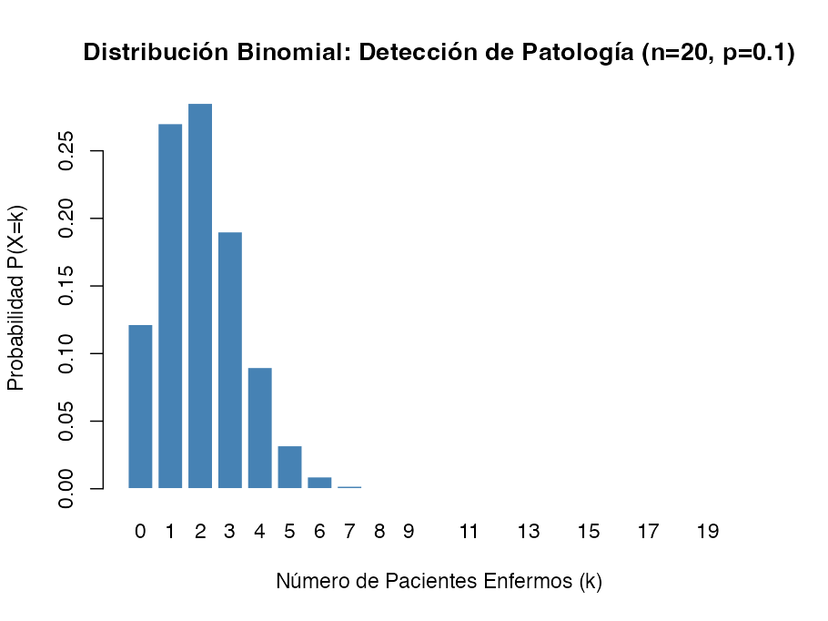

## Distribución de Bernoulli
La **distribución de Bernoulli** constituye el modelo de probabilidad más elemental en la estadística, sirviendo como la unidad fundamental para la construcción de distribuciones más complejas como la binomial, la geométrica y la binomial negativa. Representa un experimento aleatorio único con exactamente dos resultados posibles, mutuamente excluyentes, denominados tradicionalmente como "éxito" y "fracaso".

### Contexto Histórico
Esta distribución debe su nombre al eminente matemático suizo **Jacob Bernoulli** (1654–1705), quien realizó aportes pioneros a la teoría de la probabilidad en el siglo XVII. Bernoulli formalizó el estudio de las pruebas independientes con probabilidades constantes de éxito, conceptos que fueron publicados póstumamente en su obra *Ars Conjectandi* en 1713.

### Definición y Formulación Matemática
Desde una perspectiva teórica, una variable aleatoria $X$ sigue una distribución de Bernoulli si puede tomar únicamente dos valores: $X=1$ (éxito) y $X=0$ (fracaso).

#### Función de Masa de Probabilidad (PMF)
La probabilidad de observar un resultado $x$ se define matemáticamente como:
```math
P(X=x) = p^x(1-p)^{1-x}, \quad \text{para } x \in \{0, 1\}
```

Donde sus componentes significan:
* **$x$**: El valor observado de la variable (1 para éxito, 0 para fracaso).
* **$p$**: El parámetro que define la probabilidad de éxito en el ensayo ($0 \le p \le 1$).
* **$q$ (o $1-p$)**: La probabilidad de fracaso, cumpliéndose que $p + q = 1$.

#### Momentos de la Distribución
* **Esperanza Matemática (Media, $\mu$):** Es idéntica a la probabilidad de éxito.
    ```math
    E(X) = p
    ```
* **Varianza ($\sigma^2$):** Cuantifica la dispersión de los datos alrededor de la media.
    ```math
    Var(X) = p \cdot (1 - p)
    ```
* **Desviación Estándar ($\sigma$):**
    ```math
    \sigma = \sqrt{p \cdot q}
    ```

### Fundamento
El rigor de la distribución de Bernoulli se sustenta en el cumplimiento de los **ensayos de Bernoulli**, que poseen tres propiedades críticas:
1. **Dicotomía:** El ensayo solo admite dos categorías (p. ej., sano/enfermo, positivo/negativo).

2. **Independencia:** El resultado de un ensayo no afecta la probabilidad de éxito de cualquier observación subsiguiente.

3. **Probabilidad Constante:** El parámetro $p$ permanece invariable en cada ejecución del experimento.

La suma de $n$ ensayos de Bernoulli independientes da lugar a la **distribución binomial**, permitiendo modelar el número total de éxitos en una muestra clínica.

### Usos en Salud
En el ámbito biomédico, la distribución de Bernoulli es indispensable para caracterizar variables cualitativas y procesos de clasificación:
* **Diagnóstico Clínico:** El resultado de una prueba serológica (ej. VIH) donde el resultado es reactivo (éxito) o no reactivo (fracaso).
* **Epidemiología:** El estado de un individuo respecto a una patología, como ser diabético o no.
* **Ensayos Clínicos:** La respuesta dicotómica a un tratamiento médico, clasificada como recuperación satisfactoria o ausencia de la misma.
* **Genética:** La presencia o ausencia de un alelo específico vinculado a enfermedades como el Alzheimer.
* **Informática Médica:** El análisis de errores en el procesamiento de datos por software hospitalario (presencia de error = 1, ausencia = 0).

## Determinación

La detección de un problema que requiere un modelado mediante una **distribución de Bernoulli** se fundamenta en la identificación de procesos estocásticos elementales donde la incertidumbre se reduce a una respuesta binaria. Este modelo es el "átomo" de las distribuciones discretas y sirve como base para estructuras más complejas como la binomial y la geométrica.

Para determinar si un fenómeno clínico debe abordarse bajo este esquema, se deben verificar los siguientes criterios operativos y estructurales:

#### 1. Naturaleza Dicotómica del Resultado
La característica primordial es que el experimento o proceso de observación solo puede resultar en uno de dos resultados posibles y mutuamente excluyentes. Estos resultados se denominan arbitrariamente como "éxito" ($X=1$) y "fracaso" ($X=0$).

*   **Detección práctica:** El investigador debe preguntarse si la variable objetivo responde a una clasificación binaria pura.
*   **Ejemplos médicos:** Un test serológico de VIH (positivo o negativo), la supervivencia de un paciente a 30 días (vivo o fallecido), o la presencia de una mutación genética específica en una secuencia de ADN (presente o ausente).

#### 2. Estructura Unitaria del Ensayo
A diferencia de la distribución binomial, que contabiliza éxitos en varios intentos, la distribución de Bernoulli se aplica estrictamente cuando el experimento se ejecuta **una sola vez** ($n=1$). Si el problema implica una serie de eventos, estamos ante un proceso de Bernoulli, pero la distribución de Bernoulli *per se* solo describe el resultado de un único ensayo individual.

#### 3. Independencia y Probabilidad Constante
Para que un fenómeno sea tratado como un ensayo de Bernoulli dentro de un modelo mayor, se debe asumir que la probabilidad de éxito ($p$) es un parámetro fijo y que el resultado de un ensayo no afecta a otros potenciales ensayos (independencia).


El informático médico detecta la necesidad de este modelo cuando diseña sistemas de soporte a la decisión clínica (CDSS) que operan sobre variables de estado. Por ejemplo, al modelar la probabilidad de que un algoritmo de inteligencia artificial clasifique correctamente una imagen radiológica como "patológica", el resultado de cada clasificación individual es una variable de Bernoulli.


<br />
#### 📝 Programación:
<Tabs>
<TabItem value="db" label="Antecedentes" default>
<div class="alert alert--primary">
**Distribución de Bernoulli**<br />
</div>
</TabItem>
<TabItem value="db-python" label="Pyhton" default>
```python showLineNumbers
# Implementación en Python
```
</TabItem>
<TabItem value="db-r" label="R" default>
```r showLineNumbers
# Implementación en R
```
</TabItem>
</Tabs><br />


## Distribución Binomial

La **Distribución Binomial** es uno de los modelos de probabilidad discretas más fundamentales en la bioestadística. Se utiliza para modelar el número de "éxitos" observados en una serie de ensayos independientes que tienen una probabilidad constante de ocurrencia.


### Contexto
El desarrollo de esta distribución se atribuye al matemático suizo **Jacob Bernoulli** (1654-1705), quien formalizó el estudio de procesos con dos resultados posibles en su obra póstuma *Ars Conjectandi*, publicada en 1713. Los coeficientes utilizados en su expansión matemática, conocidos como el "Triángulo de Pascal", tienen antecedentes que se remontan al siglo XIII.

Posteriormente, en el siglo XVIII, **Abraham de Moivre** introdujo la aproximación de la distribución binomial a la normal. Su motivación fue puramente práctica: el cálculo manual de términos binomiales para muestras grandes (por ejemplo, $n > 50$) resultaba extremadamente tedioso antes de la existencia de la computación moderna.

### Definición y Formulación
Una variable aleatoria discreta $X$ sigue una distribución binomial si representa el número de éxitos en $n$ ensayos de Bernoulli independientes.

#### Función de Masa de Probabilidad (PMF)
La distribución binomial modela la variable aleatoria $X$, definida como el **número total de éxitos** obtenidos tras ejecutar los $n$ ensayos de Bernoulli. La probabilidad de observar exactamente $p$ éxitos se calcula mediante la función masa de probabilidad (PMF):

```math
P(X = x) = \binom{n}{x} p^x (1-p)^{n-x}
```

**Significado de sus componentes:**
*   **$n$**: Número total de ensayos o intentos fijos en el experimento.
*   **$x$**: Número de éxitos observados (donde $x = 0, 1, 2, \dots, n$).
*   **$p$**: Probabilidad de "éxito" en cada ensayo individual, la cual debe permanecer constante.
*   **$q$ (o $1-p$)**: Probabilidad de "fracaso" en cada ensayo.
*   **$\binom{n}{x}$**: Coeficiente binomial, calculado como $\frac{n!}{x!(n-x)!}$, que representa el número de combinaciones posibles de $n$ elementos tomados de $x$ en $x$.

#### Momentos de la Distribución
*   **Esperanza Matemática (Media, $\mu$):** Indica el número promedio de éxitos esperado a largo plazo.
    
    ```math
    \mu = np
    ```
*   **Varianza ($\sigma^2$):** Cuantifica la dispersión de los resultados en torno a la media.
    
    ```math
    \sigma^2 = npq
    ```

### Fundamentos Científicos y Supuestos
Para que un fenómeno biológico o médico pueda ser modelado rigurosamente mediante una distribución binomial, debe cumplir con las condiciones **BInS**:
- **B**inario: Cada ensayo tiene solo dos resultados posibles (ej. positivo/negativo, sobrevive/muere).
- **I**ndependencia: El resultado de un ensayo no afecta la probabilidad del siguiente.
- **n** constante: El número de ensayos se fija de antemano.
- **S**uccess (éxito): La probabilidad $p$ es la misma en cada ensayo.

**Nota sobre el muestreo:** A menudo se muestrea de poblaciones finitas sin reemplazo (lo que técnicamente sugeriría una distribución hipergeométrica). Sin embargo, se acepta el uso de la binomial si el tamaño de la muestra $n$ es menor al 5% del tamaño de la población $N$, ya que la probabilidad $p$ se mantiene virtualmente constante.


#### Implementación en el Entorno R
El software R proporciona funciones nativas para gestionar esta distribución sin necesidad de cálculos manuales complejos:
*   `dbinom(x, n, p)`: Calcula la probabilidad exacta de $x$ éxitos.
*   `pbinom(x, n, p)`: Calcula la probabilidad acumulada (útil para pruebas de hipótesis).
*   `rbinom(m, n, p)`: Genera $m$ valores aleatorios siguiendo una distribución binomial.


## Determinación

Para identificar si un fenómeno en el ámbito de la investigación clínica debe ser abordado mediante una **distribución binomial**, es imperativo verificar que la estructura del problema satisfaga rigurosamente cuatro criterios fundamentales, conocidos técnicamente como el modelo de ensayos independientes.

### Criterios de Detección (Propiedades Estructurales)

Un problema se rige por una ley binomial cuando presenta las siguientes características esenciales:

1.  **Naturaleza Dicotómica:** Cada observación o "ensayo" debe dar como resultado únicamente una de dos categorías mutuamente excluyentes y exhaustivas. En medicina, estas suelen ser éxito/fracaso, enfermo/sano, positivo/negativo o fallecido/vivo.

2.  **Número de Ensayos Fijo ($n$):** El experimento consiste en una secuencia de $n$ ensayos, donde este número total de observaciones se determina de forma previa a la recolección de los datos.

3.  **Independencia de los Ensayos:** El resultado de una observación no debe influir ni estar condicionado por el resultado de otra. Por ejemplo, en un muestreo aleatorio de pacientes independientes, el estado de salud de uno no aporta información sobre el estado del siguiente.

4.  **Probabilidad de Éxito Constante ($p$):** La probabilidad de que ocurra el evento de interés (éxito) debe permanecer invariable en cada uno de los ensayos.


### Reglas de Decisión Metodológica

Se debe prestar atención a dos escenarios críticos que podrían desviar el modelo hacia otras distribuciones:

*   **Población Finita vs. Infinita:** Si el muestreo se realiza **sin reemplazo** en una población pequeña, la probabilidad $p$ cambia en cada ensayo, violando el supuesto de independencia. En este caso, debería usarse la **distribución hipergeométrica**. No obstante, se puede utilizar la aproximación binomial si el tamaño de la muestra es insignificante respecto a la población (regla empírica: $n/N \le 0.05$).
*   **Aproximación de Poisson:** Cuando $n$ es muy grande y $p$ es muy pequeña (generalmente $np < 7$), se puede optar por la **distribución de Poisson** para simplificar el análisis de "eventos raros".

### Ejemplos
La distribución binomial es la piedra angular para el análisis de variables cualitativas dicotómicas:
*   **Pruebas diagnósticas:** Determinar la probabilidad de encontrar 2 resultados positivos en una muestra de 20 sujetos elegidos al azar, dada una prevalencia conocida.
*   **Eficacia de tratamientos:** Estimar el número de pacientes que experimentarán mejoría tras la administración de un fármaco en una cohorte fija.
*   **Complicaciones clínicas:** Modelar el número de mujeres embarazadas que presentan complicaciones durante el parto de un total de 100 pacientes.
*   **Epidemiología:** Estimar la prevalencia de una enfermedad en una comunidad (ej. casos positivos de influenza H1N1 en una muestra de 500 sujetos).
*   **Diagnóstico Clínico:** Calcular la probabilidad de obtener un número específico de resultados positivos en pruebas serológicas (como el VIH).
*   **Genética:** Modelar la proporción de una población que posee un gen vinculado a enfermedades complejas como el Alzheimer.
*   **Farmacología:** Evaluar la tasa de éxito de un nuevo tratamiento quirúrgico o medicamento en ensayos clínicos.


<br />
#### 📝 Programación:
<Tabs>
<TabItem value="db" label="Antecedentes" default>
<div class="alert alert--primary">
**Distribución binomial**<br />
Supongamos que un investigador desea estudiar la presencia de una enfermedad cuya prevalencia en la población es del 10% (p=0.1) en una cohorte de 20 pacientes (n=20). El siguiente script utiliza las funciones nativas de R para calcular probabilidades específicas y generar visualizaciones.
</div>
</TabItem>
<TabItem value="dbp" label="Python" default>
```python showLineNumbers
# Implementación en Python

```

</TabItem>
<TabItem value="dbr" label="R">
```r showLineNumbers
# Implementación en en R
# --- Script: Simulación de Distribución Binomial en Salud ---

# 1. Definición de Parámetros
n_pacientes <- 20    # Tamaño de la muestra (n)
p_prevalencia <- 0.1 # Probabilidad de éxito (p)
k_exitos <- 0:n_pacientes

# 2. Cálculo de la Función de Masa de Probabilidad (PMF)
# ¿Cuál es la probabilidad de encontrar exactamente 'x' enfermos?
probabilidades <- dbinom(k_exitos, size = n_pacientes, prob = p_prevalencia)

# 3. Cálculo de la Probabilidad Acumulada
# ¿Cuál es la probabilidad de encontrar 3 o menos enfermos?
prob_acumulada_3 <- pbinom(3, size = n_pacientes, prob = p_prevalencia)

# 4. Generación de una muestra aleatoria
# Simulamos 100 cohortes de 20 pacientes cada una
set.seed(1234)
simulacion_cohortes <- rbinom(n = 100, size = n_pacientes, prob = p_prevalencia)

# 5. Visualización Científica
barplot(probabilidades, 
        names.arg = k_exitos, 
        main = "Distribución Binomial: Detección de Patología (n=20, p=0.1)",
        xlab = "Número de Pacientes Enfermos (k)", 
        ylab = "Probabilidad P(X=k)",
        col = "steelblue",
        border = "white")

# 6. Salida de resultados clave
cat("Esperanza Matemática (E[X]):", n_pacientes * p_prevalencia, "pacientes\n")
cat("Probabilidad de encontrar exactamente 2 enfermos:", probabilidades[16], "\n")
cat("Probabilidad de encontrar 3 o menos enfermos:", prob_acumulada_3, "\n")

# resultado
Esperanza Matemática (E[X]): 2 pacientes
Probabilidad de encontrar exactamente 2 enfermos: 9.154957e-12 
Probabilidad de encontrar 3 o menos enfermos: 0.8670467 
```


</TabItem>
</Tabs><br />


<br />

## Distribución de Poisson

La **Distribución de Poisson** constituye uno de los pilares de la probabilidad discreta, siendo esencial para modelar fenómenos biológicos y operativos caracterizados por el recuento de eventos aleatorios que ocurren con una tasa constante en un intervalo continuo de tiempo o espacio.

### Contexto Histórico
Esta distribución debe su nombre al matemático y físico francés **Siméon-Denis Poisson** (1781-1840), quien desarrolló el concepto a partir de sus investigaciones en mecánica celeste y teoría de números. Fue formalmente introducida en su obra de 1837 como una forma límite de la distribución binomial para casos donde el número de ensayos es muy grande y la probabilidad de éxito es sumamente pequeña. Históricamente, también se le ha denominado la "ley de los sucesos raros".

### Definición y Formulación Matemática
La distribución de Poisson describe la probabilidad de observar exactamente $k$ eventos en un intervalo determinado, dado que se conoce el número promedio de ocurrencias.

La **Función de Masa de Probabilidad (PMF)** se define como:
```math
P(X=k) = \frac{e^{-\lambda} \lambda^k}{k!}
```

Donde los componentes son:
*   **$X$**: Variable aleatoria discreta que representa el número de éxitos o casos (e.g., número de admisiones a urgencias).
*   **$k$**: El número de ocurrencias observado, que toma valores enteros desde 0 hasta el infinito ($0, 1, 2, \dots$).
*   **$\lambda$ (Lambda)**: El parámetro de la distribución, que indica el número promedio esperado de eventos por unidad de tiempo, área o volumen.
*   **$e$**: Base de los logaritmos naturales o número de Euler (aproximadamente 2.71828).
*   **$!$**: Operador factorial.

En el marco de los modelos estadísticos avanzados, la distribución de Poisson pertenece a la **familia exponencial** de distribuciones, donde su parámetro natural se define como $\theta = \ln(\lambda)$.

### Fundamentos: El Proceso de Poisson
Para que un fenómeno se considere un experimento o **proceso de Poisson**, deben satisfacerse las siguientes condiciones de rigor científico:
- **Independencia**: La ocurrencia de un evento en un intervalo no influye en la probabilidad de que ocurra en otro intervalo distinto.
- **Proporcionalidad**: La probabilidad de que ocurra un solo evento en un subintervalo muy pequeño es proporcional a la longitud de dicho intervalo ($\lambda \Delta t$).
- **Exclusividad**: La probabilidad de que ocurra más de un evento en un subintervalo infinitesimal tiende a cero.
- **Tasa Constante**: El promedio de ocurrencias ($\lambda$) permanece invariable durante todo el periodo de observación.

#### Propiedades Críticas
*   **Igualdad de Momentos**: Una propiedad distintiva y diagnóstica es que la **media ($E[X]$)** y la **varianza ($V[X]$)** son idénticas y equivalen a $\lambda$.
*   **Relación con la Distribución Exponencial**: Si el número de eventos sigue una distribución de Poisson, el tiempo transcurrido entre dos eventos sucesivos sigue una **distribución exponencial** con parámetro $\lambda$.
*   **Convergencia**: A medida que $\lambda$ aumenta (típicamente $\lambda \ge 10$ o $\ge 100$ para mayor rigor), la distribución de Poisson se vuelve simétrica y puede ser aproximada satisfactoriamente por la **distribución normal**.

### Aplicaciones en Salud
En la práctica clínica y la gestión sanitaria, la distribución de Poisson es indispensable para:
*   **Análisis de Datos Clínicos**: Modelado del conteo de glóbulos blancos en una muestra de sangre, eosinófilos en un campo microscópico o desintegraciones radiactivas en medicina nuclear.
*   **Epidemiología**: Estimación de la incidencia de enfermedades raras, como casos de cáncer en una comunidad específica o mortalidad materna.
*   **Gestión Hospitalaria**: Predicción de la llegada de pacientes a servicios de urgencias o admisiones diarias para optimizar el personal de turno.
*   **Informática y Bioinformática**: Análisis del flujo de paquetes en redes de telemedicina, número de solicitudes a servidores web de salud o errores en secuencias genéticas.
*   **Seguridad del Paciente**: Registro de accidentes laborales, fallas de equipos médicos por unidad de tiempo o errores de medicación en farmacia hospitalaria.

**Validación de supuestos**: Al trabajar con grandes bases de datos (como el ACL o registros hospitalarios), es común realizar pruebas de bondad de ajuste para verificar si los conteos clínicos siguen realmente una distribución de Poisson o si presentan sobre-dispersión (donde la varianza supera a la media), caso en el cual se preferiría una distribución binomial negativa.

**Uso de la aproximación**: La distribución de Poisson es útil para aproximar la binomial cuando el tamaño de la muestra (n) es muy grande y la probabilidad del evento (p) es muy pequeña (menor a 7).

**Análisis de Tasas**: En epidemiología, el modelo de Poisson es la base para la Regresión de Poisson, la cual permite modelar la densidad de incidencia (casos por persona-tiempo) ajustando por covariables como edad, sexo o exposición a factores de riesgo.
<br />
#### 📝 Programación:
<Tabs>
<TabItem value="dpa" label="Antecedentes" default>
<div class="alert alert--primary">
**Distribución de Poisson**<br />
Supongamos que un administrador hospitalario determina que el promedio de admisiones diarias por una patología específica en la unidad de cuidados intensivos es de 3 pacientes (λ=3). El siguiente script implementa las funciones nativas de R para el análisis de este escenario.
</div>
</TabItem>
<TabItem value="dp-python" label="Pyhton" default>
```python showLineNumbers
# Implementación en Python
```
</TabItem>
<TabItem value="dp-r" label="R" default>
```r showLineNumbers
# Implementación en R
# --- Script de R: Distribución de Poisson en Entorno Clínico ---

# 1. Configuración de parámetros
set.seed(1234) # Garantiza la reproductibilidad del experimento 
lambda_diaria <- 3  # Promedio de admisiones (parámetro lambda) 
k_eventos <- 0:10   # Rango de posibles ingresos a evaluar

# 2. Cálculo de la Función de Masa de Probabilidad (dpois)
# Determina la probabilidad de observar exactamente k ingresos 
prob_exactas <- dpois(k_eventos, lambda = lambda_diaria)

# 3. Cálculo de la Función de Distribución Acumulada (ppois)
# Probabilidad de recibir 2 o menos pacientes: P(X <= 2)
prob_acum_2 <- ppois(2, lambda = lambda_diaria)

# 4. Generación de datos simulados (rpois)
# Simulación del número de ingresos diarios durante un año (365 días)
simulacion_anual <- rpois(365, lambda = lambda_diaria)

# 5. Visualización científica del modelo teórico
# Representación mediante gráfico de bastones para variable discreta
barplot(prob_exactas, 
        names.arg = k_eventos, 
        main = expression(paste("Distribución de Poisson (", lambda, " = 3 admissions/día)")),
        xlab = "Número de pacientes admitidos (k)", 
        ylab = "Probabilidad P(X = k)",
        col = "darkseagreen",
        border = "white")

# 6. Reporte de resultados clave
cat("Probabilidad de recibir exactamente 3 pacientes:", dpois(3, lambda_diaria), "\n")
cat("Probabilidad de recibir 2 o menos pacientes:", prob_acum_2, "\n")
cat("Media de la simulación anual:", mean(simulacion_anual), "\n")

# resultado
Probabilidad de recibir exactamente 3 pacientes: 0.2240418 
Probabilidad de recibir 2 o menos pacientes: 0.4231901 
Media de la simulación anual: 2.983562 
```

</TabItem>
</Tabs><br />
<br />
