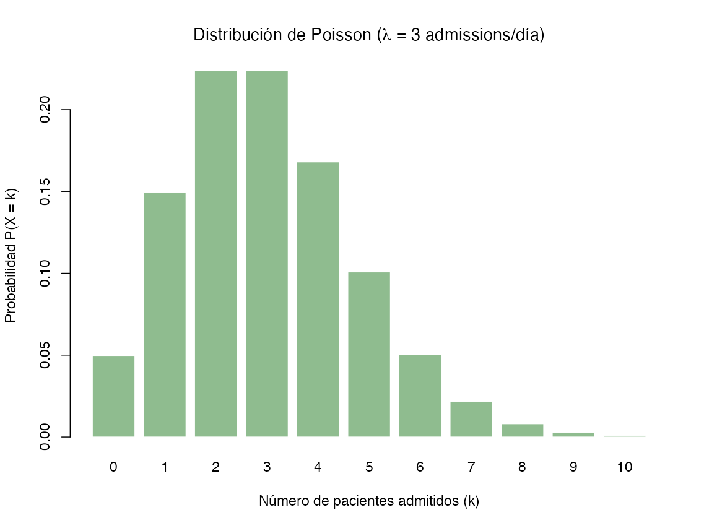

La **Distribución de Poisson** constituye uno de los pilares de la probabilidad discreta, siendo esencial para modelar fenómenos biológicos y operativos caracterizados por el recuento de eventos aleatorios que ocurren con una tasa constante en un intervalo continuo de tiempo o espacio.

### Contexto Histórico
Esta distribución debe su nombre al matemático y físico francés **Siméon-Denis Poisson** (1781-1840), quien desarrolló el concepto a partir de sus investigaciones en mecánica celeste y teoría de números. Fue formalmente introducida en su obra de 1837 como una forma límite de la distribución binomial para casos donde el número de ensayos es muy grande y la probabilidad de éxito es sumamente pequeña. Históricamente, también se le ha denominado la "ley de los sucesos raros".

La distribución de Poisson representa un modelo probabilístico fundamental en la bioestadística para analizar variables aleatorias discretas que consisten en el recuento de eventos raros que ocurren de forma independiente en un intervalo continuo, ya sea de tiempo, área o volumen. En el ámbito de la investigación, este concepto se conceptualiza como el límite de una distribución binomial cuando el número de ensayos (n) tiende al infinito y la probabilidad de éxito (p) es sumamente pequeña, manteniendo un valor esperado (λ) constante.

### Definición y Formulación Matemática
La distribución de Poisson describe la probabilidad de observar exactamente $k$ eventos en un intervalo determinado, dado que se conoce el número promedio de ocurrencias. 

La variable aleatoria es el número de veces que ocurre un evento durante un intervalo definido. El intervalo puedes ser de tiempo, distancia, área y volumen o de cualquier unidad.

La **Función de Masa de Probabilidad (PMF)** se define como:

```math
P(X=k) = \frac{e^{-\lambda} \lambda^k}{k!}
```

Donde los componentes son:
*   **$X$**: Variable aleatoria discreta que representa el número de éxitos o casos (e.g., número de admisiones a urgencias).
*   **$k$**: El número de ocurrencias observado, que toma valores enteros desde 0 hasta el infinito ($0, 1, 2, \dots$).
*   **$\lambda$ (Lambda)**: El parámetro de la distribución, que indica el número promedio esperado de eventos por unidad de tiempo, área o volumen.
*   **$e$**: Base de los logaritmos naturales o número de Euler (aproximadamente 2.71828).
*   **$!$**: Operador factorial.

En el marco de los modelos estadísticos avanzados, la distribución de Poisson pertenece a la **familia exponencial** de distribuciones, donde su parámetro natural se define como $\theta = \ln(\lambda)$.

#### Ejemplos:
Asumiendo $\lambda = 10$ representa el número promedio de pacientes por día, y $k$ es el número específico de pacientes para los cuales queremos calcular la probabilidad

- a) Probabilidad que 3 pacientes lleguen en un día

```math
P(X = 3) = \frac{e^{-10} \cdot 10^3}{3!} \approx 0.007567
```

> *Hay aproximadamente un **0.76%** de probabilidad de que lleguen exactamente 3 pacientes.*

- b) Probabilidad que 15 pacientes lleguen en un día

```math
P(X = 15) = \frac{e^{-10} \cdot 10^{15}}{15!} \approx 0.034718
```

> *Hay aproximadamente un **3.47%** de probabilidad de que lleguen exactamente 15 pacientes.*

- c) Probabilidad que 4 pacientes lleguen en un día

```math
P(X = 4) = \frac{e^{-10} \cdot 10^4}{4!} \approx 0.018917
```

> *Hay aproximadamente un **1.89%** de probabilidad de que lleguen exactamente 4 pacientes.*


### Fundamentos: El Proceso de Poisson
Para que un fenómeno se considere un experimento o **proceso de Poisson**, deben satisfacerse las siguientes condiciones de rigor científico:
- **Independencia**: La ocurrencia de un evento en un intervalo no influye en la probabilidad de que ocurra en otro intervalo distinto. Dicho de otro modo la probabilidad de ocurrencia es la misma para cualesquiera dos intervalos de igual longitud.
- **Proporcionalidad**: La probabilidad de que ocurra un solo evento en un subintervalo muy pequeño es proporcional a la longitud de dicho intervalo ($\lambda \Delta t$).
- **Exclusividad (No simultaneidad)**: La probabilidad de que ocurra más de un evento en un subintervalo infinitesimal tiende a cero. Dos eventos no pueden ocurrir exactamente al mismo tiempo.
- **Tasa Constante**: El promedio de ocurrencias ($\lambda$) permanece invariable durante todo el periodo de observación.

#### Propiedades Críticas
*   **Igualdad de Momentos**: Una propiedad distintiva y diagnóstica es que la **media ($E[X]$)** y la **varianza ($V[X]$)** son idénticas y equivalen a $\lambda$.
*   **Relación con la Distribución Exponencial**: Si el número de eventos sigue una distribución de Poisson, el tiempo transcurrido entre dos eventos sucesivos sigue una **distribución exponencial** con parámetro $\lambda$.
*   **Convergencia**: A medida que $\lambda$ aumenta (típicamente $\lambda \ge 10$ o $\ge 100$ para mayor rigor), la distribución de Poisson se vuelve simétrica y puede ser aproximada satisfactoriamente por la **distribución normal**.

### Aplicaciones en Salud
En la práctica clínica y la gestión sanitaria, la distribución de Poisson es indispensable para modelar fenómenos donde no es práctico o posible determinar el número total de "ensayos" fallidos, centrándose únicamente en los éxitos observados
. Algunos ejemplos notables incluyen:
*   **Análisis de Datos Clínicos**: Modelado del conteo de glóbulos blancos en una muestra de sangre, eosinófilos en un campo microscópico o desintegraciones radiactivas en medicina nuclear.
*   **Epidemiología**: Estimación de la incidencia de enfermedades raras, como casos de cáncer en una comunidad específica o mortalidad materna.
*   **Gestión Hospitalaria**: Predicción de la llegada de pacientes a servicios de urgencias o admisiones diarias para optimizar el personal de turno, o el número de camas ocupadas diariamente.
* **Microbiología y Genética**: Conteo de colonias bacterianas en un cultivo o el número de mutaciones cromosómicas resultantes de la exposición a radiación
*   **Informática y Bioinformática**: Análisis del flujo de paquetes en redes de telemedicina, número de solicitudes a servidores web de salud o errores en secuencias genéticas.
*   **Seguridad del Paciente**: Registro de accidentes laborales, fallas de equipos médicos por unidad de tiempo o errores de medicación en farmacia hospitalaria.
* **Modelamiento GLM**: En los Modelos Lineales Generalizados, la regresión de Poisson utiliza una función de enlace logarítmica (ln(λ)) para predecir tasas de incidencia ajustadas por múltiples covariables clínicas

**Validación de supuestos**: Al trabajar con grandes bases de datos (como el ACL o registros hospitalarios), es común realizar pruebas de bondad de ajuste para verificar si los conteos clínicos siguen realmente una distribución de Poisson o si presentan sobre-dispersión (donde la varianza supera a la media), caso en el cual se preferiría una distribución binomial negativa.

**Uso de la aproximación**: La distribución de Poisson es útil para aproximar la binomial cuando el tamaño de la muestra (n) es muy grande y la probabilidad del evento (p) es muy pequeña (menor a 7).

**Análisis de Tasas**: En epidemiología, el modelo de Poisson es la base para la Regresión de Poisson, la cual permite modelar la densidad de incidencia (casos por persona-tiempo) ajustando por covariables como edad, sexo o exposición a factores de riesgo.
<br />

#### 💻 Código:
<Tabs>
<TabItem value="dpa" label="Antecedentes" default>
<div class="alert alert--primary">
**Distribución de Poisson**<br />
Supongamos que un administrador hospitalario determina que el promedio de admisiones diarias por una patología específica en la unidad de cuidados intensivos es de 3 pacientes (λ=3). El siguiente script implementa las funciones nativas de R para el análisis de este escenario.
</div>
</TabItem>
<TabItem value="dp-python" label="Pyhton" default>
```python showLineNumbers
# Implementación en Python
```
</TabItem>
<TabItem value="dp-r" label="R" default>
```r showLineNumbers
# Implementación en R
# --- Script de R: Distribución de Poisson en Entorno Clínico ---

# 1. Configuración de parámetros
set.seed(1234) # Garantiza la reproductibilidad del experimento 
lambda_diaria <- 3  # Promedio de admisiones (parámetro lambda) 
k_eventos <- 0:10   # Rango de posibles ingresos a evaluar

# 2. Cálculo de la Función de Masa de Probabilidad (dpois)
# Determina la probabilidad de observar exactamente k ingresos 
prob_exactas <- dpois(k_eventos, lambda = lambda_diaria)

# 3. Cálculo de la Función de Distribución Acumulada (ppois)
# Probabilidad de recibir 2 o menos pacientes: P(X <= 2)
prob_acum_2 <- ppois(2, lambda = lambda_diaria)

# 4. Generación de datos simulados (rpois)
# Simulación del número de ingresos diarios durante un año (365 días)
simulacion_anual <- rpois(365, lambda = lambda_diaria)

# 5. Visualización científica del modelo teórico
# Representación mediante gráfico de bastones para variable discreta
barplot(prob_exactas, 
        names.arg = k_eventos, 
        main = expression(paste("Distribución de Poisson (", lambda, " = 3 admissions/día)")),
        xlab = "Número de pacientes admitidos (k)", 
        ylab = "Probabilidad P(X = k)",
        col = "darkseagreen",
        border = "white")

# 6. Reporte de resultados clave
cat("Probabilidad de recibir exactamente 3 pacientes:", dpois(3, lambda_diaria), "\n")
cat("Probabilidad de recibir 2 o menos pacientes:", prob_acum_2, "\n")
cat("Media de la simulación anual:", mean(simulacion_anual), "\n")

# resultado
Probabilidad de recibir exactamente 3 pacientes: 0.2240418 
Probabilidad de recibir 2 o menos pacientes: 0.4231901 
Media de la simulación anual: 2.983562 

```



</TabItem>
</Tabs><br />
<br />

## Residuos en Poisson

En la regresión de Poisson, el concepto de "residuo" trasciende la simple diferencia entre el valor observado y el predicho ($y - \hat{y}$) propia de la regresión lineal clásica. Debido a que la varianza en una distribución de Poisson no es constante, sino que es teóricamente igual a la media ($\lambda = E(Y) = Var(Y)$), se requieren métricas de error estandarizadas para realizar diagnósticos precisos.

El cálculo de los residuos en un modelo de Poisson se desglosa principalmente en tres tipologías, cada una con una utilidad analítica específica:

### 1. Residuos de Respuesta (Raw Residuals)
Es la forma más elemental y representa la diferencia directa en la escala de los conteos observados.
```math
e_i = y_i - \hat{\mu}_i
```

**Componentes:**
*   $y_i$: El conteo observado para el individuo o unidad $i$.
*   $\hat{\mu}_i$: El valor esperado (media) predicho por el modelo para esa observación, donde $\hat{\mu}_i = e^{\mathbf{X}_i\hat{\beta}}$.

Aunque intuitivos, estos residuos son limitados para el diagnóstico ya que presentan **heterocedasticidad intrínseca**: las observaciones con medias más altas tendrán necesariamente residuos con mayor dispersión.

### 2. Residuos de Pearson
Para corregir la dependencia de la varianza respecto a la media, se dividen los residuos de respuesta por la desviación estándar teórica de la distribución de Poisson.
```math
r_{P,i} = \frac{y_i - \hat{\mu}_i}{\sqrt{\hat{\mu}_i}}
```
**Componentes:**
*   $\sqrt{\hat{\mu}_i}$: Es la desviación estándar estimada, dado que en Poisson $Var(Y) = \mu$.

**Utilidad técnica:** Si el modelo está correctamente especificado y no existe sobredispersión, estos residuos deberían tener una varianza cercana a 1. Son fundamentales para calcular el estadístico $\chi^2$ de Pearson y detectar valores atípicos.

### 3. Residuos de la Devianza (Deviance Residuals)
En el marco de la modelación de datos de conteo mediante la **Distribución de Poisson**, los **residuos de la devianza** (*deviance residuals*) constituyen la métrica diagnóstica fundamental para evaluar la bondad de ajuste de una observación individual respecto al modelo propuesto.

A diferencia de la regresión lineal clásica, donde los residuos son simplemente la diferencia directa entre el valor observado y el predicho ($y - \hat{y}$), en los modelos de Poisson la varianza depende de la media ($\lambda = E(Y) = Var(Y)$), lo que hace que los residuos crudos sean inherentemente heterocedásticos. Los residuos de la devianza resuelven este problema al basarse en la verosimilitud del modelo.

Son los más utilizados en la práctica avanzada (y los que R reporta por defecto en el comando `summary(glm)`). Se basan en la contribución individual de cada observación a la **devianza total** del modelo, la cual mide cuánto se aleja el modelo ajustado de un "modelo saturado" (un modelo perfecto que ajusta los datos exactamente).

#### Fundamentación Matemática

La devianza total de un modelo se define como el doble del logaritmo de la razón de verosimilitud entre un **modelo saturado** (un modelo teórico con un parámetro por cada observación que ajusta los datos perfectamente) y el **modelo ajustado** de interés. 

Para una variable con distribución de Poisson, la devianza residual total ($D$) se expresa como:
```math
D = 2 \sum_{i=1}^{n} \left[ y_i \ln\left(\frac{y_i}{\hat{\lambda}_i}\right) - (y_i - \hat{\lambda}_i) \right]
```

Donde:
*   **$y_i$**: Es el conteo observado para la unidad $i$.
*   **$\hat{\lambda}_i$**: Es el valor esperado (tasa) predicho por el modelo para esa observación.
*   **$\ln$**: Es el logaritmo natural.

El **residuo de la devianza** para una observación individual ($d_i$) es la raíz cuadrada de la contribución de esa observación a la devianza total, manteniendo el signo de la diferencia original:

```math
d_i = \text{sign}(y_i - \hat{\mu}_i) \sqrt{2 \left[ y_i \ln\left(\frac{y_i}{\hat{\mu}_i}\right) - (y_i - \hat{\mu}_i) \right]}
```

**Significado de sus componentes:**
*   **$\text{sign}(y_i - \hat{\mu}_i)$**: Otorga un valor positivo si el dato observado es mayor al predicho, y negativo si es menor. Asegura que el residuo tenga el mismo signo que la diferencia original (positivo si el valor observado supera al predicho).
*   **$y_i \ln(y_i/\hat{\mu}_i)$**: Compara la verosimilitud del dato bajo el modelo saturado frente al modelo actual, compara la observación con la predicción.
*   **$(y_i - \hat{\mu}_i)$**: Término de ajuste que compensa la escala de la distribución Poisson.


**Interpretación:** Una suma de los cuadrados de estos residuos resulta en la **Devianza Residual** del modelo. En diagnósticos gráficos (como *Residuals vs Fitted*), se busca que estos se distribuyan aleatoriamente sin patrones sistemáticos.

#### Consideraciones

Al trabajar con datos clínicos, el investigador debe tener en cuenta dos fenómenos que afectan estos cálculos:
**Sobredispersión:** Si la varianza observada es mucho mayor que la media, los residuos serán inusualmente grandes. En R, esto se detecta si la razón `Residual deviance / Residual df` es significativamente mayor a 1.

**Conteos Pequeños:** En eventos raros (ej. incidencia de una enfermedad muy poco frecuente), los residuos pueden mostrar patrones artificiales que no indican necesariamente una falla del modelo, sino la naturaleza discreta de los datos.


#### Interpretación y Utilidad

Para un investigador, estos residuos son preferibles a los residuos de Pearson o a los crudos por las siguientes razones técnicas:

1.  **Distribución de los errores:** Los residuos de la devianza tienden a seguir una distribución más cercana a la normal que otros tipos de residuos, lo que facilita el diagnóstico visual en gráficos de probabilidad normal (Q-Q plots).
2.  **Identificación de Atípicos (Outliers):** Valores absolutos de $d_i$ inusualmente grandes (típicamente $> |2|$ o $|3|$) indican pacientes o registros clínicos cuyos conteos de eventos no son bien explicados por los predictores del modelo, sugiriendo posibles errores de registro o la necesidad de variables adicionales.
3.  **Relación con la Devianza Residual:** Por definición, la suma de los cuadrados de todos los residuos de la devianza es exactamente igual a la **Devianza Residual** del modelo ($\sum d_i^2 = D$), la cual se utiliza para pruebas de bondad de ajuste global comparándola con los grados de libertad.
4.  **Detección de Sobredispersión:** En el análisis de residuos de Poisson, si la devianza residual es significativamente mayor que los grados de libertad, los residuos de la devianza mostrarán una dispersión excesiva, indicando **sobredispersión** (varianza $>$ media), lo cual invalidaría las inferencias estándar si no se corrige mediante modelos Quasi-Poisson.

#### Implementación en R
En el lenguaje R, al ajustar un modelo con `glm(..., family = poisson)`, la función `summary()` reporta automáticamente estadísticos descriptivos de estos residuos. Para extraerlos explícitamente para un análisis de diagnóstico detallado, se utiliza:
```R
# Extracción de residuos de la devianza
residuos_dev <- residuals(mi_modelo, type = "deviance")
```


<br />
#### 💻 Código:
<Tabs>
<TabItem value="db" label="Antecedentes" default>
<div class="alert alert--primary">
**Rutas de ciclistas en Montreal:**<br />
En Montreal, el número de ciclistas que utilizan ciertas rutas puede modelarse utilizando una distribución de Poisson. Se observa un promedio de 3,000 ciclistas en la ruta Berri1.
- Determinar la probabilidad de que exactamente 3,000 ciclistas utilicen la ruta Berri1 en un día.
- Determinar la probabilidad de que lleguen 3,500 ciclistas en un día.
</div>
</TabItem>
<TabItem value="db-python" label="Pyhton" default>
```python showLineNumbers
# Implementación en Python
```
</TabItem>
<TabItem value="db-r" label="R" default>
```r showLineNumbers
# Implementación en R
# ==============================================================================
# Montreal Bike Lanes - Ridership Prediction using Poisson Regression
# ==============================================================================

# 1. Load the dataset
# Note: read.csv() automatically converts column names with spaces or special 
# characters into syntactically valid names by replacing them with dots.
file_path <- "comptagesvelo2015.csv"
bike_data <- read.csv(file_path, header = TRUE, check.names = TRUE)

# Display the formatted column names to ensure accuracy
cat("--- Formatted Column Names in R ---\n")
print(names(bike_data))
cat("\n")

# 2. Assess the linear relationship using correlation
# We use use = "complete.obs" to handle any potential missing values gracefully
correlation_value <- cor(bike_data$Berri1, bike_data$Boyer, use = "complete.obs")
cat(sprintf("Pearson correlation coefficient between Berri1 and Boyer: %.4f\n\n", correlation_value))

# 3. Fit the Poisson Regression Model
# Target Variable (y): Boyer
# Predictor Variable (x): Berri1
poisson_model <- glm(Boyer ~ Berri1, data = bike_data, family = poisson(link = "log"))

# Display the complete statistical summary of the model
cat("--- Poisson Regression Model Summary ---\n")
summary(poisson_model)
cat("\n")

# 4. Predict ridership using the fitted model
# Scenario: Suppose we observe 3,000 riders on the Berri1 path today.
new_observation <- data.frame(Berri1 = 3000)

# We specify type = "response" to get the count directly instead of the log-count
predicted_riders <- predict(poisson_model, newdata = new_observation, type = "response")

cat("--- Prediction Example ---\n")
cat(sprintf("When Berri1 has 3,000 riders, the predicted ridership on Boyer is: %.2f (~%d riders)\n", 
            predicted_riders, round(predicted_riders)))
```
```raw
Pearson correlation coefficient between Berri1 and Boyer: 0.9657

--- Poisson Regression Model Summary ---

--- Prediction Example ---
When Berri1 has 3,000 riders, the predicted ridership on Boyer is: 1584.85 (~1585 riders)
```
</TabItem>
</Tabs>


<br />
#### 💻 Código:
<Tabs>
<TabItem value="mnp" label="Antecedentes" default>
<div class="alert alert--primary">
**Pacientes en un centro médico:**<br />
La Consulta médica de San Sebastián recibe un promedio de 𝜇 = 10 pacientes por día. Sabiendo que el número de pacientes que llegan en un día sigue una distribución de Poisson, calcular:
- a) la probabilidad de que lleguen 3 pacientes en un día.
- b) la probabilidad de que lleguen 15 pacientes en un día.
- c) la probabilidad de que lleguen 4 pacientes en un día.
</div>
</TabItem>
<TabItem value="mnp-python" label="Pyhton" default>
```python showLineNumbers
# Implementación en Python
```
</TabItem>
<TabItem value="mnp-r" label="R" default>
```r showLineNumbers
# Implementación en R
# Parámetro de la distribución
lambda <- 10

# Probabilidades solicitadas
p3  <- dpois(3, lambda)
p15 <- dpois(15, lambda)
p4  <- dpois(4, lambda)

cat("P(X=3)  =", p3, "\n")
cat("P(X=15) =", p15, "\n")
cat("P(X=4)  =", p4, "\n")
```
```raw
P(X=3)  = 0.007566655 
P(X=15) = 0.03471807 
P(X=4)  = 0.01891664 
```

</TabItem>
</Tabs>
<br />

#### Ejercicios:
1. El número de solicitudes de ayuda recibidas por un servicio de grúas sigue una distribución de Poisson. Además, se reciben 4 llamadas por hora. 
- a) Calcule la probabilidad de que exactamente 10 solicitudes sean recibidas durante un período particular de 2 horas. 
- b) Si los operadores de servicio de grúas hacen una pausa de 30 minutos para la cena, ¿cuál es la probabilidad de que no dejen de atender las llamadas de auxilio?

2. A una central telefónica ingresan llamadas a un ritmo de 6 por minuto. Calcular la probabilidad de que, en un intervalo de 0,5 minutos, se reciba al menos 1 llamada.

3. Cada año ocurre un promedio de 24 accidentes aéreos. 
- a) Calcule la probabilidad de que ocurra exactamente un accidente en un mes. 
- b) Calcule la probabilidad de que ocurran 5 accidentes en medio año. 

4. La Consulta médica de San Sebastián recibe un promedio de 𝜇 = 10 pacientes por día. Sabiendo que el número de pacientes que llegan en un día sigue una distribución de Poisson, calcular: 
- a) la probabilidad de que lleguen 3 pacientes en un día.
- b) la probabilidad de que lleguen 15 pacientes en un día. 
- c) la probabilidad de que lleguen 4 pacientes en un día.
