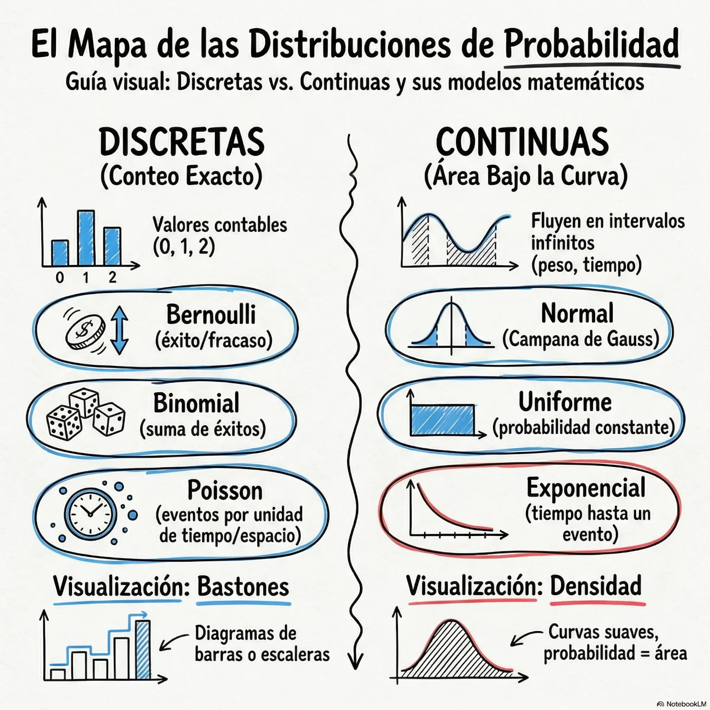

La **probabilidad** es la rama de las matemáticas que estudia la aleatoriedad y la incertidumbre. En bioestadística, es la base del razonamiento estadístico y la inferencia.

## Fundamentos de Incertidumbre

Para que la inferencia estadística funcione, es necesario contar con un lenguaje preciso para cuantificar la incertidumbre. Ese lenguaje es la **teoría de la probabilidad**. La probabilidad es una rama de las matemáticas que asigna un número entre 0 y 1 (o entre 0% y 100%) a la ocurrencia de un evento, donde 0 significa que es imposible y 1 significa que es seguro. En el contexto de la ciencia de datos, la probabilidad nos permite modelar y gestionar la aleatoriedad inherente a casi todos los fenómenos del mundo real. Desde la incertidumbre en las mediciones experimentales hasta la variabilidad en el comportamiento del consumidor, la probabilidad proporciona los instrumentos para expresar y analizar esta incertidumbre de manera sistemática.

Un concepto central en la probabilidad es el de **variable aleatoria**. Una variable aleatoria es una función que asigna un resultado numérico a cada posible resultado de un experimento aleatorio. Hay dos tipos principales:

**Variables Aleatorias Discretas** 

Toman un número contable de valores, típicamente enteros. Ejemplos incluyen el número de caras al lanzar una moneda varias veces o el número de clientes que llegan a una tienda en una hora. Una variable aleatoria es discreta cuando su rango de valores posibles es finito o "contablemente" infinito (puede organizarse en una secuencia numérica como 1,2,3,…). En el ámbito clínico, estas variables suelen ser el resultado de un proceso de conteo.

La probabilidad de cada valor posible se describe mediante una **función de masa de probabilidad (PMF)**.

Ejemplos:

* Número de pacientes admitidos en una unidad de cuidados intensivos en una hora determinada.
* Conteo de colonias bacterianas en una placa de Petri.
* Número de cigarrillos consumidos diariamente por un paciente

**Variables Aleatorias Continuas** 

Pueden tomar cualquier valor numérico dentro de un intervalo o rango continuo. Ejemplos incluyen la altura de una persona, el tiempo que tarda en llegar un autobús o la temperatura en un día determinado. La probabilidad de que una variable continua tome un valor específico es cero; en su lugar, se habla de la probabilidad de que caiga dentro de un cierto rango. Esta probabilidad se describe mediante una **función de densidad de probabilidad (PDF)**, donde el área bajo la curva entre dos puntos representa la probabilidad de que la variable caiga en ese intervalo.

Ejemplos:

* Concentración de triglicéridos o glucosa en suero (mg/dL).
* Índice de masa corporal (IMC) de un paciente.
* Tiempo transcurrido hasta la recuperación tras una intervención quirúrgica

### Diferencias Críticas y Comparativa

La distinción entre ambos tipos de distribuciones radica en la naturaleza de su soporte y el tratamiento analítico de sus probabilidades:

| Característica           | Distribución Discreta                                | Distribución Continua             |
| :----------------------- | :--------------------------------------------------- | :-------------------------------- |
| **Naturaleza**           | Basada en conteos.                                   | Basada en mediciones.             |
| **Rango**                | Valores aislados y específicos.                      | Intervalos infinitos de valores.  |
| **Probabilidad Puntual** | $P(X=x) = p(x) > 0$ para valores del rango.          | $P(X=x) = 0$ siempre.             |
| **Operador Base**        | Sumatoria ($\sum$).                                  | Integral ($\int$).                |
| **Forma de la CDF**      | Función escalonada con saltos en cada valor posible. | Curva suave y continua.           |
| **Uso de Desigualdades** | $P(X < b) \ne P(X \le b)$.                           | $P(X < b) = P(X \le b)$.          |
| **Gráficos Típicos**     | Diagrama de barras o bastones.                       | Curvas de densidad e histogramas. |

Se debe considerar que aunque muchas variables son continuas por naturaleza (como el peso), los instrumentos de medición las "discretizan" al redondearlas (por ejemplo, al gramo más cercano). No obstante, el modelado matemático continuo suele ser más eficiente y preciso para el análisis de grandes cohortes de datos hospitalarios.

A partir de las variables aleatorias, se definen las **distribuciones de probabilidad**, que describen cómo se distribuyen las probabilidades de los posibles valores de una variable aleatoria. Como mencionamos anteriormente, algunas distribuciones son tan comunes que se han convertido en herramientas esenciales en la ciencia de datos. La elección de una distribución para modelar un fenómeno de datos no es arbitraria; se basa en la naturaleza del problema: el tipo de datos (discreto o continuo), la simetría esperada, los límites de los valores y la frecuencia de los valores extremos.

Aquí hay una tabla que resume algunas de las distribuciones de probabilidad más importantes y sus aplicaciones en la ciencia de datos:

| Distribución | Tipo | Parámetros Clave | Aplicaciones Comunes |
| :--- | :--- | :--- | :--- | 
| **Normal / Gaussiana** | Continua | Media (μ), Desviación Estándar (σ) | Modelado de errores de medición, alturas, IQ, rendimientos de activos financieros, residuos de modelos lineales. |
| **Binomial** | Discreta | Número de ensayos (n), Probabilidad de éxito (p) | Resultados de experimentos con dos salidas (éxito/fracaso), tasas de conversión, pruebas clínicas. |
| **Poisson** | Discreta | Tasa media de eventos (λ) | Modelado de conteos de eventos raros en un intervalo (tiempo, espacio), llamadas a un centro de atención, fallos de hardware. |
| **Uniforme** | Discreta o Continua | Mínimo (a), Máximo (b) | Generadores de números aleatorios, escenarios donde todos los resultados son igualmente probables. |
| **Exponencial** | Continua | Tasa (μ) | Modelado del tiempo entre eventos en un proceso de Poisson (tiempo de espera, vida útil de componentes). |
| **t de Student** | Continua | Grados de libertad (df) | Inferencia sobre medias cuando la desviación estándar de la población es desconocida y los datos son pequeños. |
| **Chi-cuadrado** | Continua | Grados de libertad (df) | Pruebas de bondad de ajuste, pruebas de independencia en tablas de contingencia (prueba Chi-cuadrado). |

En resumen, la probabilidad no es solo un tema teórico; es una herramienta práctica para modelar el mundo tal como es: lleno de incertidumbre. Proporciona la base matemática para todo lo que sigue: desde el Teorema Central del Límite hasta la construcción de intervalos de confianza y las pruebas de hipótesis. Para cualquier aspirante a científico de datos, dominar la intuición detrás de estas distribuciones y saber cuándo aplicarlas es un paso decisivo hacia un análisis de datos más profundo y riguroso.

## Dominando las Distribuciones

Si la probabilidad es el lenguaje de la incertidumbre, entonces las **distribuciones de probabilidad** son sus vocablos más importantes. Son modelos matemáticos que describen cómo se distribuyen las probabilidades de los posibles resultados de una variable aleatoria. Elegir la distribución correcta para modelar un conjunto de datos es un acto de comprensión profunda del fenómeno subyacente. No todas las distribuciones son iguales, y su uso adecuado puede ser la diferencia entre un modelo predictivo exitoso y uno que falla rotundamente. Las distribuciones pueden clasificarse principalmente en discretas y continuas, dependiendo de si la variable aleatoria toma un conjunto contable de valores o un rango continuo.

### Distribución Normal

La distribución **normal**, también conocida como **gaussiana** o **campana de Gauss**, es quizás la distribución más famosa y utilizada. Su importancia radica en gran medida en el **Teorema Central del Límite**, que garantiza que la suma de muchas variables aleatorias independientes e idénticamente distribuidas tenderá a distribuirse normalmente. Esto explica por qué la distribución normal aparece tan comúnmente en la naturaleza y en la sociedad, desde las medidas antropométricas como la altura y el peso, pasando por los errores de medición, hasta los coeficientes de inteligencia (CI). 

La distribución normal está completamente definida por dos parámetros: 
* su media (μ), que determina el centro de la campana, y su desviación estándar (σ), que determina su anchura o dispersión. Una característica notable es la **regla empírica o regla 68-95-99.7**: aproximadamente el 68% de los datos caen dentro de una desviación estándar de la media, el 95% dentro de dos desviaciones estándar y el 99.7% dentro de tres. Esta regla proporciona una intuición rápida sobre la dispersión de los datos. 
* la distribución normal estándar, con μ=0 y σ=1, es una versión universalizada que se usa para calcular probabilidades a través de los **puntajes z** (que indican cuántas desviaciones estándar está un valor de la media).

