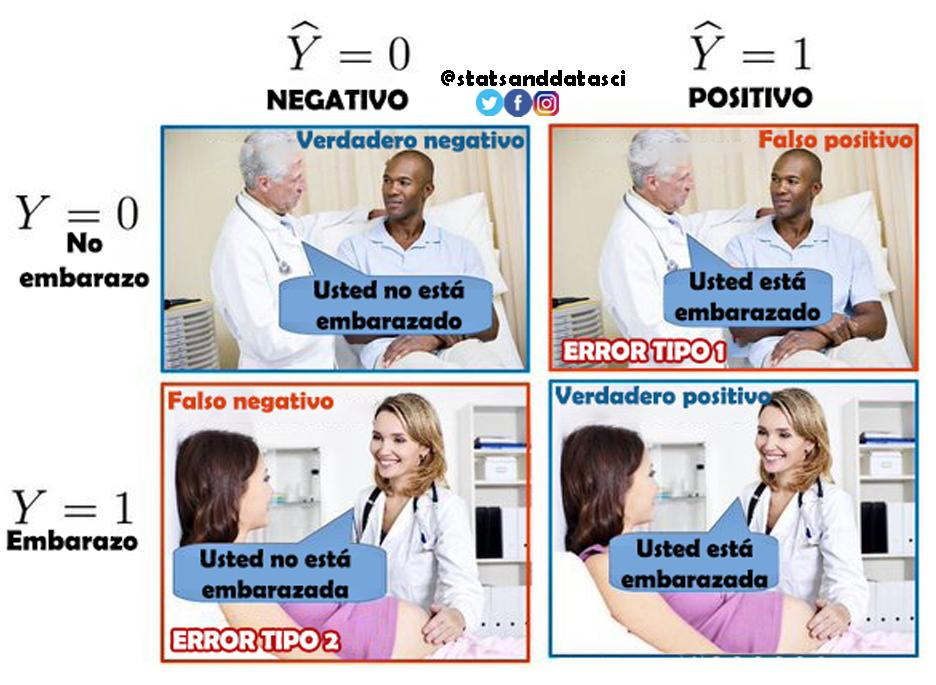

# 📌 Pruebas de Hipótesis

### Hipótesis, Hipótesis Nula y p-value

Las hipótesis y sus pruebas son características del método cientifico con que se han desarrollado los nuevos conocimientos a lo largo de la historia. Iniciando con la observación de los fenomenos que nos rodean, estos han planteado problemas a resolver, que generan una pregunta o problema de investigación.

~~~~
## Hipótesis

Una **hipótesis estadística** es una afirmación o suposición formal sobre una característica de la población que queremos evaluar a partir de datos muestrales.

**Ejemplos de hipótesis:**

* “El promedio de ingresos de un cliente supera $1.000.000.”
* “La tasa de clics de la nueva versión de una campaña es mayor que la de la versión antigua.”
* “La media de la presión arterial después de un tratamiento disminuye.”

**Rol dentro del análisis:**

* Es el **planteamiento científico** o analítico que se quiere contrastar.
* Se formula antes de ver los resultados.


## Hipótesis Nula (H₀)

La **hipótesis nula** es la afirmación que se asume como cierta inicialmente.
Representa la **situación base**, el **no cambio**, la **ausencia de efecto** o la **igualdad**. Esta la generalidad de nuestra hipótesis inicial y se establece en un formato neutro respecto de ella. No niega ni afirma.

En el ámbito de la investigación, la **hipótesis nula** (denotada como $H_0$) constituye el eje central de las pruebas de significación estadística (NHST, por sus siglas en inglés). Su formulación y contraste permiten al investigador determinar si los efectos observados en una muestra son lo suficientemente robustos como para ser generalizados a la población o si, por el contrario, pueden ser atribuidos al error de muestreo o al azar.

En pruebas estadísticas:

* Es el punto de comparación.
* Es la hipótesis que se intenta rechazar mediante evidencia.

**Ejemplos típicos:**

* H₀: el promedio de ingresos **es igual** a $1.000.000.
* H₀: la tasa de clics nueva **es igual** a la antigua.
* H₀: la presión arterial promedio **no cambia** tras el tratamiento.

### 1. Definición y Marco Conceptual
La hipótesis nula se define formalmente como la aseveración de que no existe una diferencia, efecto, cambio o relación entre los parámetros poblacionales bajo estudio. Es la "creencia previa" o el *statu quo* que se asume como verdadero al inicio del procedimiento estadístico hasta que los datos muestren una evidencia contundente en su contra.

En el contexto médico, Ronald A. Fisher la definió como la hipótesis que se somete a prueba para un posible rechazo bajo el supuesto de que es cierta. Es fundamental destacar que la hipótesis nula siempre se refiere a **parámetros poblacionales** (características ideales del universo) y no a los estadísticos obtenidos de la muestra.

### 2. Fundamento
La hipótesis nula se expresa invariablemente como una igualdad con respecto a un valor nulo específico ($\theta_0$). Dependiendo de la naturaleza del estudio clínico, su estructura matemática varía:

#### A. Comparación de Medias (Pruebas t y Z)
Se utiliza para evaluar si la respuesta media ($\mu$) en una población es igual a un valor de referencia o si las medias de dos grupos son idénticas.
*   **Fórmula:** $H_0: \mu = \mu_0$ o $H_0: \mu_1 - \mu_2 = 0$.
*   **Significado:** $\mu_1$ y $\mu_2$ representan las medias poblacionales de los grupos (ej. grupo tratamiento vs. grupo control). El valor cero indica la ausencia total de efecto diferencial.

#### B. Proporciones y Variables Dicotómicas
Esencial en epidemiología para comparar tasas de incidencia o prevalencia de una enfermedad.
*   **Fórmula:** $H_0: p_1 = p_2$ o $H_0: p_1 - p_2 = 0$.
*   **Significado:** $p$ representa la proporción de éxito o presencia de un evento en la población. La hipótesis nula postula que la probabilidad de ocurrencia es la misma en ambos estratos.

#### C. Modelos de Regresión e Independencia
En informática médica, se aplica para validar si un predictor (ej. un biomarcador) influye realmente en el desenlace clínico.
*   **Fórmula:** $H_0: \beta_i = 0$.
*   **Significado:** $\beta_i$ es el coeficiente de regresión parcial. Un valor de cero implica que la variable independiente no aporta información para predecir la variable dependiente.

### 3. El Proceso de Decisión y Errores Asociados
El procedimiento para contrastar la $H_0$ se basa en el cálculo de un estadístico de prueba y su correspondiente **valor p** (*p-value*).

*   **Lógica del valor p:** Es la probabilidad de observar un resultado tan o más extremo que el obtenido, asumiendo que la hipótesis nula es verdadera.
*   **Criterio de Rechazo:** Si el valor p es inferior al nivel de significación prefijado (usualmente $\alpha = 0.05$), se rechaza $H_0$ en favor de la hipótesis alternativa ($H_1$).

Esta decisión conlleva riesgos intrínsecos:
1.  **Error Tipo I ($\alpha$):** Rechazar una hipótesis nula que es, en realidad, verdadera (un "falso positivo" científico).
2.  **Error Tipo II ($\beta$):** No rechazar una hipótesis nula que es falsa (un "falso negativo", donde el investigador no logra detectar un efecto que sí existe).



### 4. Usos en Salud
La hipótesis nula es la herramienta base para:
*   **Ensayos Clínicos:** Demostrar la eficacia de un nuevo fármaco comparado con un placebo; la $H_0$ asume que ambos son igualmente efectivos hasta que la evidencia demuestre lo contrario.
*   **Pruebas Diagnósticas:** Evaluar si el rendimiento de un nuevo test varía significativamente respecto al "estándar de oro".
*   **Estudios Epidemiológicos:** Validar factores de riesgo, partiendo de la premisa de que la exposición no afecta la probabilidad de desarrollar la patología.
*   **Análisis de Supervivencia:** Comparar si las curvas de supervivencia de dos poblaciones son idénticas en el tiempo.

### 5. Conclusión: "Ausencia de Evidencia"
Un rigor fundamental es comprender que **no rechazar la hipótesis nula no equivale a probar que es cierta**. Simplemente significa que los datos actuales no proporcionan suficiente evidencia para descartarla. Como se señala frecuentemente en la literatura científica: "la ausencia de evidencia no es evidencia de ausencia".


:::tip 
No se busca demostrar la hipótesis nula; se busca evaluar si los datos proveen evidencia suficiente para descartarla.
:::


## Hipótesis Alternativa ($H_1$)

En el marco de la estadística inferencial, la **hipótesis alternativa** (denotada como $H_1$ o $H_a$) constituye la piedra angular del proceso de investigación científica, representando la aseveración que contradice directamente a la hipótesis nula ($H_0$). Mientras que la hipótesis nula suele postular la ausencia de efecto, relación o diferencia, la hipótesis alternativa es la que el investigador generalmente desea apoyar o validar mediante la evidencia recolectada.

### 1. Definiciones y Marco Conceptual

Desde una perspectiva técnica, la hipótesis alternativa se define como la pretensión de que existe una diferencia, efecto o relación entre los parámetros poblacionales bajo estudio. Se considera la "**hipótesis del investigador**" porque formaliza el objetivo de la investigación. Bajo el paradigma de las pruebas de significación de la hipótesis nula (NHST), $H_0$ y $H_a$ son mutuamente excluyentes (solo una puede ser cierta) y exhaustivas (una de las dos debe ser verdadera en la población).

En el análisis estadístico, el investigador no busca demostrar que la hipótesis alternativa es "verdadera" en un sentido absoluto, sino que utiliza los datos para determinar si la evidencia en contra de $H_0$ es tan contundente que esta última deba ser rechazada en favor de $H_1$. Si el valor de p (*p-value*) obtenido es menor al nivel de significación preestablecido ($\alpha$), se considera que el resultado es estadísticamente significativo y se favorece la hipótesis alternativa.

### 2. Fundamentos Matemáticos y Taxonomía

La hipótesis alternativa se formula en términos de parámetros poblacionales ($\theta$), y su estructura define la naturaleza de la prueba estadística. Dependiendo del objetivo clínico, se clasifica en dos tipos principales:

#### A. Hipótesis Bilateral o de Dos Colas (No Direccional)
Se utiliza cuando el interés radica en detectar cualquier desviación del valor nulo, sin especificar una dirección previa.
*   **Fórmula (Medias):** $H_0: \mu = \mu_0$ frente a $H_1: \mu \neq \mu_0$.
*   **Fórmula (Proporciones):** $H_0: P_1 = P_2$ frente a $H_1: P_1 \neq P_2$.
En este caso, la región crítica de rechazo se divide equitativamente entre los dos extremos de la distribución de probabilidad.

#### B. Hipótesis Unilateral o de Una Cola (Direccional)
Se emplea cuando existe una base teórica o evidencia previa que sugiere que el parámetro se desviará en un sentido específico (superior o inferior).
*   **Cola Superior:** $H_1: \mu > \mu_0$ o $H_1: P_1 > P_2$. Se busca demostrar que un valor es mayor que el de referencia.
*   **Cola Inferior:** $H_1: \mu < \mu_0$ o $H_1: P_1 < P_2$. Se busca demostrar que un valor es inferior.
Rigor metodológico: La decisión de usar una prueba unilateral debe tomarse **antes** de la recolección de los datos; formular una hipótesis direccional "inspirada" por los resultados observados invalida la inferencia.

### 3. El Rol de la Potencia Estadística

Un concepto fundamental vinculado a la hipótesis alternativa es la **potencia del estudio** ($1 - \beta$). Se define matemáticamente como la probabilidad de rechazar correctamente una hipótesis nula que es falsa, es decir, la capacidad de la prueba para detectar un efecto que realmente existe en la población. 

**Riesgo $\beta$ (Error Tipo II):** Es la probabilidad de no rechazar $H_0$ cuando en realidad $H_a$ es la verdadera.

Un diseño experimental robusto en informática médica debe garantizar una potencia adecuada (usualmente $\geq 80\%$) para asegurar que, si el tratamiento o intervención tiene el efecto postulado en la hipótesis alternativa, el estudio sea capaz de demostrarlo significativamente.


### 4. Usos y Aplicaciones en Salud

La hipótesis alternativa se aplica de forma ubícua en la investigación biomédica contemporánea:
1.  **Ensayos Clínicos de Superioridad:** Para demostrar que un fármaco nuevo es más eficaz que el estándar de oro o el placebo ($H_1: \mu_{nuevo} > \mu_{placebo}$).

2.  **Estudios Epidemiológicos de Factores de Riesgo:** Para validar si la exposición a un tóxico aumenta la incidencia de una patología.

3.  **Evaluación de Pruebas Diagnósticas:** Para determinar si un nuevo biomarcador tiene una capacidad de clasificación superior a la suerte o a métodos previos.

4.  **Estudios de Asociación Genómica:** Para identificar variantes alélicas que se presentan con una frecuencia distinta en pacientes con enfermedades específicas en comparación con controles sanos.


<br />

## p-value (valor-p)

El **p-value** es la probabilidad de observar un estadístico igual o más extremo que el obtenido en los datos **asumiendo que la hipótesis nula H₀ es verdadera**.

Formalmente:

> Es una medida de la evidencia contra la hipótesis nula.

Decisión típica con α = 0.05:
- p ≤ 0.05 → Rechazar H₀  
- p > 0.05 → No rechazar H₀  

Interpretación correcta:

* **p-value pequeño** → datos muy improbables bajo H₀ → evidencia contra H₀.
* **p-value grande** → datos compatibles con H₀ → no hay evidencia suficiente para rechazarla.

**NO significa:**

* No es la probabilidad de que H₀ sea verdadera.
* No mide tamaño del efecto.
* No reemplaza el razonamiento científico.

<br />

## 🔗 Relación entre los tres conceptos

1. **Planteamos una hipótesis (científica):** queremos evaluar un supuesto sobre la población.

2. **Formulamos H₀ (hipótesis nula):** especifica que *no hay diferencia* o *no hay efecto*.

3. **Calculamos el p-value:** para medir si los datos entregan evidencia suficiente para rechazar H₀.

**Decisión típica (con nivel de significancia α = 0.05):**

* Si **p ≤ 0.05** → se **rechaza H₀** → hay evidencia estadística del efecto.

* Si **p > 0.05** → **no se rechaza H₀** → no hay evidencia suficiente.

<br />

## 💡 Ejemplo sencillo aplicado (A/B Testing)

Supongamos que queremos saber si la nueva campaña (B) tiene mayor tasa de clics que la versión anterior (A).

#### 1. Hipótesis científica:

> “La campaña B aumenta la tasa de clics.”

#### 2. Hipótesis nula:

> H₀: CTR-B = CTR-A (no hay diferencia)

#### 3. Prueba estadística:

Se calcula el **p-value** en base a las tasas de clics observadas.

#### 4. Interpretación:

* Si *p-value = 0.01* → probabilidad de observar esta diferencia si H₀ fuera cierta es 1% → **rechazamos H₀** (B es significativamente mejor).

* Si *p-value = 0.22* → datos compatibles con que no hay diferencia → **no se rechaza H₀**.

#### Ejemplo en Python:
```python
import numpy as np
from scipy import stats

# Grupo A y Grupo B simulados
group_A = np.random.normal(10, 2, 100)
group_B = np.random.normal(11, 2, 100)

# Prueba t independiente
t_stat_ab, p_value_ab = stats.ttest_ind(group_A, group_B)

t_stat_ab, p_value_ab
````
Si el p-value es pequeño, concluimos que la diferencia entre A y B es estadísticamente significativa.

<br />

## 📘 Cuándo se usan en Ciencia de Datos

* Validación de modelos (supuestos de normalidad, independencia, homocedasticidad).
* Pruebas A/B para productos digitales.

* Experimentos clínicos.

* Manufactura y control estadístico de calidad.

* Estudios socioeconómicos.

* Modelos causales.

* Evaluación de features o comparaciones entre grupos.

<br />

### Resumen

| Concepto                | Definición                                                                | Función                                   |
| ----------------------- | ------------------------------------------------------------------------- | ----------------------------------------- |
| **Hipótesis**           | Afirmación a evaluar con datos                                            | Plantea el supuesto científico            |
| **Hipótesis nula (H₀)** | Afirmación base que representa “sin efecto” o “igualdad”                  | Punto de comparación; se intenta rechazar |
| **p-value**             | Probabilidad de obtener datos tan extremos suponiendo que H₀ es verdadera | Mide evidencia contra H₀                  |

---