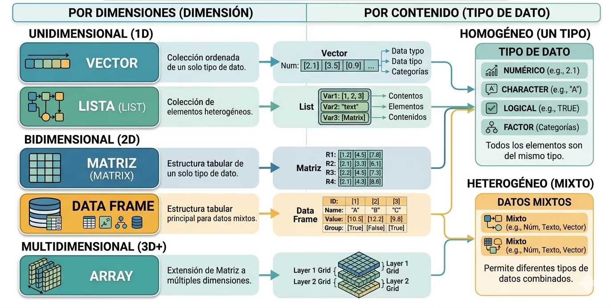
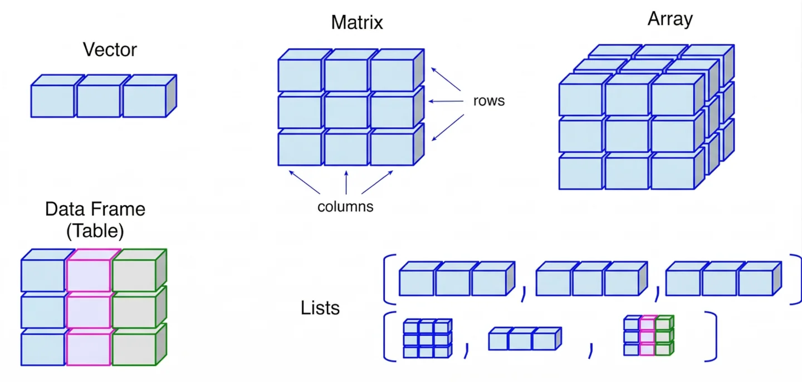

# Estructura de datos en R

En el ecosistema de programación R, los datos se organizan en jerarquías que van desde tipos atómicos simples hasta estructuras complejas multidimensionales. Es esencial comprender que R es un lenguaje orientado a objetos donde cada entidad posee una clase (que define cómo las funciones interactúan con ella) y un modo (que describe su almacenamiento interno).

Se encuentran de distinta clase.



### 1. Clases Atómicas (Tipos de Datos Simples)
R maneja cinco clases básicas de datos, denominadas atómicas, que sirven como los bloques de construcción de cualquier análisis clínico:

*   **Numeric (Números reales):** Es el tipo por defecto para datos numéricos (p. ej., niveles de glucosa o IMC) y se almacena internamente como *double precision*.
*   **Integer (Enteros):** Se utiliza para conteos discretos (p. ej., número de admisiones). Para definirlo explícitamente, se añade el sufijo `L`.
*   **Logical (Booleanos):** Representa valores de verdad (`TRUE` o `FALSE`). Es vital para filtrar bases de datos según condiciones clínicas.
*   **Character (Cadenas):** Texto encerrado en comillas, utilizado para nombres de pacientes o identificadores de fármacos.
*   **Complex:** Números con partes imaginarias, denotadas por el sufijo `i`.

**Ejemplo de uso:**
```r
# Definición de variables clínicas simples
presion_sistolica <- 120.5       # numeric
frecuencia_cardiaca <- 72L       # integer
es_diabetico <- TRUE             # logical
codigo_paciente <- "ID-405"      # character
```

### 2. Estructuras de Datos Fundamentales
A diferencia de otros lenguajes, R no maneja valores escalares aislados; un solo número es, en realidad, un **vector** de longitud uno.

#### A. Vectores
Es la estructura más básica y es **homogénea**, lo que significa que todos sus elementos deben ser del mismo tipo. Se crean comúnmente con la función de combinación `c()`.

**Ejemplo:** `pesos <- c(70.5, 82.1, 65.4)`. Si se intenta mezclar tipos, R aplica la **coerción**, transformando todo al tipo más flexible (usualmente a *character*).

#### B. Matrices y Arreglos (Arrays)
Son extensiones de los vectores con dimensiones. Una **matriz** es bidimensional (filas y columnas), mientras que un **arreglo** puede tener n-dimensiones. Al igual que los vectores, son estructuras homogéneas.

**Operación matemática:** El producto matricial se define como $\mathbf{C} = \mathbf{A} \times \mathbf{B}$, y en R se ejecuta con el operador `%*%`.

#### C. Factores
Son estructuras críticas para la estadística, diseñadas para manejar **variables categóricas** (nominales u ordinales). Internamente, R almacena un factor como un vector de enteros con una tabla de niveles (*levels*) asociada.

**Ejemplo:**
```r
# Clasificación de estadios tumorales
estadio <- factor(c("I", "II", "I", "III"), levels = c("I", "II", "III"), ordered = TRUE)
# Esto permite que R entienda que estadio I < estadio II.
```

#### D. Data Frames
Es la estructura de datos por excelencia en la informática médica. Es una lista de vectores de igual longitud, pero cada vector (columna) puede tener un tipo de dato distinto. Esto emula la estructura de una hoja de cálculo o una tabla de base de datos SQL.

**Ejemplo:**
```r
pacientes <- data.frame(
  ID = 1:3,
  Edad = c(25, 40, 55),
  Fumador = c(FALSE, TRUE, FALSE)
)
```

#### E. Listas
Son colecciones **heterogéneas** de objetos. Una lista puede contener vectores, matrices, data frames e incluso otras listas. Muchas funciones estadísticas en R devuelven sus resultados en formato de lista para organizar métricas dispares (p. ej., p-valores, intervalos de confianza y estadísticos de prueba).

### 3. Valores Especiales y Datos Faltantes
En registros de salud electrónicos (EHR), es común encontrar irregularidades que R gestiona mediante etiquetas específicas:
*   **NA (Not Available):** Representa un dato ausente (p. ej., una prueba de laboratorio no realizada).
*   **NaN (Not a Number):** Resultado de operaciones matemáticas indefinidas como $0/0$.
*   **Inf:** Infinito positivo o negativo (p. ej., $1/0$).
   


### Resumen de Propiedades

| Estructura     | Dimensiones | Contenido                          |
| :------------- | :---------- | :--------------------------------- |
| **Vector**     | 1D          | Homogéneo (mismo tipo)             |
| **Matriz**     | 2D          | Homogéneo                          |
| **Data Frame** | 2D          | Heterogéneo (por columnas)         |
| **Lista**      | 1D (lineal) | Heterogéneo (objetos arbitrarios)  |
| **Factor**     | 1D          | Categorías (codificación numérica) |

***

Ejemplo en R:
```r
# Uso de datos en R

```
