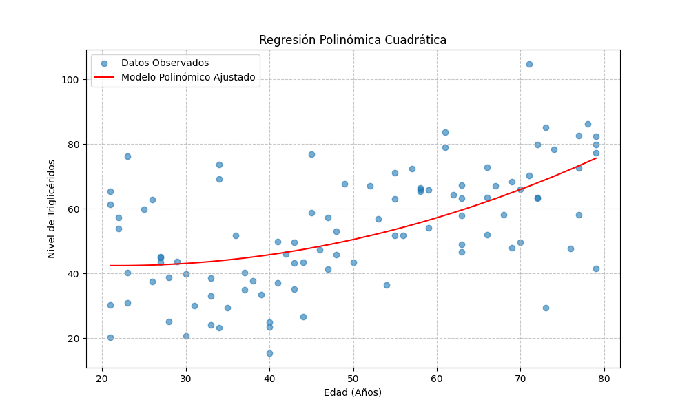
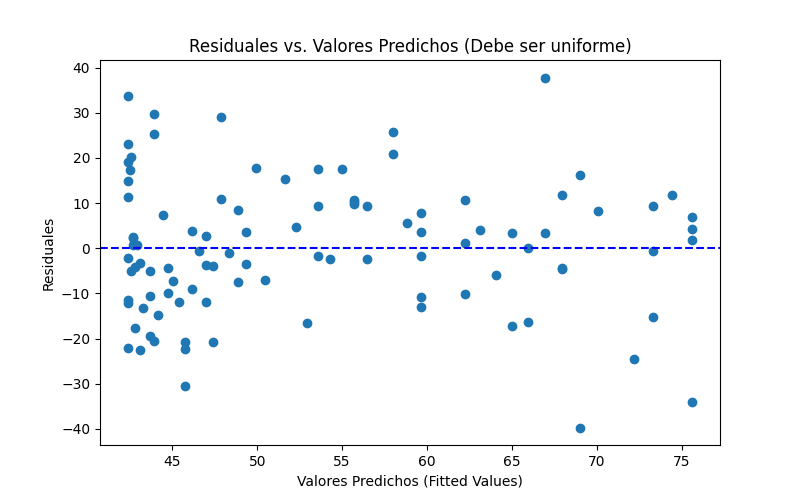
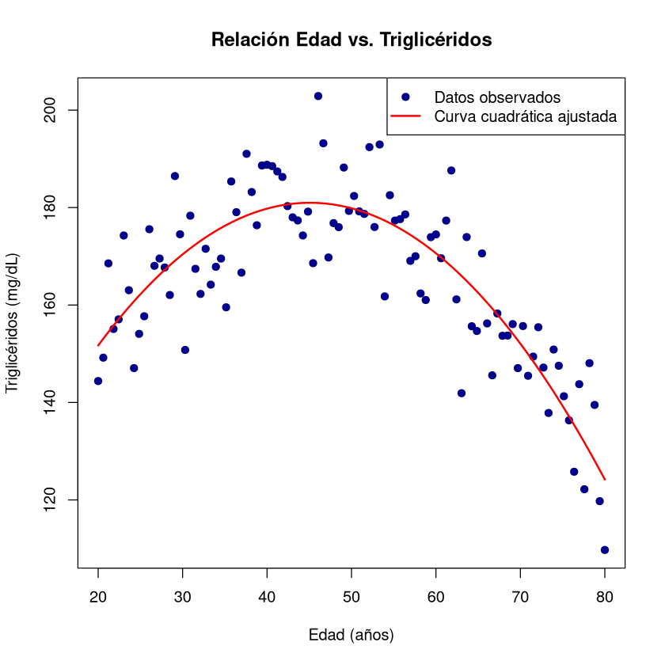

# El Análisis Predictivo: Regresión Lineal y Covarianza

Una vez que entendemos los datos, podemos empezar a responder preguntas más complejas: ¿Hay una relación entre dos variables? ¿Podemos usar el conocimiento de una variable para predecir otra? Estas preguntas son el núcleo del análisis predictivo, una de las áreas más prácticas y valiosas de la ciencia de datos. Dos de las herramientas estadísticas más fundamentales para explorar relaciones y construir predicciones son la **covarianza** y la **regresión lineal**.

## Covarianza

La **covarianza** es una medida que cuantifica la dirección de la relación lineal entre dos variables cuantitativas. Específicamente, mide si los cambios en una variable están asociados con cambios en la otra. Una covarianza positiva indica que cuando una variable tiende a aumentar, la otra también lo hace. Una covarianza negativa indica que cuando una variable aumenta, la otra tiende a disminuir. Sin embargo, la principal limitación de la covarianza es que su valor numérico no está estandarizado, por lo que es difícil interpretar la magnitud de la relación; su signo es lo único que realmente importa para la dirección. Por esta razón, se suele utilizar una versión estandarizada de la covarianza: el **coeficiente de correlación de Pearson**.

## Análisis de regresión sobre datos

El **análisis de regresión** es una técnica estadística utilizada para modelar y analizar la relación entre una variable dependiente (o respuesta) y una o más variables independientes (o predictoras). La forma más simple y común de análisis de regresión es la **regresión lineal simple** (RLS), que examina la relación entre dos variables cuantitativas. Aquí, una variable se identifica como la variable de respuesta o dependiente (Y), y la otra como la variable predictora o independiente (X). En la RLS, se busca dibujar una línea recta que mejor se ajuste a sus datos, permitiendo predecir el valor de Y a partir de un valor conocido de X. La ecuación de la línea de regresión se expresa generalmente como:
$$ Y = \beta_0 + \beta_1 X + \epsilon $$
donde:
- $ Y $ es la variable dependiente (lo que queremos predecir).
- $X $ es la variable independiente (la que usamos para hacer la predicción).
- $ \beta_0 $ es la intersección (el valor de $ Y $ cuando $ X = 0 $).
- $ \beta_1 $ es la pendiente de la línea (cuánto cambia $ Y $ por un cambio unitario en $ X $).
- $ \epsilon $ es el término de error (la variabilidad en $ Y $ que no puede ser explicada por $ X $).

## Regresión Lineal

Mientras que la correlación describe una relación existente, la **regresión lineal** va un paso más allá y permite modelar y predecir. La regresión lineal simple se utiliza para modelar la relación entre una variable dependiente (o respuesta, *y*) y una única variable independiente (o predictor, *x*) suponiendo que esa relación es lineal. El objetivo es encontrar la línea recta "mejor ajustada" que pasa a través de los puntos de datos en un gráfico de dispersión. Esta línea se describe mediante la ecuación `y = mx + b`, donde `m` es la pendiente (indica cómo cambia *y* por cada unidad de cambio en *x*) y `b` es la intersección en el eje *y*. En el contexto de la inferencia estadística, se construyen intervalos de confianza para la pendiente para determinar si es estadísticamente significativa (es decir, si difiere de cero).

La regresión lineal múltiple extiende este concepto para incorporar más de un predictor. Por ejemplo, podríamos querer predecir el precio de una casa (`price`) basándonos en su tamaño (`square_feet`), el número de habitaciones (`bedrooms`) y su antigüedad (`age`). La ecuación se generaliza a `y = b0 + b1*x1 + b2*x2 + ... + bn*xn`. La regresión lineal es un modelo paramétrico que a menudo asume que los residuos (las diferencias entre los valores observados y los predichos por el modelo) se distribuyen normalmente y tienen una varianza constante. Validar estas suposiciones es una parte crítica del proceso de modelado.

Estos métodos son la base de muchas aplicaciones en la ciencia de datos. El comercio electrónico utiliza la regresión para analizar la relación entre el tiempo de permanencia en una página y las ventas. Los fabricantes usan el análisis de correlación para identificar factores que influyen en la calidad de un producto. Los economistas utilizan la regresión para modelar la relación entre el gasto en publicidad y las ventas de un producto. El aprendizaje automático y la inteligencia artificial se basan enormemente en estas bases estadísticas para crear modelos predictivos que impulsan sistemas de recomendación, detección de fraudes, diagnóstico médico y mucho más. Entender cómo funcionan la covarianza y la regresión no solo ayuda a analizar datos, sino que también proporciona una comprensión profunda de cómo se construyen muchos de los modelos que impulsan la tecnología moderna.


## El Concepto Básico del Modelo
Cualquier modelo estadístico describe una variable de respuesta (Y) como la suma de dos componentes:

```math
\text{Variable de respuesta } = \text{ Componente sistemático } + \text{ Componente de error}
```

El **Componente Sistemático** describe la variación de Y que puede ser explicada por el modelo (las variables $X$). El **Componente de Error** ($e_i$) representa la variación en Y que no se puede explicar; esto incluye errores de medición o la influencia de otras variables no incluidas.

## Regresión Lineal Simple (RLS)

La RLS asume que la relación entre la variable de respuesta ($Y$) y la variable predictora ($X$) se puede describir con una línea recta.

### La Fórmula del Modelo RLS
El modelo de RLS para un sujeto $i$ se expresa como:

```math
Y_{i} = \beta_{0} + \beta_{1}X_{i} + e_{i}
```

**Explicación:**
*   $Y_i$: Es el valor observado de la variable de respuesta para el sujeto $i$.
*   $X_i$: Es el valor observado de la variable predictora para el sujeto $i$.
*   $\beta_0$: Es el **Intercepto**. Es el valor esperado de $Y$ cuando $X$ es cero.
*   $\beta_1$: Es la **Pendiente** (o coeficiente de regresión). Mide cuánto cambia $Y$ por cada unidad de cambio en $X$.
*   $e_i$: Es el **Error Aleatorio** para el sujeto $i$.

La parte sistemática, que es la línea recta que estamos estimando, es el valor esperado de $Y$ dado $X$ ($\mu_{Y|X}$) [9, 10]:

```math
\mu_{Y|X} = \beta_{0} + \beta_{1}X
```

### Relación con Modelos Lineales
La RLS es un caso de Modelo de Regresión Lineal [5]. Un modelo es "lineal" si sus parámetros ($\beta_0, \beta_1$, etc.) no están en funciones complejas (como el exponente).

**Ejemplos de modelos considerados Lineales (por ser lineales en los $\beta$s):**
1.  **RLS Estándar (Relación Recta):**
    $$Y_{i} = \beta_{0} + \beta_{1}X_{i} + e_{i}$$
2.  **Transformación Logarítmica de Y:**
    $$\ln(Y_{i}) = \beta_{0} + \beta_{1}X_{i} + e_{i}$$
3.  **Modelo Polinómico (Relación Curva):** Se utiliza para modelar una asociación no lineal (curva) entre $Y$ y $X$, pero se ajusta usando técnicas de regresión lineal porque los $\beta$s no están elevados a potencias.
    ```math
    Y_{i} = \beta_{0} + \beta_{1}X_{i} + \beta_{2}X_{i}^{2} + e_{i}
    ```

<br />
#### 📝 Programación:
<Tabs>
<TabItem value="mnp" label="Antecedentes" default>
<div class="alert alert--primary">
**Modelo de regresión lineal simple**<br />
</div>
</TabItem>
<TabItem value="mnp-python" label="Pyhton" default>
```python showLineNumbers
# Implementación en Python
```
</TabItem>
<TabItem value="mnp-r" label="R" default>
```r showLineNumbers
# Implementación en R
```
</TabItem>
</Tabs><br />

## Modelos de Regresión No Lineal (MRNL)

Un modelo es considerado verdaderamente **No Lineal** si es no lineal en los parámetros ($\beta$s). En el ámbito de la bioestadística, el **Modelo de Regresión No Lineal (MRNL)** constituye una herramienta analítica avanzada para describir procesos biológicos cuya complejidad no puede ser capturada por combinaciones lineales de parámetros. A diferencia de los modelos lineales (que incluyen a la regresión polinómica), en un MRNL la variable dependiente se define como una función no lineal respecto a sus **parámetros**.


### Fundamentación Matemática

Es crucial distinguir entre una "relación curva" y un "modelo no lineal". Un modelo se considera **lineal** si la ecuación es una suma ponderada de los parámetros ($\beta$), incluso si las variables independientes están elevadas a una potencia (ej. $Y = \beta_0 + \beta_1 X + \beta_2 X^2$).

En contraste, el **Modelo de Regresión No Lineal** se expresa de forma general como:
```math
Y_i = f(X_i, \theta) + \epsilon_i
```

Donde:
*   **$Y_i$**: Variable de respuesta observada (ej. concentración plasmática de un fármaco).
*   **$X_i$**: Vector de variables independientes o predictores (ej. tiempo o dosis).
*   **$\theta$**: Vector de parámetros a estimar (donde al menos uno aparece de forma no lineal, como un exponente o dentro de una función logarítmica).
*   **$f(X_i, \theta)$**: Función no lineal que describe la relación sistemática.
*   **$\epsilon_i$**: Término de error aleatorio, que usualmente se asume sigue una distribución normal $N(0, \sigma^2)$.

**Ejemplo de estructura verdaderamente no lineal:**
```math
Y = \beta_0 + \beta_1 e^{\frac{X}{\beta_2}} + \epsilon
```
Aquí, el parámetro $\beta_2$ se encuentra en el denominador de un exponente, lo que imposibilita resolver el modelo mediante álgebra lineal simple.


### Métodos de Validación y Adecuación del Modelo

La validación es esencial para determinar si se cumplen los supuestos del modelo antes de realizar inferencias. El procedimiento principal de validación es el **Análisis de Residuales**.

### Definición de Residual
El residual ($\hat{e}_i$) es la diferencia entre el valor observado de Y ($y_i$) y el valor predicho ($\hat{y}_i$) por el modelo:

```math
\hat{e}_{i}=y_{i}-\hat{y}_{i}
```


### Métodos de Estimación: El Proceso Iterativo

A diferencia de la regresión lineal, que posee una solución algebraica cerrada (ecuaciones normales de mínimos cuadrados), el MRNL requiere métodos **computacionalmente intensivos e iterativos**.

1.  **Valores Iniciales (*Initial Guesses*):** El investigador debe proporcionar estimaciones iniciales de los parámetros para generar una curva preliminar.
2.  **Iteraciones:** El algoritmo (como el método de Gauss-Newton o Levenberg-Marquardt) ajusta los parámetros en pequeños pasos ("stepwise") para acercar la curva a los puntos de datos observados.
3.  **Convergencia:** El proceso se repite hasta que los cambios en los parámetros ya no reducen significativamente la suma de los cuadrados de los residuos.


### Ejemplos de Aplicación

#### A. Farmacodinamia: Curvas Dosis-Respuesta (Ecuación de Hill)
Se utiliza para modelar el efecto de un fármaco según su concentración. Un ejemplo clásico es la relajación del músculo vesical ante la norepinefrina.
```math
Y = \text{Base} + \frac{\text{Máximo} - \text{Base}}{1 + 10^{(\log EC_{50} - X) \cdot \text{Pendiente}}}
```
*   **$EC_{50}$**: Parámetro que indica la concentración necesaria para obtener el 50% del efecto máximo.

#### B. Farmacocinética: Modelos Multi-exponenciales
Para describir la caída de la concentración plasmática de un fármaco a lo largo del tiempo, se emplean sumas de funciones exponenciales, reflejando fases de distribución y eliminación.
```math
C(t) = A e^{-\alpha t} + B e^{-\beta t}
```

#### C. Cinética Enzimática: Ecuación de Michaelis-Menten
Modela la velocidad de una reacción química catalizada por una enzima.
```math
V = \frac{V_{max} \cdot [S]}{K_m + [S]}
```
*   **$V_{max}$**: Velocidad máxima de la reacción.
*   **$K_m$**: Concentración de sustrato ($S$) a la cual la velocidad es la mitad de la máxima.

#### D. Análisis de Supervivencia: Modelos Paramétricos
Aunque el modelo de Cox es común, los modelos no lineales exponenciales o de Weibull son fundamentales cuando se asume que una proporción constante de la población experimenta el evento por unidad de tiempo.


### Verificación de Supuestos mediante Gráficos

| Supuesto | Método de Verificación | Indicación de Incumplimiento |
| :--- | :--- | :--- |
| **Linealidad y Varianza Constante** | Gráfico de Residuales vs. Valores Predichos (o vs. Predictor X). | Un patrón **no lineal** en los puntos indica que la suposición lineal no es adecuada. Si la dispersión de los residuales no es uniforme alrededor de cero, la varianza no es constante. |
| **Normalidad de Errores** | Histogramas y gráficos de probabilidad (Q-Q plots) de los residuales. | Si los residuales no siguen aproximadamente una campana (distribución normal) en el histograma o una línea recta en el Q-Q plot |
| **Detección de Valores Influyentes** | Estadísticas de diagnóstico (e.g., Cook's Distance, DFFITS). | Valores extremadamente altos en estas estadísticas sugieren que ciertas observaciones tienen un impacto fuerte en los resultados de la regresión y deben ser revisadas. |

<br />
#### 📝 Programación:
<Tabs>
<TabItem value="mnp" label="Antecedentes" default>
<div class="alert alert--primary">
**Modelo de regresión no lineal**<br />
</div>
</TabItem>
<TabItem value="mnp-python" label="Pyhton" default>
```python showLineNumbers
# Implementación en Python
```
</TabItem>
<TabItem value="mnp-r" label="R" default>
```r showLineNumbers
# Implementación en R
```
</TabItem>
</Tabs><br />

## Modelos de Regresión Polinómica (MRP)

El **Modelo de Regresión Polinómica (MRP)** representa una extensión del modelo lineal general, diseñada para capturar relaciones no lineales entre una variable dependiente y uno o más predictores,. En la informática médica y la investigación clínica, este modelo es fundamental cuando la respuesta biológica no sigue una tendencia de línea recta, sino que presenta curvaturas, picos o valles debidos a procesos fisiológicos complejos,.

### Fundamentación Matemática

Un modelo polinómico de grado $k$ se define mediante la siguiente ecuación probabilística:

```math
Y = \beta_0 + \beta_1x + \beta_2x^2 + \dots + \beta_kx^k + \epsilon
```

**Significado de sus componentes,:**
*   **$Y$**: Variable dependiente o de respuesta (ej. niveles de un biomarcador).
*   **$x$**: Variable independiente o predictora (ej. dosis de un fármaco o edad).
*   **$\beta_0$**: Intercepto; representa el valor esperado de $Y$ cuando $x=0$.
*   **$\beta_1, \dots, \beta_k$**: Coeficientes de regresión parcial; $\beta_1$ es el coeficiente lineal, $\beta_2$ el cuadrático, etc.
*   **$k$**: Grado del polinomio. Determina el número de "curvas" o cambios de dirección en la función ($k-1$ bends).
*   **$\epsilon$**: Término de error aleatorio, el cual se asume que sigue una distribución normal con media 0 y varianza constante $\sigma^2$ ($\epsilon \sim N(0, \sigma^2)$),.

Es imperativo notar que, aunque la relación entre $Y$ y $x$ es curvilínea, el modelo sigue considerándose **lineal** desde el punto de vista estadístico, ya que es lineal en relación con sus parámetros ($\beta$).

### Consideraciones Técnicas

#### A. Selección del Grado del Modelo
El investigador debe equilibrar la bondad de ajuste con la parsimonia. Un polinomio de grado superior siempre tendrá un coeficiente de determinación ($R^2$) igual o mayor que uno de grado inferior, pero puede incurrir en sobreajuste (*overfitting*). Se recomienda utilizar el **$R^2$ ajustado**, el cual penaliza la inclusión de parámetros adicionales que no mejoran significativamente la explicación de la varianza,:

```math
R^2_{ajustada} = 1 - \frac{n-1}{n-(k+1)} \cdot \frac{SCE}{STC}
```

#### B. Multicolinealidad y Centrado
En los MRP, los términos $x, x^2, \dots, x^k$ suelen estar altamente correlacionados entre sí, lo que infla los errores estándar de los coeficientes,. Para mitigar este efecto, se utiliza el **centrado de variables**, restando la media ($\bar{x}$) a cada observación antes de elevarla a la potencia,:
```math
Y = \beta_0^* + \beta_1^*(x - \bar{x}) + \beta_2^*(x - \bar{x})^2 + \epsilon
```

### Ejemplos de Aplicación en Salud

1.  **Niveles de Triglicéridos y Edad**: En estudios epidemiológicos, se ha observado que la relación entre los triglicéridos y la edad no es puramente lineal; los niveles tienden a aumentar hasta cierta etapa de la vida y luego se estabilizan o descienden, lo que requiere un **modelo cuadrático** ($k=2$) para una predicción precisa.

2.  **Ritmos Circadianos de la Presión Arterial**: Para modelar la variabilidad de la presión arterial sistólica a lo largo de 24 horas, se utilizan polinomios de orden superior (incluso de 7.º grado) para capturar las fluctuaciones complejas durante el ciclo de sueño-vigilia.

3.  **Gasto Energético durante el Sueño**: En investigaciones sobre obesidad infantil, se han empleado modelos polinómicos para describir cómo el gasto energético disminuye rápidamente durante los primeros 30 minutos de sueño y luego continúa descendiendo a un ritmo menor hasta el despertar.

4.  **Relación Peso-Talla**: Aunque a menudo se modela linealmente, en poblaciones pediátricas o estudios de crecimiento, los modelos de segundo o tercer orden (cúbicos) suelen proporcionar un mejor ajuste a la realidad biológica del desarrollo óseo y muscular.

### Implementación en el Entorno R

Para ajustar estos modelos en R, se utiliza la función `lm()`. Existen dos métodos principales:
*   **Uso de `I()`**: Para proteger los términos aritméticos dentro de la fórmula: `lm(y ~ x + I(x^2))`.
*   **Función `poly()`**: Genera polinomios ortogonales, lo cual es preferible para evitar la multicolinealidad estructural: `lm(y ~ poly(x, grado))`.


<br />
#### 📝 Programación:
<Tabs>
<TabItem value="rpc" label="Antecedentes" default>
<div class="alert alert--primary">
**Regresión Polinómica Cuadrática:**<br />
Usaremos el ejemplo de los niveles de triglicéridos ($Y$) explicados por la edad ($X$) y la edad al cuadrado ($X^2$), tal como se encuentra en los estudios de regresión lineal múltiple.

Desde el punto de vista estadístico, aunque el modelo sea cuadrático en la variable X, sigue siendo un modelo lineal porque es lineal en relación con sus parámetros (β).

En la salida, se debe prestar atención al valor `p` asociado al término I($edad^2$). Un valor $p < 0.05$ indica que la curvatura es estadísticamente significativa y que un modelo de línea recta sería inadecuado para describir el fenómeno biológico.
</div>
</TabItem>
<TabItem value="rpc-python" label="Pyhton" default>

```python showLineNumbers
# Implementación en Python
import numpy as np
import pandas as pd
import statsmodels.api as sm
import matplotlib.pyplot as plt

# Datos de ejemplo 
# Usaremos datos ficticios que muestran una relación curva con la edad.
np.random.seed(42)
edad = np.random.randint(20, 80, 100)
# Creamos la edad al cuadrado (la variable polinómica)
edad_cuadrado = edad**2 

# Relación: Triglicéridos = a + b1*edad + b2*edad^2 + error
# Donde la relación con edad^2 es positiva para simular una curva.
trigliceridos = 50 - 0.5 * edad + 0.01 * edad_cuadrado + np.random.normal(0, 15, 100)

# Crear DataFrame y definir variables
data = pd.DataFrame({'Edad': edad, 'Edad_Cuadrado': edad_cuadrado, 'Trigliceridos': trigliceridos})

# Definir predictores (X) y respuesta (Y)
# Note que incluimos tanto Edad como Edad_Cuadrado
X = data[['Edad', 'Edad_Cuadrado']]
Y = data['Trigliceridos']

# Añadir la constante (Intercepto, β0)
X = sm.add_constant(X) 

# Ajuste del modelo de Regresión Polinómica (MLRM)
modelo_polinomico = sm.OLS(Y, X).fit()

print("--- Resumen del Modelo de Regresión Polinómica (Cuadrático) ---")
print(modelo_polinomico.summary())

# --- Visualización de la Curva Ajustada ---
# Generar puntos para dibujar la curva
x_fit = np.linspace(edad.min(), edad.max(), 100)
X_fit = pd.DataFrame({'Edad': x_fit, 'Edad_Cuadrado': x_fit**2})
X_fit = sm.add_constant(X_fit, has_constant='add')

y_pred = modelo_polinomico.predict(X_fit)

plt.figure(figsize=(10, 6))
plt.scatter(data['Edad'], data['Trigliceridos'], label='Datos Observados', alpha=0.6)
plt.plot(x_fit, y_pred, color='red', label='Modelo Polinómico Ajustado')
plt.xlabel('Edad (Años)')
plt.ylabel('Nivel de Triglicéridos')
plt.title('Regresión Polinómica Cuadrática')
plt.legend()
plt.grid(True, linestyle='--', alpha=0.7)
plt.show()

# --- Análisis de Residuales para Linealidad ---
# Un residual plot plano (distribución uniforme alrededor de cero)
# es un buen indicador de que el modelo polinómico capturó la no-linealidad.
residuales = modelo_polinomico.resid
predichos = modelo_polinomico.fittedvalues

plt.figure(figsize=(8, 5))
plt.scatter(predichos, residuales)
plt.axhline(0, color='blue', linestyle='--')
plt.xlabel('Valores Predichos (Fitted Values)')
plt.ylabel('Residuales')
plt.title('Residuales vs. Valores Predichos (Debe ser uniforme)')
plt.show()
```
```raw
--- Resumen del Modelo de Regresión Polinómica (Cuadrático) ---
                            OLS Regression Results                            
==============================================================================
Dep. Variable:          Trigliceridos   R-squared:                       0.339
Model:                            OLS   Adj. R-squared:                  0.326
Method:                 Least Squares   F-statistic:                     24.93
Date:                Tue, 07 Apr 2026   Prob (F-statistic):           1.84e-09
Time:                        21:34:17   Log-Likelihood:                -411.11
No. Observations:                 100   AIC:                             828.2
Df Residuals:                      97   BIC:                             836.0
Df Model:                           2                                         
Covariance Type:            nonrobust                                         
=================================================================================
                    coef    std err          t      P>|t|      [0.025      0.975]
---------------------------------------------------------------------------------
const            47.2125     12.524      3.770      0.000      22.356      72.069
Edad             -0.4419      0.547     -0.808      0.421      -1.528       0.644
Edad_Cuadrado     0.0101      0.005      1.870      0.065      -0.001       0.021
==============================================================================
Omnibus:                        0.109   Durbin-Watson:                   2.044
Prob(Omnibus):                  0.947   Jarque-Bera (JB):                0.002
Skew:                           0.011   Prob(JB):                        0.999
Kurtosis:                       3.002   Cond. No.                     2.77e+04
==============================================================================

Notes:
[1] Standard Errors assume that the covariance matrix of the errors is correctly specified.
[2] The condition number is large, 2.77e+04. This might indicate that there are
strong multicollinearity or other numerical problems.
```



</TabItem>
<TabItem value="rpc-r" label="R" default>
```r showLineNumbers
# Implementación en R
# --- Script de Regresión Polinómica Cuadrática ---

# 1. Generación de datos ficticios basados en lógica clínica
set.seed(123)
edad <- seq(20, 80, length.out = 100)
trigliceridos <- 80 + 4.5*edad - 0.05*edad^2 + rnorm(length(edad), 0, 10)

datos_clinicos <- data.frame(edad, trigliceridos)

# 2. Ajuste del modelo cuadrático
modelo_quad <- lm(trigliceridos ~ edad + I(edad^2), data = datos_clinicos)

# 3. Visualización de los parámetros estimados
summary(modelo_quad)

# 4. Comparación con el modelo lineal simple
modelo_lineal <- lm(trigliceridos ~ edad, data = datos_clinicos)
tabla_comparativa <- anova(modelo_lineal, modelo_quad)
print(tabla_comparativa)

# 5. Representación Gráfica
plot(datos_clinicos$edad, datos_clinicos$trigliceridos, 
    pch = 19, col = "darkblue",
    main = "Relación Edad vs. Triglicéridos",
    xlab = "Edad (años)", ylab = "Triglicéridos (mg/dL)")

# Extraemos los coeficientes beta del modelo (índices correctos: 1, 2, 3)
b0 <- coef(modelo_quad)[1]
b1 <- coef(modelo_quad)[2]
b2 <- coef(modelo_quad)[3]

# Superposición de la curva ajustada
curve(b0 + b1*x + b2*x^2, add = TRUE, col = "red", lwd = 2)

# Leyenda
legend("topright", legend = c("Datos observados", "Curva cuadrática ajustada"),
      col = c("darkblue", "red"), pch = c(19, NA), lty = c(NA, 1), lwd = c(NA, 2))

```
```raw
Call:
lm(formula = trigliceridos ~ edad + I(edad^2), data = datos_clinicos)

Residuals:
     Min       1Q   Median       3Q      Max 
-24.0680  -5.9884  -0.2665   6.7743  21.9457 

Coefficients:
            Estimate Std. Error t value Pr(>|t|)    
(Intercept) 86.36069    7.83395   11.02   <2e-16 ***
edad         4.19829    0.33810   12.42   <2e-16 ***
I(edad^2)   -0.04657    0.00334  -13.94   <2e-16 ***
---
Signif. codes:  0 ‘***’ 0.001 ‘**’ 0.01 ‘*’ 0.05 ‘.’ 0.1 ‘ ’ 1

Residual standard error: 9.143 on 97 degrees of freedom
Multiple R-squared:  0.7367,	Adjusted R-squared:  0.7312 
F-statistic: 135.7 on 2 and 97 DF,  p-value: < 2.2e-16
Analysis of Variance Table

Model 1: trigliceridos ~ edad
Model 2: trigliceridos ~ edad + I(edad^2)
  Res.Df     RSS Df Sum of Sq      F    Pr(>F)    
1     98 24354.8                                  
2     97  8108.3  1     16246 194.36 < 2.2e-16 ***
---
Signif. codes:  0 ‘***’ 0.001 ‘**’ 0.01 ‘*’ 0.05 ‘.’ 0.1 ‘ ’ 1
```


</TabItem>
</Tabs><br />
