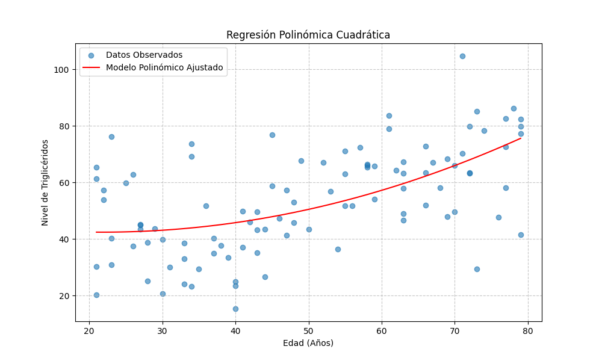
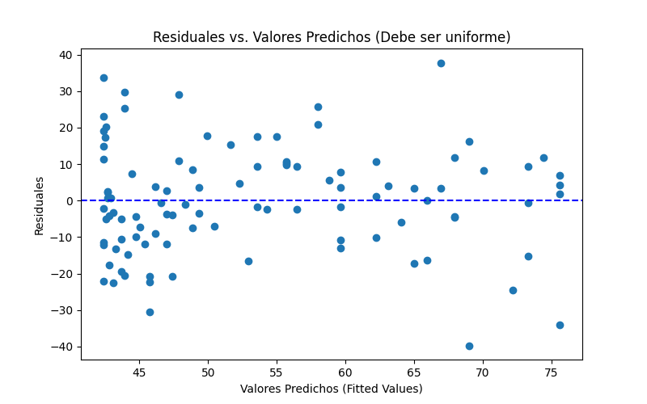
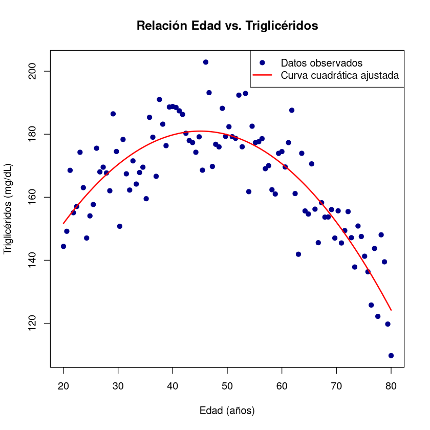

# El Análisis Predictivo: Regresión Lineal y Covarianza

Una vez que entendemos los datos, podemos empezar a responder preguntas más complejas: ¿Hay una relación entre dos variables? ¿Podemos usar el conocimiento de una variable para predecir otra? Estas preguntas son el núcleo del análisis predictivo, una de las áreas más prácticas y valiosas de la ciencia de datos. Dos de las herramientas estadísticas más fundamentales para explorar relaciones y construir predicciones son la **covarianza** y la **regresión lineal**.

## Covarianza

La **covarianza** es una medida que cuantifica la dirección de la relación lineal entre dos variables cuantitativas. Específicamente, mide si los cambios en una variable están asociados con cambios en la otra. Una covarianza positiva indica que cuando una variable tiende a aumentar, la otra también lo hace. Una covarianza negativa indica que cuando una variable aumenta, la otra tiende a disminuir. Sin embargo, la principal limitación de la covarianza es que su valor numérico no está estandarizado, por lo que es difícil interpretar la magnitud de la relación; su signo es lo único que realmente importa para la dirección. Por esta razón, se suele utilizar una versión estandarizada de la covarianza: el **coeficiente de correlación de Pearson**.

## Análisis de regresión sobre datos

El **análisis de regresión** es una técnica estadística utilizada para modelar y analizar la relación entre una variable dependiente (o respuesta) y una o más variables independientes (o predictoras). La forma más simple y común de análisis de regresión es la **regresión lineal simple** (RLS), que examina la relación entre dos variables cuantitativas. Aquí, una variable se identifica como la variable de respuesta o dependiente (Y), y la otra como la variable predictora o independiente (X). En la RLS, se busca dibujar una línea recta que mejor se ajuste a sus datos, permitiendo predecir el valor de Y a partir de un valor conocido de X. La ecuación de la línea de regresión se expresa generalmente como:
$$ Y = \beta_0 + \beta_1 X + \epsilon $$
donde:
- $ Y $ es la variable dependiente (lo que queremos predecir).
- $X $ es la variable independiente (la que usamos para hacer la predicción).
- $ \beta_0 $ es la intersección (el valor de $ Y $ cuando $ X = 0 $).
- $ \beta_1 $ es la pendiente de la línea (cuánto cambia $ Y $ por un cambio unitario en $ X $).
- $ \epsilon $ es el término de error (la variabilidad en $ Y $ que no puede ser explicada por $ X $).

## Regresión Lineal

Mientras que la correlación describe una relación existente, la **regresión lineal** va un paso más allá y permite modelar y predecir. La regresión lineal simple se utiliza para modelar la relación entre una variable dependiente (o respuesta, *y*) y una única variable independiente (o predictor, *x*) suponiendo que esa relación es lineal. El objetivo es encontrar la línea recta "mejor ajustada" que pasa a través de los puntos de datos en un gráfico de dispersión. Esta línea se describe mediante la ecuación

```math
y = mx + b
```

donde $m$ es la pendiente (indica cómo cambia $y$ por cada unidad de cambio en $x$) y $b$ es la intersección en el eje $y$. En el contexto de la inferencia estadística, se construyen intervalos de confianza para la pendiente para determinar si es estadísticamente significativa (es decir, si difiere de cero).

La regresión lineal múltiple extiende este concepto para incorporar más de un predictor. Por ejemplo, podríamos querer predecir el precio de una casa ($\text{price}$) basándonos en su tamaño ($\text{square\_feet}$), el número de habitaciones ($\text{bedrooms}$) y su antigüedad ($\text{age}$). La ecuación se generaliza a

```math
y = b0 + b1*x1 + b2*x2 + ... + bn*xn
```

La regresión lineal es un modelo paramétrico que a menudo asume que los residuos (las diferencias entre los valores observados y los predichos por el modelo) se distribuyen normalmente y tienen una varianza constante. Validar estas suposiciones es una parte crítica del proceso de modelado.

Estos métodos son la base de muchas aplicaciones en la ciencia de datos. El comercio electrónico utiliza la regresión para analizar la relación entre el tiempo de permanencia en una página y las ventas. Los fabricantes usan el análisis de correlación para identificar factores que influyen en la calidad de un producto. Los economistas utilizan la regresión para modelar la relación entre el gasto en publicidad y las ventas de un producto. 

El aprendizaje automático y la inteligencia artificial se basan enormemente en estas bases estadísticas para crear modelos predictivos que impulsan sistemas de recomendación, detección de fraudes, diagnóstico médico y mucho más. Entender cómo funcionan la covarianza y la regresión no solo ayuda a analizar datos, sino que también proporciona una comprensión profunda de cómo se construyen muchos de los modelos que impulsan la tecnología moderna.


## El Concepto Básico del Modelo
Cualquier modelo estadístico describe una variable de respuesta (Y) como la suma de dos componentes:

```math
\text{Variable de respuesta } = \text{ Componente sistemático } + \text{ Componente de error}
```

El **Componente Sistemático** describe la variación de Y que puede ser explicada por el modelo (las variables $X$). El **Componente de Error** ($e_i$) representa la variación en Y que no se puede explicar; esto incluye errores de medición o la influencia de otras variables no incluidas.

## Regresión Lineal Simple (RLS)

La RLS asume que la relación entre la variable de respuesta ($Y$) y la variable predictora ($X$) se puede describir con una línea recta.

### La Fórmula del Modelo RLS
El modelo de RLS para un sujeto $i$ se expresa como:

```math
Y_{i} = \beta_{0} + \beta_{1}X_{i} + e_{i}
```

**Explicación:**
*   $Y_i$: Es el valor observado de la variable de respuesta para el sujeto $i$.
*   $X_i$: Es el valor observado de la variable predictora para el sujeto $i$.
*   $\beta_0$: Es el **Intercepto**. Es el valor esperado de $Y$ cuando $X$ es cero.
*   $\beta_1$: Es la **Pendiente** (o coeficiente de regresión). Mide cuánto cambia $Y$ por cada unidad de cambio en $X$.
*   $e_i$: Es el **Error Aleatorio** para el sujeto $i$.

La parte sistemática, que es la línea recta que estamos estimando, es el valor esperado de $Y$ dado $X$ ($\mu_{Y|X}$) [9, 10]:

```math
\mu_{Y|X} = \beta_{0} + \beta_{1}X
```

### Relación con Modelos Lineales
La RLS es un caso de Modelo de Regresión Lineal [5]. Un modelo es "lineal" si sus parámetros ($\beta_0, \beta_1$, etc.) no están en funciones complejas (como el exponente).

**Ejemplos de modelos considerados Lineales (por ser lineales en los $\beta$s):**
1.  **RLS Estándar (Relación Recta):**
    $$Y_{i} = \beta_{0} + \beta_{1}X_{i} + e_{i}$$
2.  **Transformación Logarítmica de Y:**
    $$\ln(Y_{i}) = \beta_{0} + \beta_{1}X_{i} + e_{i}$$
3.  **Modelo Polinómico (Relación Curva):** Se utiliza para modelar una asociación no lineal (curva) entre $Y$ y $X$, pero se ajusta usando técnicas de regresión lineal porque los $\beta$s no están elevados a potencias.
    ```math
    Y_{i} = \beta_{0} + \beta_{1}X_{i} + \beta_{2}X_{i}^{2} + e_{i}
    ```

<br />
El método de **Mínimos Cuadrados Ordinarios** (conocido frecuentemente por sus siglas en inglés **OLS**, *Ordinary Least Squares*) representa el estándar de oro en el análisis de regresión para estimar los parámetros de un modelo lineal.  el cual busca minimizar la Suma de los Cuadrados de los Errores (SSE), garantizando que la recta calculada sea la de mejor ajuste para los puntos observados. En el marco de la bioestadística, este procedimiento se utiliza para encontrar la "línea de mejor ajuste" que describa la relación entre una variable dependiente (por ejemplo, el nivel de glucosa) y una o más variables independientes o predictores (como el índice de masa corporal o la edad).

### 1. Concepto y Fundamentación Matemática

Desde una perspectiva geométrica, el OLS busca minimizar la suma de las distancias verticales (desviaciones) al cuadrado entre los puntos de datos observados en una muestra y la línea o hiperplano de regresión calculada.

La función sistemática que el OLS intenta optimizar es la **Suma de los Cuadrados de los Errores (SSE)** o Suma de Cuadrados Residuales (RSS). Matemáticamente, para un modelo de regresión lineal simple, el objetivo es minimizar:

$$S(\beta_0, \beta_1) = \sum_{i=1}^{n} (y_i - \hat{y}_i)^2 = \sum_{i=1}^{n} [y_i - (\beta_0 + \beta_1 x_i)]^2$$

**Significado de sus componentes:**
*   **$y_i$**: El valor observado de la variable dependiente para el individuo $i$.
*   **$\hat{y}_i$**: El valor estimado o predicho por el modelo para ese mismo individuo.
*   **$\beta_0$**: El intercepto o término constante; representa el valor esperado de $Y$ cuando el predictor $X$ es cero.
*   **$\beta_1$**: La pendiente de la recta, que cuantifica el cambio esperado en $Y$ por cada unidad de cambio en $X$.
*   **$n$**: El tamaño de la muestra o número total de observaciones.
*   **$y_i - \hat{y}_i$**: Conocido como **residuo** ($e_i$), es la diferencia entre lo observado y lo predicho.

### 2. Estimación de Parámetros

Para obtener los valores óptimos de los coeficientes ($\hat{\beta}_0$ y $\hat{\beta}_1$), se resuelven las denominadas **ecuaciones normales**, derivadas al igualar a cero las derivadas parciales de la función de error respecto a cada parámetro.

*   **Pendiente ($\hat{\beta}_1$):** Se calcula como el cociente entre la covarianza de $X$ e $Y$ y la varianza de $X$:
    $$\hat{\beta}_1 = \frac{\sum (x_i - \bar{x})(y_i - \bar{y})}{\sum (x_i - \bar{x})^2}$$
*   **Intercepto ($\hat{\beta}_0$):** Se obtiene asegurando que la recta pase por el punto de los promedios $(\bar{x}, \bar{y})$:
    $$\hat{\beta}_0 = \bar{y} - \hat{\beta}_1 \bar{x}$$

En contextos de informática médica avanzada, donde se manejan múltiples predictores simultáneamente, se recurre a la **notación matricial** para una solución más compacta:
$$\hat{\beta} = (X'X)^{-1}X'y$$

### 3. Supuestos Críticos (Teorema de Gauss-Markov)

Para que las estimaciones de OLS posean propiedades estadísticas deseables, deben satisfacerse ciertos requisitos estructurales conocidos como supuestos de Gauss-Markov:
1.  **Linealidad:** La relación entre las variables y los parámetros debe ser lineal.
2.  **Independencia:** Las observaciones deben ser independientes entre sí (los residuos no deben estar correlacionados).
3.  **Homocedasticidad:** La varianza de los términos de error debe ser constante para todos los valores de los predictores.
4.  **Normalidad:** Para realizar pruebas de hipótesis e intervalos de confianza, se asume que los errores siguen una distribución normal $N(0, \sigma^2)$.

Bajo el cumplimiento de estos supuestos, el OLS proporciona los **mejores estimadores lineales e insesgados** (MELI o BLUE), lo que significa que poseen la varianza mínima entre todos los estimadores posibles.

Para que las inferencias derivadas de un modelo de regresión lineal posean validez científica y los estimadores obtenidos mediante **Mínimos Cuadrados Ordinarios (MCO)** gocen de propiedades estadísticas óptimas, es imperativo que los datos y los residuos del modelo satisfagan un conjunto de requisitos conocidos como los **supuestos del modelo lineal clásico**.

A continuación, se detallan estos supuestos con el rigor académico requerido:

### 1. Linealidad en los Parámetros
La relación entre la variable dependiente ($Y$) y las variables independientes ($X_j$) debe ser lineal respecto a sus parámetros ($\beta_j$). Formalmente, el modelo se expresa como:
$$Y_i = \beta_0 + \beta_1 X_{1i} + \beta_2 X_{2i} + \dots + \beta_k X_{ki} + \epsilon_i$$
Esto implica que el cambio esperado en $Y$ ante un incremento unitario en un predictor es constante, independientemente del valor de dicho predictor.

### 2. Independencia de los Errores (No Autocorrelación)
Las perturbaciones aleatorias o errores ($\epsilon_i$) deben ser estadísticamente independientes entre sí. Esto significa que el valor del error de una observación no debe influir ni estar correlacionado con el error de otra:
$$Cov(\epsilon_i, \epsilon_j) = 0 \quad \text{para todo } i \neq j$$
La violación de este supuesto es común en datos de series de tiempo o muestras con estructura de conglomerados.

### 3. Homocedasticidad (Varianza Constante)
La varianza del término de error debe ser constante para todos los niveles de las variables independientes. En términos matemáticos:
$$Var(\epsilon_i | \mathbf{X}) = \sigma^2$$
Si la dispersión de los residuos varía (por ejemplo, aumenta a medida que aumenta el valor predicho), nos enfrentamos a un problema de **heterocedasticidad**, lo que invalida los errores estándar y las pruebas de significancia ($t$ y $F$).

### 4. Normalidad de los Residuos
Para propósitos de inferencia en muestras finitas (construcción de intervalos de confianza y cálculo de valores $p$), se asume que los errores siguen una distribución normal con media cero:
$$\epsilon_i \sim N(0, \sigma^2)$$
Visualmente, esto se verifica mediante gráficos **Normal Q-Q**, donde los residuos deben alinearse sobre la diagonal ideal.

### 5. Esperanza Matemática del Error Igual a Cero
Se asume que, en promedio, el error del modelo es nulo para cualquier valor de los predictores:
$$E(\epsilon_i | X) = 0$$
Este supuesto garantiza que el intercepto ($\beta_0$) capture correctamente el punto de anclaje del modelo y que los estimadores no estén sesgados.

### 6. Ausencia de Multicolinealidad Perfecta (en RLM)
En modelos de regresión múltiple, no debe existir una relación lineal exacta entre los predictores. La presencia de **multicolinealidad** infla artificialmente los errores estándar, dificultando la identificación del efecto individual de cada variable. Se evalúa comúnmente mediante el **Factor de Inflación de la Varianza (VIF)**, donde valores superiores a 5 o 10 sugieren problemas de colinealidad.

### Implicación: El Teorema de Gauss-Markov
Si se cumplen los primeros cinco supuestos (excluyendo la normalidad, necesaria solo para inferencia), el Teorema de Gauss-Markov establece que los estimadores de MCO son los **Mejores Estimadores Lineales Insesgados** (MELI o BLUE), lo que significa que poseen la varianza mínima entre todos los estimadores lineales posibles.


### Coeficiente de Determinación ($R^2$)

El **Coeficiente de Determinación ($R^2$)** es una métrica fundamental de bondad de ajuste que cuantifica la capacidad predictiva de un modelo lineal. Formalmente, representa la proporción de la varianza total de la variable dependiente ($Y$) que es explicada o "capturada" por el predictor o conjunto de predictores ($X$) incluidos en el modelo.

#### Fundamentación Matemática

El cálculo del $R^2$ se basa en la partición de la variabilidad total de los datos, conocida como la **Suma Total de Cuadrados ($SS_{Total}$)**, la cual se descompone en dos elementos excluyentes: la variabilidad explicada por la regresión (**$SS_{Regression}$**) y la variabilidad residual o no explicada (**$SS_{Residual}$**).

La expresión matemática general es:

$$R^2 = \frac{SS_{Regression}}{SS_{Total}} = 1 - \frac{SS_{Residual}}{SS_{Total}}$$

**Significado de sus componentes:**
*   **$SS_{Total}$**: Representa la dispersión total de las observaciones respecto a su media aritmética ($\sum (y_i - \bar{y})^2$).
*   **$SS_{Regression}$**: Mide la variación que el modelo logra predecir basándose en la relación lineal establecida.
*   **$SS_{Residual}$ (o $SSE$)**: Corresponde a la suma de los errores al cuadrado (residuales), es decir, la diferencia entre los valores observados y los valores predichos por el modelo que queda sin explicación.

#### Interpretación

El valor de $R^2$ oscila estrictamente en un rango de **0 a 1** (o de 0% a 100% si se expresa porcentualmente):

*   **$R^2 = 1$**: Indica un ajuste perfecto, donde todos los puntos observados se sitúan exactamente sobre la línea de regresión y el modelo explica el 100% de la variabilidad.
*   **$R^2 = 0$**: Significa que el modelo no explica ninguna proporción de la varianza de la respuesta, comportándose de manera equivalente a una línea horizontal en la media de $Y$.
*   **Relación con la Correlación**: En modelos de regresión lineal simple (un solo predictor), el $R^2$ equivale exactamente al cuadrado del coeficiente de correlación de Pearson ($r^2$), representando la varianza compartida entre ambas variables.

Es imperativo considerar que valores de $R^2$ moderados (entre 0.05 y 0.20) son comunes y aceptables debido a la alta variabilidad biológica intrínseca y a la presencia de múltiples factores (genéticos, ambientales o clínicos) que influyen en los desenlaces de salud y que a menudo no están capturados en un solo modelo lineal.

#### Coeficiente de Determinación Ajustado ($R^2_{adj}$)

Una limitación crítica del $R^2$ convencional es que su valor nunca disminuye al añadir predictores adicionales al modelo, lo que puede inducir a un sobreajuste (*overfitting*) artificial. Para corregir este sesgo, se utiliza el **$R^2$ ajustado**, que penaliza la inclusión de variables que no aportan una mejora significativa a la explicación de la varianza.

Su fórmula incorpora los grados de libertad:

$$R_{adj}^2 = 1 - \left[ \frac{SS_{Residual} / (n - k - 1)}{SS_{Total} / (n - 1)} \right]$$

Donde **$n$** es el tamaño de la muestra y **$k$** es el número de predictores.

#### Implementación e Identificación en R

Al ejecutar un modelo lineal en R mediante la función `lm()`, el valor del coeficiente se extrae utilizando la función `summary()`.

```R
modelo <- lm(Variable_Respuesta ~ Predictor, data = mi_dataset)
summary(modelo)
```

En la salida de la consola (*output*), el investigador debe identificar dos campos específicos:
1.  **Multiple R-squared**: El coeficiente de determinación estándar.
2.  **Adjusted R-squared**: El valor corregido por el número de parámetros, el cual es preferible para comparar modelos con distinto número de variables.

***
### Qué es el R2 ajustado y cuándo usarlo?

En el análisis de regresión avanzado, particularmente en contextos de investigación clínica, el **Coeficiente de Determinación Ajustado ($R^2_{adj}$)** es una métrica de bondad de ajuste que corrige las limitaciones del $R^2$ convencional al considerar la complejidad del modelo estadístico. Mientras que el $R^2$ estándar siempre aumenta o permanece igual al añadir nuevos predictores, el $R^2$ ajustado penaliza la inclusión de variables que no aportan una mejora significativa a la explicación de la varianza, permitiendo así una evaluación más honesta y rigurosa del modelo.

#### Fundamentación Matemática

El $R^2$ ajustado se deriva de la relación entre las medias cuadráticas del error y el total, incorporando los grados de libertad asociados al tamaño de la muestra y al número de variables independientes. Su expresión matemática es:

$$R_{A}^{2} = 1 - \frac{SSE / (n - k - 1)}{SST / (n - 1)} = 1 - \frac{n - 1}{n - (k + 1)} (1 - R^2)$$

**Significado de sus componentes:**
*   **$R^2$**: Coeficiente de determinación estándar.
*   **$n$**: Tamaño total de la muestra o número de observaciones.
*   **$k$** (o **$d$**): Número de variables independientes o predictores en el modelo.
*   **$SSE$**: Suma de los Cuadrados del Error (variación no explicada).
*   **$SST$**: Suma Total de Cuadrados (variación total de la respuesta).
*   **$n - k - 1$**: Grados de libertad del error.

A diferencia del $R^2$ estándar, el $R^2$ ajustado puede disminuir si la reducción en la suma de cuadrados del error ($SSE$) no es suficiente para compensar la pérdida de grados de libertad al añadir un nuevo parámetro.

#### ¿Cuándo debe utilizarse el $R^2$ ajustado?

El uso del $R^2$ ajustado es imperativo en los siguientes escenarios técnicos:

1.  **Comparación de Modelos con Distinto Número de Predictores:** Es la herramienta de elección para decidir entre modelos competitivos. Si un modelo con cinco variables tiene un $R^2$ ligeramente mayor que uno de tres variables, pero su $R^2$ ajustado es menor, el principio de parsimonia dicta que el modelo con menos variables es preferible.
2.  **Prevención del Sobreajuste (*Overfitting*):** En estudios con muestras pequeñas y múltiples variables (común en genómica o medicina de precisión), el $R^2$ estándar puede estar artificialmente inflado. El $R^2$ ajustado actúa como una salvaguarda al "castigar" la complejidad innecesaria.
3.  **Selección de Variables en Regresión Múltiple:** Se utiliza como criterio en algoritmos de selección (como *stepwise regression*) para identificar el subconjunto óptimo de predictores. El modelo que maximiza el $R^2$ ajustado es generalmente el que minimiza el error cuadrático medio ($CME$).
4.  **Estimación Insesgada en la Población:** Mientras que el $R^2$ muestral suele ser una estimación optimista (sesgada) del ajuste en la población, el $R^2$ ajustado proporciona una estimación más cercana a la realidad biológica poblacional.

#### Ejemplo Práctico e Interpretación

Considere un modelo para predecir la **resistencia de fijación ósea** basado en el momento de torsión. Si se añade la **edad del paciente** como un segundo predictor:
*   Si la edad es un factor biológicamente irrelevante ("ruido"), el $R^2$ aumentará levemente, pero el $R^2$ ajustado **disminuirá**, indicando que la variable no debe incluirse.
*   Si la adición de la edad reduce significativamente la varianza no explicada, el $R^2$ ajustado **aumentará**, validando científicamente su inclusión en el modelo clínico.

Es frecuente observar valores de $R^2$ ajustado moderados (ej. 0.15 o 15%), lo cual no implica necesariamente un "mal" modelo, sino que refleja la alta variabilidad biológica intrínseca y la influencia de factores no medidos en el desenlace de salud.

### la diferencia entre el R2 y el R2 ajustado

Es fundamental para el análisis avanzado de datos clínicos comprender las métricas de bondad de ajuste que validan nuestros modelos predictivos. En el ámbito de la bioestadística, el **Coeficiente de Determinación ($R^2$)** y su variante, el **$R^2$ Ajustado**, son herramientas esenciales para cuantificar la capacidad explicativa de una regresión, aunque poseen diferencias estructurales y operativas críticas.

#### El Coeficiente de Determinación ($R^2$)

El $R^2$ representa la proporción de la variabilidad total de la variable dependiente ($Y$) que es explicada o capturada por el modelo de regresión. En términos matemáticos, se basa en la partición de la varianza mediante la **Identidad de la Suma de Cuadrados**:

$$R^2 = \frac{SS_{Regression}}{SS_{Total}} = 1 - \frac{SS_{Residual}}{SS_{Total}}$$

**Significado de sus componentes:**
*   **$SS_{Total}$ (Suma Total de Cuadrados):** Representa la dispersión total de los datos observados respecto a su media aritmética ($\sum (y_i - \bar{y})^2$).
*   **$SS_{Regression}$ (Suma de Cuadrados de la Regresión):** Mide la variación explicada por la relación lineal establecida en el modelo ($\sum (\hat{y}_i - \bar{y})^2$).
*   **$SS_{Residual}$ o $SSE$ (Suma de Cuadrados del Error):** Cuantifica la variabilidad "residual" o no explicada, es decir, la diferencia entre los valores reales y las predicciones del modelo ($\sum (y_i - \hat{y}_i)^2$).

El valor de $R^2$ oscila estrictamente entre **0 y 1**. Un valor cercano a 1 indica que el modelo explica una gran parte de la varianza, mientras que un valor cercano a 0 sugiere que el modelo no aporta información relevante sobre la respuesta. En informática médica, es común observar valores de $R^2$ moderados (ej. 0.20) debido a la alta variabilidad biológica intrínseca.

#### El Coeficiente de Determinación Ajustado ($R^2_{adj}$)

La limitación principal del $R^2$ convencional es que su valor **nunca disminuye** al añadir nuevos predictores al modelo, sin importar si estos son biológicamente relevantes o simple "ruido". Esto puede conducir al **sobreajuste (*overfitting*)**, donde el modelo parece muy preciso en la muestra de entrenamiento pero falla en predecir nuevos datos clínicos.

El $R^2$ Ajustado corrige este sesgo al incorporar los **grados de libertad**, penalizando la inclusión de variables innecesarias. Su fórmula es:

$$R_{adj}^2 = 1 - \left[ \frac{SS_{Residual} / (n - k - 1)}{SS_{Total} / (n - 1)} \right]$$

O bien, expresado en función del $R^2$ estándar:

$$R_{adj}^2 = 1 - \frac{n - 1}{n - (k + 1)} (1 - R^2)$$

**Significado de sus componentes:**
*   **$n$**: Tamaño total de la muestra o número de observaciones.
*   **$k$**: Número de variables independientes o predictores en el modelo.
*   **$n - k - 1$**: Grados de libertad del error.

#### Diferencias Clave y Cuándo Usarlos

Para un investigador, la elección entre ambas métricas depende del objetivo del análisis:

| Característica | $R^2$ Estándar | $R^2$ Ajustado |
| :--- | :--- | :--- |
| **Dependencia de variables** | Aumenta siempre que se añade un predictor. | Aumenta solo si el nuevo predictor reduce el error más de lo esperado por azar. |
| **Propósito principal** | Describir la bondad de ajuste en la muestra actual. | Comparar modelos con diferente número de predictores y evitar el sobreajuste. |
| **Relación de magnitud** | Siempre es mayor o igual al $R^2$ ajustado. | Suele ser menor; puede ser negativo si el ajuste es extremadamente pobre. |
| **Inferencia** | Proporciona una estimación optimista del ajuste poblacional. | Proporciona una estimación más honesta de la capacidad predictiva del modelo. |

**Ejemplo Clínico:** Si intentamos predecir el nivel de glucosa basándonos en el IMC y la edad, el $R^2$ nos dirá cuánto explican estas dos variables. Si añadimos una tercera variable irrelevante (ej. el color de ojos), el $R^2$ subirá levemente, pero el $R^2$ Ajustado disminuirá, indicando científicamente que esa variable no debe formar parte del modelo clínico.

En el entorno de programación **R**, ambos valores se obtienen fácilmente ejecutando la función `summary(lm())` sobre el objeto del modelo.

***


<br />
#### 💻 Código:

<Tabs>
<TabItem value="mnp" label="Antecedentes" default>
<div class="alert alert--primary">
**Modelo de regresión lineal simple**<br />
Considere un estudio para predecir el **peso al nacer de un neonato** ($Y$) basado en el **peso de la madre** antes del embarazo ($X$). Al aplicar OLS, el investigador obtiene una ecuación de regresión donde el coeficiente de la pendiente indica cuántos gramos adicionales de peso fetal se esperan por cada libra adicional de peso materno. La precisión de este ajuste se evalúa mediante el **coeficiente de determinación ($R^2$)**, que representa la proporción de la variabilidad del peso neonatal explicada por el peso de la madre.
</div>
</TabItem>
<TabItem value="mnp-python" label="Pyhton" default>
```python showLineNumbers
# Implementación en Python
```
</TabItem>
<TabItem value="mnp-r" label="R" default>
```r showLineNumbers
# Implementación en R
# Utilizaremos el dataset real **birthwt** del paquete MASS, el cual contiene datos de 189 nacimientos.

# 1. Carga de librerías y datos
library(MASS)
library(ggplot2)
data("birthwt")

# 2. Análisis Exploratorio de Datos (EDA)
# lwt: peso materno en la última menstruación (libras)
# bwt: peso al nacer (gramos)
summary(birthwt[, c("lwt", "bwt")])

# Visualización inicial de la dispersión
ggplot(birthwt, aes(x = lwt, y = bwt)) +
  geom_point(alpha = 0.6, color = "darkblue") +
  geom_smooth(method = "lm", color = "red", se = TRUE) +
  labs(title = "Relación entre Peso Materno y Peso al Nacer",
       x = "Peso Materno Pre-embarazo (lbs)",
       y = "Peso del Neonato (g)") +
  theme_minimal()

# 3. Ajuste del Modelo OLS
modelo_natal <- lm(bwt ~ lwt, data = birthwt)
summary(modelo_natal)

#Análisis de Resultados y Diagnóstico
#Al ejecutar el modelo, obtendremos una tabla de coeficientes. Supongamos que el resultado arroja un #$\beta_1 \approx 4.43$. Esto significa que, por cada libra adicional en el peso de la madre, se espera un #incremento promedio de 4.43 gramos en el peso del recién nacido.Para garantizar el rigor científico, #debemos validar los supuestos del modelo:

# Diagnóstico gráfico de residuos
par(mfrow = c(2, 2))
plot(modelo_natal)

```
</TabItem>
</Tabs><br />

## Regresión No Lineal (MRNL)

Un modelo es considerado verdaderamente **No Lineal** si es no lineal en los parámetros ($\beta$s). En el ámbito de la bioestadística, el **Modelo de Regresión No Lineal (MRNL)** constituye una herramienta analítica avanzada para describir procesos biológicos cuya complejidad no puede ser capturada por combinaciones lineales de parámetros. A diferencia de los modelos lineales (que incluyen a la regresión polinómica), en un MRNL la variable dependiente se define como una función no lineal respecto a sus **parámetros**.


### Fundamentación Matemática

Es crucial distinguir entre una "relación curva" y un "modelo no lineal". Un modelo se considera **lineal** si la ecuación es una suma ponderada de los parámetros ($\beta$), incluso si las variables independientes están elevadas a una potencia (ej. $Y = \beta_0 + \beta_1 X + \beta_2 X^2$).

En contraste, el **Modelo de Regresión No Lineal** se expresa de forma general como:
```math
Y_i = f(X_i, \theta) + \epsilon_i
```

Donde:
*   **$Y_i$**: Variable de respuesta observada (ej. concentración plasmática de un fármaco).
*   **$X_i$**: Vector de variables independientes o predictores (ej. tiempo o dosis).
*   **$\theta$**: Vector de parámetros a estimar (donde al menos uno aparece de forma no lineal, como un exponente o dentro de una función logarítmica).
*   **$f(X_i, \theta)$**: Función no lineal que describe la relación sistemática.
*   **$\epsilon_i$**: Término de error aleatorio, que usualmente se asume sigue una distribución normal $N(0, \sigma^2)$.

**Ejemplo de estructura verdaderamente no lineal:**
```math
Y = \beta_0 + \beta_1 e^{\frac{X}{\beta_2}} + \epsilon
```
Aquí, el parámetro $\beta_2$ se encuentra en el denominador de un exponente, lo que imposibilita resolver el modelo mediante álgebra lineal simple.


### Métodos de Validación y Adecuación del Modelo

La validación es esencial para determinar si se cumplen los supuestos del modelo antes de realizar inferencias. El procedimiento principal de validación es el **Análisis de Residuales**.

#### Definición de Residual
El residual ($\hat{e}_i$) es la diferencia entre el valor observado de Y ($y_i$) y el valor predicho ($\hat{y}_i$) por el modelo:

```math
\hat{e}_{i}=y_{i}-\hat{y}_{i}
```


#### Métodos de Estimación: El Proceso Iterativo

A diferencia de la regresión lineal, que posee una solución algebraica cerrada (ecuaciones normales de mínimos cuadrados), el MRNL requiere métodos **computacionalmente intensivos e iterativos**.

1.  **Valores Iniciales (*Initial Guesses*):** El investigador debe proporcionar estimaciones iniciales de los parámetros para generar una curva preliminar.
2.  **Iteraciones:** El algoritmo (como el método de Gauss-Newton o Levenberg-Marquardt) ajusta los parámetros en pequeños pasos ("stepwise") para acercar la curva a los puntos de datos observados.
3.  **Convergencia:** El proceso se repite hasta que los cambios en los parámetros ya no reducen significativamente la suma de los cuadrados de los residuos.


### Ejemplos de Aplicación

#### A. Farmacodinamia: Curvas Dosis-Respuesta (Ecuación de Hill)
Se utiliza para modelar el efecto de un fármaco según su concentración. Un ejemplo clásico es la relajación del músculo vesical ante la norepinefrina.
```math
Y = \text{Base} + \frac{\text{Máximo} - \text{Base}}{1 + 10^{(\log EC_{50} - X) \cdot \text{Pendiente}}}
```
*   **$EC_{50}$**: Parámetro que indica la concentración necesaria para obtener el 50% del efecto máximo.

#### B. Farmacocinética: Modelos Multi-exponenciales
Para describir la caída de la concentración plasmática de un fármaco a lo largo del tiempo, se emplean sumas de funciones exponenciales, reflejando fases de distribución y eliminación.
```math
C(t) = A e^{-\alpha t} + B e^{-\beta t}
```

#### C. Cinética Enzimática: Ecuación de Michaelis-Menten
Modela la velocidad de una reacción química catalizada por una enzima.
```math
V = \frac{V_{max} \cdot [S]}{K_m + [S]}
```
*   **$V_{max}$**: Velocidad máxima de la reacción.
*   **$K_m$**: Concentración de sustrato ($S$) a la cual la velocidad es la mitad de la máxima.

#### D. Análisis de Supervivencia: Modelos Paramétricos
Aunque el modelo de Cox es común, los modelos no lineales exponenciales o de Weibull son fundamentales cuando se asume que una proporción constante de la población experimenta el evento por unidad de tiempo.


### Verificación de Supuestos mediante Gráficos

| Supuesto | Método de Verificación | Indicación de Incumplimiento |
| :--- | :--- | :--- |
| **Linealidad y Varianza Constante** | Gráfico de Residuales vs. Valores Predichos (o vs. Predictor X). | Un patrón **no lineal** en los puntos indica que la suposición lineal no es adecuada. Si la dispersión de los residuales no es uniforme alrededor de cero, la varianza no es constante. |
| **Normalidad de Errores** | Histogramas y gráficos de probabilidad (Q-Q plots) de los residuales. | Si los residuales no siguen aproximadamente una campana (distribución normal) en el histograma o una línea recta en el Q-Q plot |
| **Detección de Valores Influyentes** | Estadísticas de diagnóstico (e.g., Cook's Distance, DFFITS). | Valores extremadamente altos en estas estadísticas sugieren que ciertas observaciones tienen un impacto fuerte en los resultados de la regresión y deben ser revisadas. |

<br />
#### 💻 Código:
<Tabs>
<TabItem value="mnp" label="Antecedentes" default>
<div class="alert alert--primary">
**Modelo de regresión no lineal**<br />
</div>
</TabItem>
<TabItem value="mnp-python" label="Pyhton" default>
```python showLineNumbers
# Implementación en Python
```
</TabItem>
<TabItem value="mnp-r" label="R" default>
```r showLineNumbers
# Implementación en R
```
</TabItem>
</Tabs><br />

## Regresión Polinómica (MRP)

El **Modelo de Regresión Polinómica (MRP)** representa una extensión del modelo lineal general, diseñada para capturar relaciones no lineales entre una variable dependiente y uno o más predictores,. En la informática médica y la investigación clínica, este modelo es fundamental cuando la respuesta biológica no sigue una tendencia de línea recta, sino que presenta curvaturas, picos o valles debidos a procesos fisiológicos complejos,.

### Fundamentación Matemática

Un modelo polinómico de grado $k$ se define mediante la siguiente ecuación probabilística:

```math
Y = \beta_0 + \beta_1x + \beta_2x^2 + \dots + \beta_kx^k + \epsilon
```

**Significado de sus componentes,:**
*   **$Y$**: Variable dependiente o de respuesta (ej. niveles de un biomarcador).
*   **$x$**: Variable independiente o predictora (ej. dosis de un fármaco o edad).
*   **$\beta_0$**: Intercepto; representa el valor esperado de $Y$ cuando $x=0$.
*   **$\beta_1, \dots, \beta_k$**: Coeficientes de regresión parcial; $\beta_1$ es el coeficiente lineal, $\beta_2$ el cuadrático, etc.
*   **$k$**: Grado del polinomio. Determina el número de "curvas" o cambios de dirección en la función ($k-1$ bends).
*   **$\epsilon$**: Término de error aleatorio, el cual se asume que sigue una distribución normal con media 0 y varianza constante $\sigma^2$ ($\epsilon \sim N(0, \sigma^2)$),.

Es imperativo notar que, aunque la relación entre $Y$ y $x$ es curvilínea, el modelo sigue considerándose **lineal** desde el punto de vista estadístico, ya que es lineal en relación con sus parámetros ($\beta$).

### Consideraciones Técnicas

#### A. Selección del Grado del Modelo
El investigador debe equilibrar la bondad de ajuste con la parsimonia. Un polinomio de grado superior siempre tendrá un coeficiente de determinación ($R^2$) igual o mayor que uno de grado inferior, pero puede incurrir en sobreajuste (*overfitting*). Se recomienda utilizar el **$R^2$ ajustado**, el cual penaliza la inclusión de parámetros adicionales que no mejoran significativamente la explicación de la varianza,:

```math
R^2_{ajustada} = 1 - \frac{n-1}{n-(k+1)} \cdot \frac{SCE}{STC}
```

#### B. Multicolinealidad y Centrado
En los MRP, los términos $x, x^2, \dots, x^k$ suelen estar altamente correlacionados entre sí, lo que infla los errores estándar de los coeficientes,. Para mitigar este efecto, se utiliza el **centrado de variables**, restando la media ($\bar{x}$) a cada observación antes de elevarla a la potencia,:
```math
Y = \beta_0^* + \beta_1^*(x - \bar{x}) + \beta_2^*(x - \bar{x})^2 + \epsilon
```

### Ejemplos de Aplicación en Salud

1.  **Niveles de Triglicéridos y Edad**: En estudios epidemiológicos, se ha observado que la relación entre los triglicéridos y la edad no es puramente lineal; los niveles tienden a aumentar hasta cierta etapa de la vida y luego se estabilizan o descienden, lo que requiere un **modelo cuadrático** ($k=2$) para una predicción precisa.

2.  **Ritmos Circadianos de la Presión Arterial**: Para modelar la variabilidad de la presión arterial sistólica a lo largo de 24 horas, se utilizan polinomios de orden superior (incluso de 7.º grado) para capturar las fluctuaciones complejas durante el ciclo de sueño-vigilia.

3.  **Gasto Energético durante el Sueño**: En investigaciones sobre obesidad infantil, se han empleado modelos polinómicos para describir cómo el gasto energético disminuye rápidamente durante los primeros 30 minutos de sueño y luego continúa descendiendo a un ritmo menor hasta el despertar.

4.  **Relación Peso-Talla**: Aunque a menudo se modela linealmente, en poblaciones pediátricas o estudios de crecimiento, los modelos de segundo o tercer orden (cúbicos) suelen proporcionar un mejor ajuste a la realidad biológica del desarrollo óseo y muscular.

#### Implementación en el Entorno R

Para ajustar estos modelos en R, se utiliza la función `lm()`. Existen dos métodos principales:
*   **Uso de `I()`**: Para proteger los términos aritméticos dentro de la fórmula: `lm(y ~ x + I(x^2))`.
*   **Función `poly()`**: Genera polinomios ortogonales, lo cual es preferible para evitar la multicolinealidad estructural: `lm(y ~ poly(x, grado))`.


<br />
#### 💻 Código:
<Tabs>
<TabItem value="rpc" label="Antecedentes" default>
<div class="alert alert--primary">
**Regresión Polinómica Cuadrática:**<br />
Usaremos el ejemplo de los niveles de triglicéridos ($Y$) explicados por la edad ($X$) y la edad al cuadrado ($X^2$), tal como se encuentra en los estudios de regresión lineal múltiple.

Desde el punto de vista estadístico, aunque el modelo sea cuadrático en la variable X, sigue siendo un modelo lineal porque es lineal en relación con sus parámetros (β).

En la salida, se debe prestar atención al valor `p` asociado al término I($edad^2$). Un valor $p < 0.05$ indica que la curvatura es estadísticamente significativa y que un modelo de línea recta sería inadecuado para describir el fenómeno biológico.

</div>
</TabItem>
<TabItem value="rpc-python" label="Pyhton" default>

```python showLineNumbers
# Implementación en Python
import numpy as np
import pandas as pd
import statsmodels.api as sm
import matplotlib.pyplot as plt

# Datos de ejemplo 
# Usaremos datos ficticios que muestran una relación curva con la edad.
np.random.seed(42)
edad = np.random.randint(20, 80, 100)
# Creamos la edad al cuadrado (la variable polinómica)
edad_cuadrado = edad**2 

# Relación: Triglicéridos = a + b1*edad + b2*edad^2 + error
# Donde la relación con edad^2 es positiva para simular una curva.
trigliceridos = 50 - 0.5 * edad + 0.01 * edad_cuadrado + np.random.normal(0, 15, 100)

# Crear DataFrame y definir variables
data = pd.DataFrame({'Edad': edad, 'Edad_Cuadrado': edad_cuadrado, 'Trigliceridos': trigliceridos})

# Definir predictores (X) y respuesta (Y)
# Note que incluimos tanto Edad como Edad_Cuadrado
X = data[['Edad', 'Edad_Cuadrado']]
Y = data['Trigliceridos']

# Añadir la constante (Intercepto, β0)
X = sm.add_constant(X) 

# Ajuste del modelo de Regresión Polinómica (MLRM)
modelo_polinomico = sm.OLS(Y, X).fit()

print("--- Resumen del Modelo de Regresión Polinómica (Cuadrático) ---")
print(modelo_polinomico.summary())

# --- Visualización de la Curva Ajustada ---
# Generar puntos para dibujar la curva
x_fit = np.linspace(edad.min(), edad.max(), 100)
X_fit = pd.DataFrame({'Edad': x_fit, 'Edad_Cuadrado': x_fit**2})
X_fit = sm.add_constant(X_fit, has_constant='add')

y_pred = modelo_polinomico.predict(X_fit)

plt.figure(figsize=(10, 6))
plt.scatter(data['Edad'], data['Trigliceridos'], label='Datos Observados', alpha=0.6)
plt.plot(x_fit, y_pred, color='red', label='Modelo Polinómico Ajustado')
plt.xlabel('Edad (Años)')
plt.ylabel('Nivel de Triglicéridos')
plt.title('Regresión Polinómica Cuadrática')
plt.legend()
plt.grid(True, linestyle='--', alpha=0.7)
plt.show()

# --- Análisis de Residuales para Linealidad ---
# Un residual plot plano (distribución uniforme alrededor de cero)
# es un buen indicador de que el modelo polinómico capturó la no-linealidad.
residuales = modelo_polinomico.resid
predichos = modelo_polinomico.fittedvalues

plt.figure(figsize=(8, 5))
plt.scatter(predichos, residuales)
plt.axhline(0, color='blue', linestyle='--')
plt.xlabel('Valores Predichos (Fitted Values)')
plt.ylabel('Residuales')
plt.title('Residuales vs. Valores Predichos (Debe ser uniforme)')
plt.show()
```
```raw
--- Resumen del Modelo de Regresión Polinómica (Cuadrático) ---
                            OLS Regression Results                            
==============================================================================
Dep. Variable:          Trigliceridos   R-squared:                       0.339
Model:                            OLS   Adj. R-squared:                  0.326
Method:                 Least Squares   F-statistic:                     24.93
Date:                Tue, 07 Apr 2026   Prob (F-statistic):           1.84e-09
Time:                        21:34:17   Log-Likelihood:                -411.11
No. Observations:                 100   AIC:                             828.2
Df Residuals:                      97   BIC:                             836.0
Df Model:                           2                                         
Covariance Type:            nonrobust                                         
=================================================================================
                    coef    std err          t      P>|t|      [0.025      0.975]
---------------------------------------------------------------------------------
const            47.2125     12.524      3.770      0.000      22.356      72.069
Edad             -0.4419      0.547     -0.808      0.421      -1.528       0.644
Edad_Cuadrado     0.0101      0.005      1.870      0.065      -0.001       0.021
==============================================================================
Omnibus:                        0.109   Durbin-Watson:                   2.044
Prob(Omnibus):                  0.947   Jarque-Bera (JB):                0.002
Skew:                           0.011   Prob(JB):                        0.999
Kurtosis:                       3.002   Cond. No.                     2.77e+04
==============================================================================

Notes:
[1] Standard Errors assume that the covariance matrix of the errors is correctly specified.
[2] The condition number is large, 2.77e+04. This might indicate that there are
strong multicollinearity or other numerical problems.
```



</TabItem>
<TabItem value="rpc-r" label="R" default>
```r showLineNumbers
# Implementación en R
# --- Script de Regresión Polinómica Cuadrática ---

# 1. Generación de datos ficticios basados en lógica clínica
set.seed(123)
edad <- seq(20, 80, length.out = 100)
trigliceridos <- 80 + 4.5*edad - 0.05*edad^2 + rnorm(length(edad), 0, 10)

datos_clinicos <- data.frame(edad, trigliceridos)

# 2. Ajuste del modelo cuadrático
modelo_quad <- lm(trigliceridos ~ edad + I(edad^2), data = datos_clinicos)

# 3. Visualización de los parámetros estimados
summary(modelo_quad)

# 4. Comparación con el modelo lineal simple
modelo_lineal <- lm(trigliceridos ~ edad, data = datos_clinicos)
tabla_comparativa <- anova(modelo_lineal, modelo_quad)
print(tabla_comparativa)

# 5. Representación Gráfica
plot(datos_clinicos$edad, datos_clinicos$trigliceridos, 
    pch = 19, col = "darkblue",
    main = "Relación Edad vs. Triglicéridos",
    xlab = "Edad (años)", ylab = "Triglicéridos (mg/dL)")

# Extraemos los coeficientes beta del modelo (índices correctos: 1, 2, 3)
b0 <- coef(modelo_quad)[1]
b1 <- coef(modelo_quad)[2]
b2 <- coef(modelo_quad)[3]

# Superposición de la curva ajustada
curve(b0 + b1*x + b2*x^2, add = TRUE, col = "red", lwd = 2)

# Leyenda
legend("topright", legend = c("Datos observados", "Curva cuadrática ajustada"),
      col = c("darkblue", "red"), pch = c(19, NA), lty = c(NA, 1), lwd = c(NA, 2))

```
```raw
Call:
lm(formula = trigliceridos ~ edad + I(edad^2), data = datos_clinicos)

Residuals:
     Min       1Q   Median       3Q      Max 
-24.0680  -5.9884  -0.2665   6.7743  21.9457 

Coefficients:
            Estimate Std. Error t value Pr(>|t|)    
(Intercept) 86.36069    7.83395   11.02   <2e-16 ***
edad         4.19829    0.33810   12.42   <2e-16 ***
I(edad^2)   -0.04657    0.00334  -13.94   <2e-16 ***
---
Signif. codes:  0 ‘***’ 0.001 ‘**’ 0.01 ‘*’ 0.05 ‘.’ 0.1 ‘ ’ 1

Residual standard error: 9.143 on 97 degrees of freedom
Multiple R-squared:  0.7367,	Adjusted R-squared:  0.7312 
F-statistic: 135.7 on 2 and 97 DF,  p-value: < 2.2e-16
Analysis of Variance Table

Model 1: trigliceridos ~ edad
Model 2: trigliceridos ~ edad + I(edad^2)
  Res.Df     RSS Df Sum of Sq      F    Pr(>F)    
1     98 24354.8                                  
2     97  8108.3  1     16246 194.36 < 2.2e-16 ***
---
Signif. codes:  0 ‘***’ 0.001 ‘**’ 0.01 ‘*’ 0.05 ‘.’ 0.1 ‘ ’ 1
```


</TabItem>
</Tabs><br />
