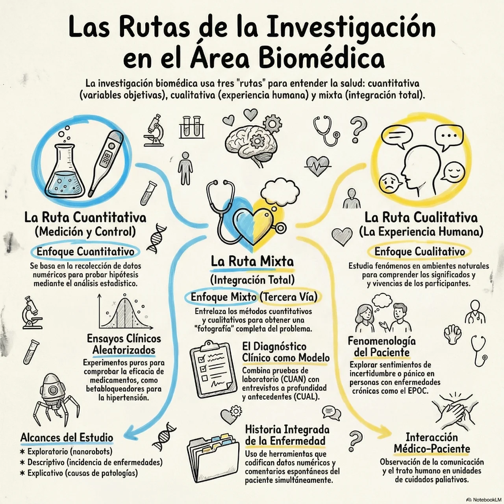

El **diseño de investigación** se define como el **plan o estrategia** concebida para obtener la información necesaria con el propósito de responder satisfactoriamente al planteamiento del problema. Representa el "mapa operativo" de un estudio, conectando las etapas conceptuales (objetivos, preguntas e hipótesis) con la recolección y el análisis de los datos.

La naturaleza del diseño varía fundamentalmente según el enfoque del estudio científico:

### En la ruta cuantitativa
En este enfoque, el diseño se utiliza para analizar la certeza de las hipótesis o responder a preguntas exploratorias y descriptivas. Se caracteriza por ser:
*   **Estructurado y predeterminado:** Es un plan que debe seguirse rigurosamente tal como fue concebido para garantizar la calidad y validez de la investigación.

*   **Clasificación principal:** Se divide en **[diseños experimentales](./2-experimental.md)** (donde se manipulan intencionalmente variables independientes para ver sus efectos) y **[diseños no experimentales](./3-noexprimental.md)** (donde se observan fenómenos tal como se dan en su contexto natural sin intervención directa).

### En la ruta cualitativa
Aquí el diseño adquiere un significado diferente, refiriéndose al **abordaje general** o marco interpretativo que se utilizará. Sus características principales son:
*   **Flexible y abierto:** No es un plan rígido, sino que surge y se adapta durante el proceso de inmersión inicial y el trabajo de campo según las circunstancias y el contexto.

*   **Tipos comunes:** Incluye abordajes como la **teoría fundamentada**, diseños etnográficos, narrativos, fenomenológicos y de investigación-acción.

### En los métodos mixtos
En la investigación mixta, el diseño es una tarea aún más **artesanal** y única para cada estudio. Implica recolectar, analizar e integrar datos cuantitativos y cualitativos de manera simultánea o secuencial para lograr una comprensión integral del fenómeno.

### Importancia de la elección del diseño
Ningún diseño es intrínsecamente mejor que otro. Su selección depende de factores críticos como:
*   El **planteamiento del problema** y los objetivos fijados.
*   El **alcance del estudio** (exploratorio, descriptivo, correlacional o explicativo).
*   La formulación o no de **hipótesis**.
*   La disponibilidad de **recursos** y el tiempo disponible.