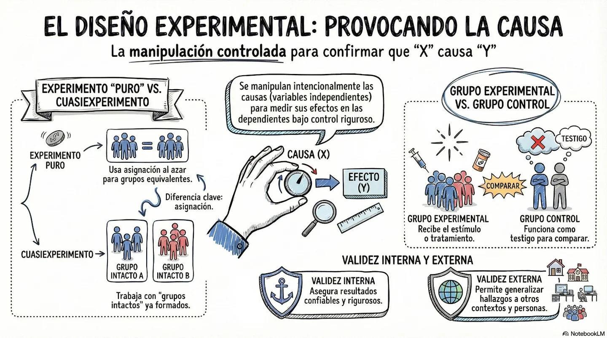

En estos diseños, el investigador **manipula intencionalmente** una o más variables independientes (como un fármaco o terapia) para observar su efecto en variables dependientes (como la curación o reducción de síntomas) en una situación controlada.
Estos diseños tienen mayor validez interna ya que se pueden replicar.

### 🔸Pre-experimentos
Tienen un grado de control mínimo y suelen ser estudios de un solo grupo.
    *   *Ejemplo 1:* Administrar una terapia psicológica innovadora a un grupo pequeño de personas con una adicción nueva y medir el resultado al final.
    *   *Ejemplo 2:* Realizar un estudio de caso médico con una sola medición tras aplicar un estímulo experimental para observar niveles descriptivos.

### 🔸Ensayos Clínicos Aleatorizados
Reúnen los requisitos de manipulación, medición y control mediante la **asignación al azar** de los participantes a los grupos.
    *   *Ejemplo 1:* Un estudio para probar la eficacia de una vacuna contra el Ébola, comparando un grupo vacunado frente a uno que no la recibió.
    *   *Ejemplo 2:* Evaluar el efecto del consumo suplementario de selenio en el ritmo de crecimiento de tumores cancerígenos en los senos, con grupos asignados al azar para diferentes dosis y un grupo de control.

Casos reales de **ensayos clínicos aleatorizados (ECA)**, los cuales representan el diseño de tipo experimental por excelencia en las ciencias de la salud. A continuación, se detallan los casos más relevantes encontrados:

A continuación, se presenta detalles sobre casos reales de **ensayos clínicos aleatorizados (ECA)** documentados , los cuales sirven como modelos de rigor científico en la investigación biomédica:

#### 1. Tratamiento de escoliosis idiopática en adolescentes (Toye et al., 2016)
Este estudio se realizó en el Reino Unido para evaluar la factibilidad de un ensayo a gran escala sobre un tratamiento no quirúrgico.
*   **Muestra y Contexto:** Se reclutaron **58 pacientes** de entre 10 y 16 años del Servicio Nacional de Salud (NHS) con escoliosis leve o moderada. 
*   **Diseño Experimental:** Los participantes fueron **asignados al azar** a dos condiciones:
    1.  **Atención estándar:** Recibieron consejos médicos e información escrita.
    2.  **Ejercicio fisioterapéutico:** Siguieron un plan de ejercicios diarios específicos en casa y supervisión en línea.
*   **Variables Medidas:** Se evaluaron los resultados de la rehabilitación según estándares médicos, la **aceptación del tratamiento** y la percepción de la intervención.
*   **Hallazgos:** El estudio no solo comprobó la eficiencia del tratamiento, sino que detectó necesidades de información insatisfechas y concluyó que en medicina es vital considerar al paciente como un **individuo único** en lugar de solo un "cuerpo" o un número.

#### 2. Eficacia de la vacuna contra el Ébola (2015)
Este caso es un ejemplo clásico de un experimento puro con un impacto de salud pública global.
*   **Muestra:** Participaron **11,841 personas**.
*   **Grupos de Comparación:** Se contrastó a un grupo experimental de **5,837 personas** a las cuales se les administró la vacuna, frente al resto de la población que no la recibió (grupo de control).
*   **Resultado:** El análisis estadístico demostró que la vacuna tenía una **eficacia del 100%** para prevenir la enfermedad.

#### 3. Plasma rico en plaquetas (PRP) para úlceras en pie diabético
Este estudio piloto se utilizó para probar una alternativa que disminuyera el tiempo de regeneración tisular.
*   **Metodología:** Los pacientes diabéticos con úlceras cutáneas fueron **asignados al azar** a dos tratamientos. El grupo experimental recibió PRP, mientras que el otro recibió el método tradicional de lavado y curación.
*   **Recolección de Datos:** Se tomaron fotografías de las lesiones durante ocho semanas, analizando el área de cicatrización con el software *Launch Doc-ItLS®*.
*   **Resultados:** Se logró una **reducción promedio del 72.39%** en el área de la úlcera en los pacientes tratados con plasma, un resultado significativamente superior al grupo tradicional. Además, se demostró que este manejo mejora la calidad de vida y disminuye los gastos de atención a largo plazo.

#### 4. Comparación de medicamentos para la hipertensión (Lescano et al., 1997)
Un grupo de médicos internistas buscó determinar qué fármaco reducía más la presión arterial sistólica 30 minutos después de su administración.
*   **Sujetos:** **62 pacientes hipertensos** asignados aleatoriamente.
*   **Tratamientos (Variables Independientes):**
    1.  **Betabloqueador:** Logró una reducción media de **25.62 mm** de mercurio.
    2.  **Bloqueador BRA:** Reducción media de **18.86 mm**.
    3.  **Vasodilatador:** Reducción media de **14.42 mm**.
*   **Conclusión:** Mediante una prueba de **ANOVA**, se confirmó con una significancia de $p < 0.01$ que el betabloqueador era el tratamiento más eficaz entre los tres probados.

Estos ejemplos ilustran cómo el **doble ciego** y la **asignación al azar** (randomización) son fundamentales para eliminar sesgos y asegurar que los efectos observados se deban realmente al tratamiento y no a factores externos o al azar.

### 🔸Cuasiexperimentos
Se manipulan variables pero los grupos no se asignan al azar, sino que son **grupos intactos** (ya formados antes del estudio).
    *   *Ejemplo 1:* Probar la eficacia de dos antipsicóticos diferentes en pacientes con esquizofrenia que ya están internados en dos hospitales distintos.
    *   *Ejemplo 2:* Aplicar plasma rico en plaquetas para tratar úlceras de pie diabético en un grupo de pacientes, comparándolo con otro grupo que recibe el lavado tradicional, sin que el investigador haya asignado los grupos inicialmente (aunque el estudio citado también sugiere que puede hacerse de forma aleatoria, en biomedicina se usa el término cuasiexperimento cuando la aleatorización no es posible por ética o logística).

### 🔸El Caso del Doble Ciego

En el contexto de los **Ensayos Clínicos Aleatorizados** (experimentos puros), el diseño de **doble ciego** es una técnica de control donde **ni el paciente ni el investigador** saben quién está recibiendo el tratamiento activo y quién el placebo. El propósito es eliminar las explicaciones rivales o fuentes de invalidación interna, como el sesgo del experimentador o el efecto de maduración psicológica del paciente, asegurando que los cambios observados se deban únicamente al estímulo experimental. Esto garantiza que los resultados tengan el máximo rigor científico y puedan generalizarse con confianza (validez externa).

El diseño de un estudio de **doble ciego** (término que se describe en la práctica científica a través de los componentes metodológicos de control) se enmarca dentro de lo que se conoce como un **experimento puro** o **ensayo clínico aleatorizado**. Su propósito es alcanzar el máximo grado de **validez interna**, asegurando que los resultados se deban únicamente a la variable independiente y no a sesgos del investigador o de los participantes.

A continuación, se detallan los pasos y requisitos clave para diseñar este tipo de estudio:

#### 1. Definición de variables y planteamiento
El investigador debe identificar con precisión la **variable independiente** (el tratamiento o estímulo que se manipulará) y la **variable dependiente** (el efecto o resultado que se medirá). Es fundamental establecer qué se entenderá por el tratamiento mediante una **definición operacional experimental**.

#### 2. Formación de grupos mediante aleatorización
Para garantizar la equivalencia inicial de los grupos, es indispensable realizar una **asignación al azar** (aleatorización) de los participantes. Este procedimiento asegura que variables extrañas (conocidas o desconocidas) se distribuyan de manera similar en todos los grupos, evitando que afecten sistemáticamente los resultados. Se requiere, como mínimo, un **grupo experimental** y un **grupo de control**.

#### 3. Implementación del Placebo
En el grupo de control (también llamado testigo), se utiliza un **placebo**, como una píldora de azúcar o una sustancia inactiva que tenga la misma apariencia que el medicamento real. Esto permite que los participantes del grupo de control realicen las mismas actividades y tengan las mismas expectativas que el grupo experimental, sin recibir el estímulo real.

#### 4. Control de la conducta del experimentador
Para que un estudio sea verdaderamente de doble ciego (conforme a la información de nuestra historia de conversación y principios generales de investigación), se debe controlar la **conducta del experimentador**. El comportamiento del investigador puede influir en los resultados; por ello, este debe actuar igual con todos los grupos y mantener la objetividad. En la práctica del doble ciego, esto se traduce en que ni el sujeto ni quien recolecta los datos conocen quién pertenece a cada grupo.

#### 5. Medición estandarizada
La recolección de datos debe realizarse mediante instrumentos válidos, confiables y **estandarizados**. De preferencia, la medición posterior (posprueba) debe aplicarse de manera simultánea a ambos grupos inmediatamente después de concluido el tratamiento para evitar que la variable dependiente cambie por el paso del tiempo.

#### Resumen del proceso de diseño
| Paso  | Acción clave                     | Propósito                                                                       |
| :---- | :------------------------------- | :------------------------------------------------------------------------------ |
| **1** | **Aleatorización**               | Lograr que los grupos sean comparables y equivalentes.                          |
| **2** | **Asignación de grupos**         | Tener un punto de contraste (Experimental vs. Control).                         |
| **3** | **Uso de Placebo**               | Mantener a los sujetos "ciegos" respecto a su condición.                        |
| **4** | **Objetividad del investigador** | Evitar que las expectativas de quien observa alteren el dato.                   |
| **5** | **Medición (Posprueba)**         | Detectar diferencias significativas ($0_1 \neq 0_2$) para aceptar la hipótesis. |

Es importante señalar que la manipulación de variables en seres humanos debe observar **principios éticos rigurosos**, asegurando siempre el consentimiento informado y evitando privar a los pacientes de tratamientos necesarios.