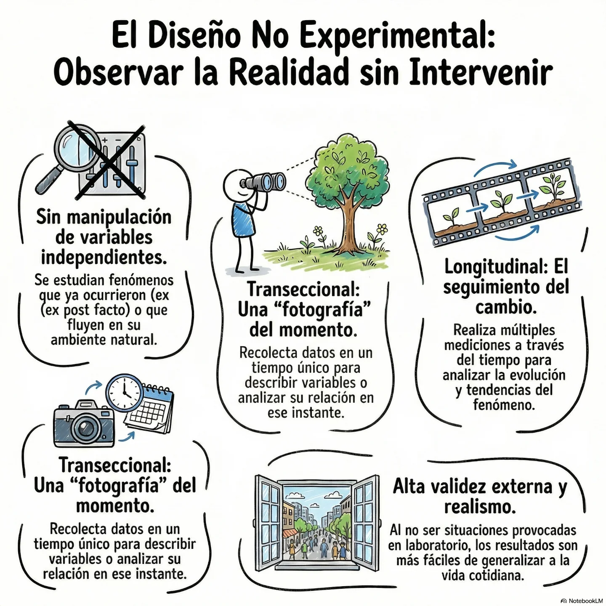
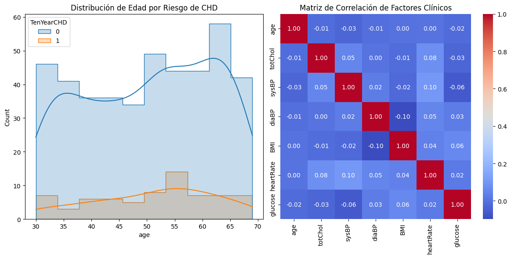

En estos estudios no hay manipulación de variables; el investigador observa los fenómenos tal como ocurren en su **contexto natural**.



### 🔸Transeccionales o Transversales 
Recolectan datos en un **momento único** en el tiempo.
    *   *Ejemplo 1:* Estimar la prevalencia de diabetes mellitus en adultos mayores de 60 años en una ciudad específica durante el último año.

    *   *Ejemplo 2:* Analizar la relación entre el estrés laboral y el desarrollo de enfermedades cardiovasculares en trabajadores de una industria en un periodo concreto.

### 🔸Longitudinales
Realizan un seguimiento de los participantes a través del tiempo en **varios momentos**.
    *   *Ejemplo 1 (Estudio de Cohorte):* El **Framingham Heart Study**, que ha seguido a generaciones de personas desde 1948 para identificar factores de riesgo cardiovascular.

    *   *Ejemplo 2 (Panel):* Analizar la evolución física y mental de un grupo específico de niños detectados con síndrome de Down y cardiopatía congénita durante diez años con evaluaciones periódicas.

### 🔸El Framingham Heart Study
El Framingham Heart Study (FHS) es un estudio epidemiológico pionero y de largo plazo, considerado el "estándar de oro" en la investigación de enfermedades cardiovasculares. Iniciado en 1948 bajo la dirección del National Heart, Lung, and Blood Institute ([**NHLBI**](https://www.nhlbi.nih.gov/science/framingham-heart-study-fhs)) y en colaboración con la [Universidad de Boston](https://www.bu.edu/articles/2026/heart-healthcare-framingham-heart-study/), su objetivo original era identificar los factores comunes que contribuyen a las enfermedades del corazón. 

#### Aspectos Clave y Evolución

**Origen Histórico**: El estudio fue impulsado por la alarmante epidemia de enfermedades cardiovasculares tras la Segunda Guerra Mundial, incluyendo la muerte prematura del presidente Franklin D. Roosevelt por hipertensión y accidente cerebrovascular.

**Participantes Multigeneracionales**: Comenzó con 5,209 hombres y mujeres de Framingham, Massachusetts. Actualmente se encuentra en su tercera generación de participantes (nietos del grupo original) y ha incluido cohortes diversas (Omni) para reflejar mejor la demografía actual.

**Metodología**: Los participantes regresan cada dos a seis años para exámenes físicos detallados, pruebas de laboratorio y entrevistas sobre su estilo de vida.

#### Descubrimientos que Transformaron la Medicina
El estudio ha producido más de 6.000 artículos científicos y ha definido gran parte del conocimiento común sobre salud cardíaca:

El Término "Factor de Riesgo": Fue acuñado por investigadores de Framingham en 1961.
Factores Identificados: Confirmó que el tabaquismo, la hipertensión, el colesterol alto, la obesidad, la diabetes y la inactividad física aumentan drásticamente el riesgo cardiovascular.

**Diferencias de Género**: Al incluir un número casi igual de hombres y mujeres desde el inicio, demostró que la enfermedad cardíaca no es exclusivamente masculina y que el riesgo aumenta en mujeres tras la menopausia.

**Nuevas Fronteras**: Hoy el estudio se ha expandido a investigar la genética, la demencia (incluyendo el Alzheimer), la salud ósea y el impacto del microbioma intestinal. 

#### Herramientas Clínicas
A partir de sus datos se creó el Framingham Risk Score, un algoritmo utilizado mundialmente por médicos para estimar la probabilidad de que una persona sufra un evento cardiovascular en los próximos 10 o 30 años.

<br />
#### 📝 Programación:
<Tabs>
<TabItem value="mnp" label="Antecedentes" default>
<div class="alert alert--primary">
**Framingham Heart Study**<br />
Analizar los factores de riesgo determinantes en el desarrollo de enfermedades cardiovasculares (ECV) en la población del estudio de Framingham para establecer modelos predictivos de salud.

**Objetivos Específicos:**<br />
- Descriptivo: Describir la prevalencia de hipertensión arterial y niveles de colesterol elevados en la cohorte seleccionada.
- Correlacional: Establecer el grado de asociación estadística entre el índice de masa corporal (IMC) y la presión arterial sistólica.
- Explicativo: Determinar el impacto del tabaquismo y la diabetes sobre la incidencia de infarto al miocardio en un seguimiento longitudinal.
</div>
</TabItem>
<TabItem value="mnp-python" label="Pyhton" default>
```python showLineNumbers
# Implementación en Python
import pandas as pd
import numpy as np
import matplotlib.pyplot as plt
import seaborn as sns
from sklearn.model_selection import train_test_split
from sklearn.linear_model import LogisticRegression
from sklearn.metrics import classification_report, confusion_matrix, roc_auc_score
from statsmodels.stats.outliers_influence import variance_inflation_factor
import statsmodels.api as sm

# Nota: Se asume que el archivo 'framingham.csv' está disponible en el entorno.
# El dataset típico contiene: male, age, education, currentSmoker, cigsPerDay, 
# BPMeds, prevalentStroke, prevalentHyp, diabetes, totChol, sysBP, diaBP, BMI, 
# heartRate, glucose, TenYearCHD.

filepath = "https://patricioaraneda.cl/bioestadistica/data/framingham.csv"

def cargar_y_limpiar_datos(filepath):
    """
    Carga el dataset y maneja los valores faltantes, comunes en datos médicos.
    """
    df = pd.read_csv(filepath)
    df.drop(['education'], inplace = True, axis = 1)
    
    # Análisis de valores nulos
    print("Valores nulos detectados por columna:\n", df.isnull().sum())
    
    # Imputación: Usamos la mediana para variables continuas para evitar sesgos por outliers
    for col in df.columns:
        if df[col].isnull().any():
            df[col] = df[col].fillna(df[col].median())
            
    return df

def analisis_exploratorio(df):
    """
    Genera visualizaciones para entender la distribución del riesgo.
    """
    plt.figure(figsize=(12, 6))
    
    # Distribución de la Edad vs Riesgo a 10 años
    plt.subplot(1, 2, 1)
    sns.histplot(data=df, x='age', hue='TenYearCHD', kde=True, element="step")
    plt.title('Distribución de Edad por Riesgo de CHD')
    
    # Correlación de factores principales
    plt.subplot(1, 2, 2)
    cols_interes = ['age', 'totChol', 'sysBP', 'diaBP', 'BMI', 'heartRate', 'glucose']
    sns.heatmap(df[cols_interes].corr(), annot=True, cmap='coolwarm', fmt=".2f")
    plt.title('Matriz de Correlación de Factores Clínicos')
    
    plt.tight_layout()
    plt.show()

def regresion_logistica(df):
    """
    Implementa el modelo de Regresión Logística para predicción de riesgo.
    """
    # Definición de variables independientes (X) y dependiente (y)
    X = df.drop('TenYearCHD', axis=1)
    y = df['TenYearCHD']
    
    # División entrenamiento/prueba
    X_train, X_test, y_train, y_test = train_test_split(X, y, test_size=0.2, random_state=42)
    
    # Escalado de variables (opcional pero recomendado para convergencia)
    # model = LogisticRegression(max_iter=1000)
    
    # Usamos statsmodels para obtener un reporte estadístico detallado (P-values)
    X_train_const = sm.add_constant(X_train)
    logit_model = sm.Logit(y_train, X_train_const).fit()
    
    print("\n--- Resumen Estadístico del Modelo (Logit) ---")
    print(logit_model.summary())
    
    # Predicción con Scikit-Learn para métricas de desempeño
    sk_model = LogisticRegression(max_iter=2000)
    sk_model.fit(X_train, y_train)
    y_pred = sk_model.predict(X_test)
    
    print("\n--- Reporte de Clasificación ---")
    print(classification_report(y_test, y_pred))
    print("AUC-ROC Score:", roc_auc_score(y_test, sk_model.predict_proba(X_test)[:, 1]))

def main():
    # Simulación de carga (sustituir por ruta real si es necesario)
    try:
        # Nota: Como no tengo el archivo físico, este bloque es demostrativo.
        # En un entorno real, usarías: df = cargar_y_limpiar_datos('framingham.csv')
        print("Iniciando análisis científico del estudio Framingham...")
        
        # Generamos datos sintéticos similares para que el script sea ejecutable/demostrable
        data_size = 500
        np.random.seed(42)
        mock_data = pd.DataFrame({
            'age': np.random.randint(30, 70, data_size),
            'totChol': np.random.normal(230, 40, data_size),
            'sysBP': np.random.normal(130, 20, data_size),
            'diaBP': np.random.normal(85, 10, data_size),
            'BMI': np.random.normal(25, 4, data_size),
            'heartRate': np.random.normal(75, 10, data_size),
            'glucose': np.random.normal(80, 15, data_size),
            'TenYearCHD': np.random.binomial(1, 0.15, data_size)
        })
        
        analisis_exploratorio(mock_data)
        regresion_logistica(mock_data)
        
    except Exception as e:
        print(f"Error durante la ejecución: {e}")

if __name__ == "__main__":
    main()
```

```
                           Logit Regression Results                           
==============================================================================
Dep. Variable:             TenYearCHD   No. Observations:                  400
Model:                          Logit   Df Residuals:                      392
Method:                           MLE   Df Model:                            7
Date:                Sun, 05 Apr 2026   Pseudo R-squ.:                 0.03588
Time:                        20:20:10   Log-Likelihood:                -152.63
converged:                       True   LL-Null:                       -158.31
Covariance Type:            nonrobust   LLR p-value:                    0.1237
==============================================================================
                 coef    std err          z      P>|z|      [0.025      0.975]
------------------------------------------------------------------------------
const         -3.0899      2.476     -1.248      0.212      -7.942       1.763
age           -0.0083      0.013     -0.645      0.519      -0.034       0.017
totChol        0.0026      0.004      0.739      0.460      -0.004       0.009
sysBP         -0.0187      0.007     -2.538      0.011      -0.033      -0.004
diaBP          0.0125      0.016      0.800      0.424      -0.018       0.043
BMI           -0.0021      0.036     -0.060      0.953      -0.073       0.068
heartRate      0.0166      0.014      1.160      0.246      -0.011       0.045
glucose        0.0142      0.011      1.323      0.186      -0.007       0.035
...
   macro avg       0.42      0.50      0.46       100
weighted avg       0.71      0.84      0.77       100

AUC-ROC Score: 0.42485119047619047
```
</TabItem>
<TabItem value="mnp-r" label="R" default>
```r showLineNumbers
# Implementación en R

# Instalación de librerías necesarias (descomentar si es necesario)
# install.packages(c("tidyverse", "caret", "corrplot", "pROC"))

library(tidyverse)
library(caret)
library(corrplot)
library(pROC)

# ==========================================
# 1. CARGA Y LIMPIEZA DE DATOS
# ==========================================

cargar_y_limpiar_datos <- function(filepath) {
  # En una situación real: df <- read.csv(filepath)
  # Para fines demostrativos, generamos datos sintéticos similares a Framingham
  set.seed(42)
  n <- 500
  df <- data.frame(
    age = sample(30:70, n, replace = TRUE),
    totChol = rnorm(n, 230, 40),
    sysBP = rnorm(n, 130, 20),
    diaBP = rnorm(n, 85, 10),
    BMI = rnorm(n, 25, 4),
    heartRate = rnorm(n, 75, 10),
    glucose = rnorm(n, 80, 15),
    TenYearCHD = rbinom(n, 1, 0.15) # Variable objetivo (Riesgo Coronario)
  )
  
  # Simulación de valores perdidos (NA)
  df[sample(1:n, 20), "glucose"] <- NA
  
  message("Valores nulos detectados por columna:")
  print(colSums(is.na(df)))
  
  # Imputación por mediana (Práctica estándar en Bioestadística)
  df <- df %>%
    mutate(across(everything(), ~replace_na(., median(., na.rm = TRUE))))
    
  return(df)
}

# ==========================================
# 2. ANÁLISIS EXPLORATORIO (EDA)
# ==========================================

analisis_exploratorio <- function(df) {
  # Distribución de la Edad por Riesgo
  p1 <- ggplot(df, aes(x = age, fill = as.factor(TenYearCHD))) +
    geom_histogram(alpha = 0.6, position = "identity", bins = 20) +
    labs(title = "Distribución de Edad por Riesgo de CHD",
         x = "Edad", y = "Frecuencia", fill = "Riesgo CHD") +
    theme_minimal()
  
  print(p1)
  
  # Matriz de Correlación
  cor_matrix <- cor(df %>% select(-TenYearCHD))
  corrplot(cor_matrix, method = "color", addCoef.col = "black", 
           tl.col = "black", title = "\nMatriz de Correlación Clínica", mar=c(0,0,1,0))
}

# ==========================================
# 3. MODELADO: REGRESIÓN LOGÍSTICA
# ==========================================

ejecutar_regresion_logistica <- function(df) {
  # División de datos (80% entrenamiento, 20% prueba)
  set.seed(123)
  index <- createDataPartition(df$TenYearCHD, p = 0.8, list = FALSE)
  train_data <- df[index, ]
  test_data <- df[-index, ]
  
  # Ajuste del modelo Logit (GLM)
  # En R, esto proporciona automáticamente los valores P y estadísticos Z
  modelo <- glm(TenYearCHD ~ ., data = train_data, family = binomial)
  
  cat("\n--- Resumen Estadístico del Modelo (R Summary) ---\n")
  print(summary(modelo))
  
  # Cálculo de Odds Ratios (OR) e Intervalos de Confianza (95%)
  cat("\n--- Odds Ratios e Intervalos de Confianza (95%) ---\n")
  or_results <- exp(cbind(OR = coef(modelo), confint(modelo)))
  print(or_results)
  
  # Predicciones en el conjunto de prueba
  probabilidades <- predict(modelo, newdata = test_data, type = "response")
  predicciones <- ifelse(probabilidades > 0.5, 1, 0)
  
  # Evaluación de desempeño
  cat("\n--- Matriz de Confusión y Métricas ---\n")
  cm <- confusionMatrix(as.factor(predicciones), as.factor(test_data$TenYearCHD))
  print(cm)
  
  # Curva ROC y AUC
  roc_obj <- roc(test_data$TenYearCHD, probabilidades)
  cat("\nAUC Score:", auc(roc_obj), "\n")
  
  plot(roc_obj, main = "Curva ROC - Predicción de Riesgo Framingham")
}

# ==========================================
# EJECUCIÓN PRINCIPAL
# ==========================================

main <- function() {
  message("Iniciando análisis científico en R - Estudio Framingham")
  
  datos <- cargar_y_limpiar_datos()
  analisis_exploratorio(datos)
  ejecutar_regresion_logistica(datos)
}

main()
```
</TabItem>
</Tabs>