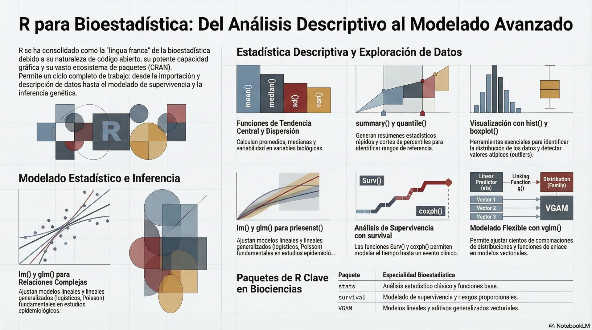
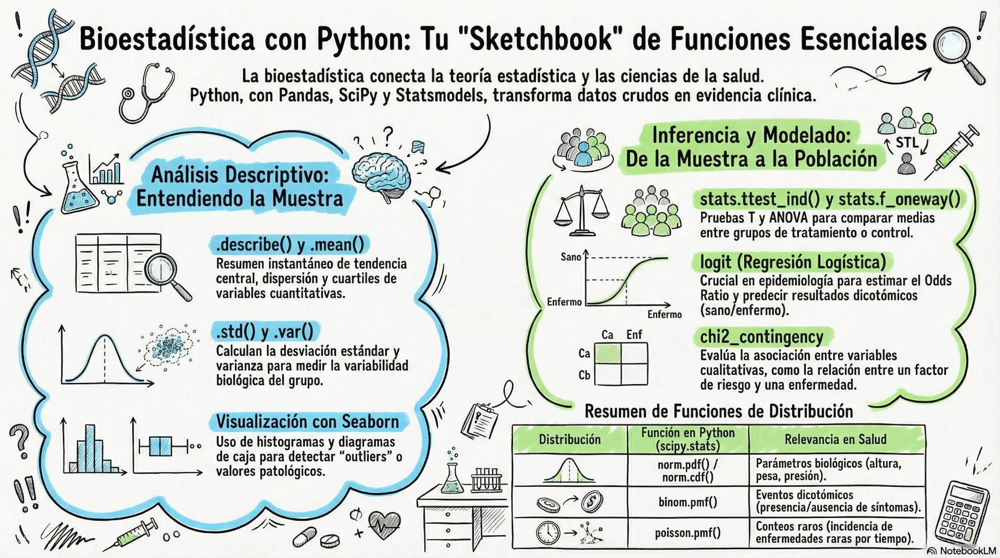

# Bioestadística con R y Python

Sitio educativo para aprender **Bioestadística** con R / Python, construido con [Docusaurus](https://docusaurus.io/).

Este sitio de estudio está diseñado para guiar a los principiantes a través de los pilares estadísticos que sustentan la ciencia de datos, partiendo desde conceptos extremadamente básicos hasta ideas más avanzadas. El objetivo es ofrecer una visión clara y orientada a la aplicación práctica, evitando la complejidad innecesaria del formalismo matemático (pero si perder la rigurosidad de los conceptos), para priorizar la intuición y la interpretación. 

Exploraremos cómo la estadística descriptiva nos permite conocer nuestros datos, cómo la inferencia estadística nos permite generalizar hallazgos, y cómo la teoría de la probabilidad y las distribuciones de probabilidad son herramientas indispensables para modelar incertidumbre y construir predicciones robustas.

## ¿Por qué aprender Bioestadística?

En el siglo XXI, la capacidad de analizar datos es esencial en cualquier área de la ciencia. La bioestadística permite:

1. **Evaluar evidencia científica**: Determinar si un tratamiento es efectivo o si una asociación es real.
2. **Tomar decisiones clínicas**: Fundamentar protocolos y guías de práctica clínica.
3. **Publicar investigación**: La mayoría de las revistas científicas requieren un análisis estadístico riguroso.
4. **Entender la literatura científica**: Leer e interpretar artículos de investigación.

## Herramientas que usaremos

En este curso utilizaremos dos lenguajes de programación ampliamente usados en análisis de datos:

### R (Software estadístico)

[R](https://www.r-project.org/) es un lenguaje de programación y entorno de software libre diseñado especialmente para análisis estadístico y gráficos. Es el estándar de facto en estadística académica y ciencias de la salud.

### Python (Lenguaje de programación)

[Python](https://www.python.org/) es un lenguaje de propósito general muy popular en ciencia de datos, con potentes bibliotecas como `pandas`, `scipy`, `statsmodels` y `matplotlib` que lo hacen excelente para bioestadística.

## Estructura del Curso

El curso está organizado en los siguientes módulos:

| Módulo | Contenido |
|--------|-----------|
| [**Introducción a la Bioestadística**](../docs/01-introduccion/README.md) | Variables, niveles de medición, conceptos fundamentales |
| [**Estadística Descriptiva**](../docs/02-estadistica-descriptiva/README.md) | Medidas de tendencia central y dispersión, visualización de datos |
| [**Probabilidad**](../docs/03-probabilidad/README.md) | Distribución normal, binomial, t de Student, chi-cuadrado |
| [**Inferencia Estadística**](../docs/04-inferencia-estadistica/README.md) | Pruebas de hipótesis, intervalos de confianza, correlación, ANOVA |
| **Programación con R** | Introducción al lenguaje R con ejemplos biomédicos |
| **Programación en Python** | Introducción a Python con numpy, pandas, scipy y matplotlib |
| **Casos de uso** | Basados en el entorno de programación R y además en Python |
| **Temas avanzados** | Conceptos avanzados de Bioestadística |

## Tipos de Variables

Antes de comenzar el análisis estadístico, es esencial identificar el **tipo de variable** con la que trabajamos:

### Variables Cuantitativas

- **Continuas**: Pueden tomar cualquier valor numérico (peso, talla, temperatura)
- **Discretas**: Toman valores enteros (número de hijos, conteo de células)

### Variables Cualitativas (Categóricas)

- **Nominales**: Sin orden natural (sexo, grupo sanguíneo, diagnóstico)
- **Ordinales**: Con orden natural (estadio de enfermedad: I, II, III, IV)
 
 

:::tip Buena práctica
Siempre identifica el tipo de variable antes de elegir el método estadístico a aplicar. La elección incorrecta del método puede llevar a conclusiones erróneas.
:::

## Niveles de Medición

Los niveles de medición (escala de Stevens) determinan qué operaciones matemáticas son válidas:

1. **Nominal**: Solo categorías, sin orden (ej: tipo de sangre)
2. **Ordinal**: Categorías con orden (ej: nivel de dolor: leve, moderado, severo)
3. **Intervalo**: Diferencias iguales, sin cero absoluto (ej: temperatura en Celsius)
4. **Razón**: Diferencias iguales y cero absoluto (ej: peso, talla)

## Conceptos Fundamentales

### Población y Muestra

- **Población**: Conjunto completo de individuos o mediciones de interés
- **Muestra**: Subconjunto de la población seleccionado para el estudio

### Parámetro y Estadístico

- **Parámetro**: Valor numérico que describe una característica de la **población** (ej: media poblacional μ)
- **Estadístico**: Valor calculado a partir de los datos de la **muestra** (ej: media muestral x̄)

