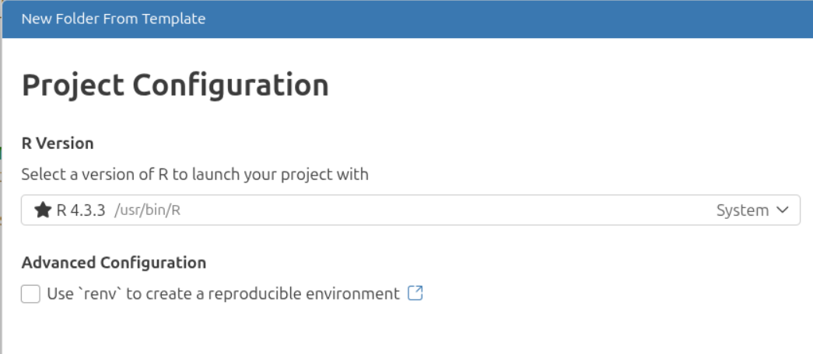

## Instalación del lenguaje R

### 🔹Windows
1. Busca el instalador desde [CRAN Windows](https://cran.r-project.org/bin/windows/base/)
2. Descarga desde el enlace [Download R-4.5.3 for Windows](https://cran.r-project.org/bin/windows/base/R-4.5.3-win.exe)
3. Ejecuta el archivo `.exe` descargado
4. Sigue el asistente de instalación con las opciones predeterminadas
5. Verifica la instalación abriendo CMD y ejecutando: `R --version`

:::warning Error
Si presenta mensaje de error del tipo: 
`Cannot locate the history for command line --version`

Solo es propio de la ruta desde Windows (variable de entorno PATH) y no afecta su uso con el IDE respectivo.
:::

### 🔹macOS
1. Descarga el instalador `.pkg` desde [CRAN macOS](https://cran.r-project.org/bin/macos/)
2. Selecciona la versión compatible con tu procesador (Apple Silicon o Intel)
3. Abre el instalador y sigue las instrucciones
4. Verifica desde Terminal: `R --version`

### 🔹Linux
**Ubuntu/Debian:**
```bash
sudo apt update
sudo apt install r-base r-base-dev
```

**Fedora/RHEL:**
```bash
sudo dnf install R
```

**Arch Linux:**
```bash
sudo pacman -S r
```

Verifica: `R --version`

## IDE
- Instala [RStudio](https://posit.co/download/rstudio-desktop/) para una experiencia mejorada con editor, consola y visualización integrados.

- Instala [Positron](https://positron.posit.co/) para un proceso más profesional con ciencia de datos.

- Instale [Jupyter Lab](https://jupyterlab.readthedocs.io/en/latest/) como una interface simple y de laboratorio.

:::info IDE Recomendado
Utiliza **Positron** ya que es una mejora respecto de RStudio y más orientado a ciencia de datos.
:::

### 🔹Instalación y configuración de Positrón

#### Instalación
1. Descarga la versión según tu sistema operativo desde https://positron.posit.co/download.html
2. Abre el instalador y ejecuta la instalación según opciones predeterminadas.
3. Abre el programa Positron


#### Configuración
1. Una vez abiertoselecciona desde el menú `File->New Project From Template...`
2. Selecciona `R Project`
3. Escribe el nombre del proyecto (nombre de la carpeta nueva)
4. Selecciona la carpeta donde se alojará el proyecto (carpeta padre)
5. Selecciona `Next`
6. Selecciona la versión de R instalada

:::info
Debería reconocer por defecto la instalación de R en el equipo.
:::



Opcionalmente marca `Use renv ...` en configuración avanzada `Advanced Configuration` lo que permitirá que al compartir el proyecto se instalen las librerías instaladas en el transcurso de su desarrollo.

Para realizar ajustes en caso de no localizar R automaticamente:

- Desde el menu elija `File->Preferences->Settings` 
- En Settings busque `Extensions->R->Adcanced`
- Realice los cambios necesarios en:
  - `Positron >R:Custom Binaries`
  - `Positron> R:Custom Root Folders`

### 🔹Instalación de Jupyter Lab

:::tip Importante
Debe tener instalado Python 3.13 o superior de antemano.
:::

#### Instalar Python
Se sugiere instalar la version 3.13.12
- MacOs: https://www.python.org/ftp/python/3.13.12/python-3.13.12-macos11.pkg
- Windows: https://www.python.org/ftp/python/3.13.12/python-3.13.12-amd64.exe

#### Instalar Jupyter Lab

- Accede a la terminal y ejecuta:
```bash
pip install jupyterlab
```
Instalar kernel R "IRkernel" desde el terminal R: 
*user = FALSE para instalar a todos los usuarios del sistema*
- Ejecuta R en el terminal para que cambie a R > y ejecuta las siguientes sentencias:
```r
install.packages(IRkernel')
IRkernel::installspec(user=TRUE) 
q() # salir de la sesion
```

Para ejecutar KupyterLab, escribe en la terminal:
```bash
jupyter lab
```
