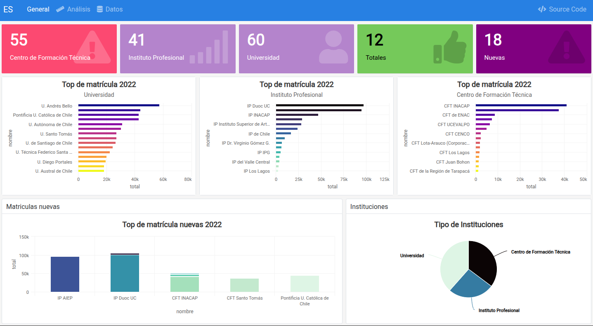

En R pueden crearse paneles de control al estilo de herramientas como PowerBI o Tableau, eso si con ciertas limitaciones. De forma estática con Quarto, que es lo que se verá en esta sección, o con **Shiny** estableciendo un servidor.

Para aprender sobre la creación con Shiny [sigue este enlace](https://shiny.posit.co/).

## Paneles de Control con Quarto

Documentación de creación de paneles en: https://quarto.org/docs/dashboards/

:::info
Sección en desarrollo...
:::